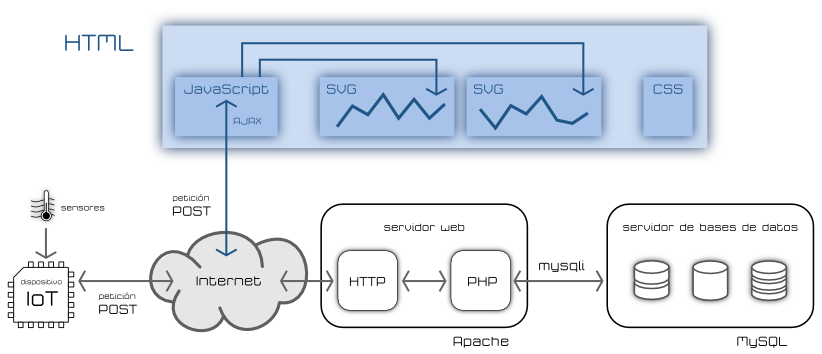

## [¿Qué es IOT?](https://es.wikipedia.org/wiki/Internet_de_las_cosas)

(De Drawed by Wilgengebroed on Flickr - Translated by Prades97, CC BY-SA 3.0, https://commons.wikimedia.org/w/index.php?curid=32745149)

¿Qué dispositivos IOT conoces?

## IOT con Raspberry

Dada la capacidad de procesamiento y la compatibilidad con todo tipo de sistemas, Raspberry Pi es ideal para ser el centro de las comunicaciones de un sistema IOT. Puede actuar como:

* Broker de comunicaciones, a donde se conectan todos los otros dispositivos.
* Base de datos para guardar los datos.
* Visualizador de datos usando aplicaciones específicas.
* Hacer  data minin sobre los datos guardados
* Publicar contenidos en forma de página web, canal de Telegram, etc

# IOT (Internet de las cosas)

¿Qué dispositivos te gustaría controlar remotamente?

* Calefacción.
* Aire acondicionado.
* Encender la cocina para calentar la comida antes de que lleguemos a casa.
* ¿Estás seguro que se han apagado todas las luces de la casa al salir?.
* Una alarma que nos avise de si hay algún problema cuando no estamos en casa.
* Poder ver el estado de un familiar remotamente.
* Controlar el ejercicio que hace durante un día para así motivarte a hacer más.
* Todas las aplicaciones que si tu curro de la domótica de una casa.

## Características de los dispositivos IOT

* Bajo consumo o mejor autosuficiente (un panel solar y una batería). Si tiene una pulsera de actividad sabrá que es necesario cargarla una vez al mes.
* Conectividad con otros dispositivos como puede ser un teléfono móvil ya sea por medio de Bluetooth y /o WiFi.
* Medir algo: actividad, temperatura, consumo.
* Almacenar los datos, que se guardan hasta que se vuelve a sincronizar.
* Estos datos se suelen subir a páginas web (thingspeak, blynk, adafruit, Cayenne, etc) Dónde se almacenan, y dónde posteriormente podemos construir nuestros gráficos e informes.

## Proyectos

Veamos algunos de los proyectos en los que podríamos trabajar:

* Estación meteorológica: mediremos las magnitudes atmosféricas, mostrando los datos, guardándose y publicándose en internet para su posterior análisis.

* Medida de consumo y fomento de la eficiencia energética: mediremos el consumo de nuestro propio equipo y veremos cómo a medida que vamos incluyendo más componentes el consumo se hace mayor. Podríamos adaptar este sistema a un uso real dentro de la casa y viendo el consumo de los electrodomésticos.

* Control remoto de componentes: mediante el uso de un relé vamos a poder encender y apagar dispositivos remotamente con nuestro sistema bien por el cambio de alguna tela sistemas que medimos o bien por accionamiento externo.

* Medida de calidad del aire. Usaremos sensores de medida de partículas para determinar la calidad del aire y al mismo tiempo también mediremos el contenido en gases y los parámetros atmosféricos. Publicaremos todos estos datos en una página web para poder comparar la medida en diferentes lugares.

## Algunos ejemplos:

* Pulsera para medir la actividad física.
  * Su batería dura unos ¡¡¡30 días!!!
  * Almacena sus datos (en local) y cuando puede se sincroniza (guardando datos en la nube).
  * Sólo proporciona información que luego vemos en otros dispositivos.
* Sistema de riego inteligente.
  * Un Arduino que mide la humedad y decide si activar o no una bomba de agua es una prueba de concepto.
  * Sistema de riego para una instalación de gran tamaño:
    * Cientos/miles de sensores de humedad.
    * Multitud de puntos de riego (válvulas/bombas).
    * Hacemos un datamining sobre los datos de humedad y se activan los puntos de riego.

### Qué le pedimos al IOT

* Inteligencia:
    * [Niveles](http://www.domodesk.com/a-fondo-que-es-el-internet-de-las-cosas): identidad, ubicación, estado, contexto, criterio. Ejemplo: los cientos de sensores de humedad de una gran explotación. Un nivel más de Inteligencia sería incluir predicción (por ejemplo la atmosférica: si sabemos a que va llover, esperamos antes de regar).
* Arquitectura
  * [Protocolos](http://www.domodesk.com/a-fondo-que-es-el-internet-de-las-cosas): Cable, Wifi, Zigbee, bluetooth, GSM (y todas sus Gs), ...
  * M2M: Comunicación Machine To Machine.
    * Un drone recoge datos del nivel de suciedad de los paneles solares.
    * Envía los datos  a la central.
    * Cuando el nivel es el adecuado se activa el robot de limpieza en determinada zona.

## ¿Cómo hacerse un IOT?

¿Qué necesito?

[Arquitectura de un sistema completo IOT](https://polaridad.es/grafica-sensor-internet-de-las-cosas-iot/)

