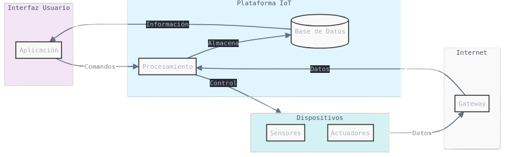

## [¿Qué es IOT?](https://es.wikipedia.org/wiki/Internet_de_las_cosas)

(De Drawed by Wilgengebroed on Flickr - Translated by Prades97, CC BY-SA 3.0, https://commons.wikimedia.org/w/index.php?curid=32745149)

IoT, o "Internet de las Cosas" (del inglés, *Internet of Things*), es un concepto que se refiere a la interconexión de objetos cotidianos a Internet, permitiendo que estos dispositivos recopilen, compartan y, en algunos casos, procesen datos de manera autónoma. Estos "objetos inteligentes" pueden ser desde electrodomésticos, sensores industriales y vehículos, hasta dispositivos de salud, ropa y ciudades enteras. La finalidad del IoT es mejorar la eficiencia, la comodidad y la toma de decisiones mediante el uso de datos en tiempo real.

### ¿Cómo funciona el IoT?
La arquitectura de IoT generalmente, se compone de varios elementos clave:
1. **Dispositivos o sensores**: Los dispositivos IoT tienen sensores o actuadores que recopilan datos, como la temperatura, la ubicación, o incluso el ritmo cardíaco en dispositivos médicos.
2. **Conectividad**: Estos dispositivos se conectan a Internet o a redes locales a través de Wi-Fi, Bluetooth, redes móviles, entre otras tecnologías, para transmitir los datos.
3. **Nube o almacenamiento**: Los datos se almacenan en servidores o plataformas en la nube, donde pueden procesarse y analizarse.
4. **Procesamiento y análisis**: Los datos recopilados se analizan para proporcionar información útil o activar acciones automáticas, como encender una luz, activar un sistema de seguridad o realizar predicciones basadas en tendencias.
5. **Interfaz de usuario**: Muchas veces, los datos se muestran en una aplicación o panel, donde los usuarios pueden monitorear y controlar los dispositivos.

### Ejemplos de aplicaciones de IoT
1. **Hogares inteligentes**: Dispositivos como termostatos, cerraduras y asistentes de voz (ej. Alexa o Google Home), automatizan tareas y permiten controlar el hogar de forma remota.
2. **Salud y bienestar**: Los dispositivos portátiles como pulseras o relojes inteligentes monitorizan constantes vitales y ayudan en la gestión de la salud.
3. **Industria 4.0**: En las fábricas, los sensores y máquinas conectadas permiten un control detallado y en tiempo real de los procesos productivos, optimizando recursos y reduciendo fallos.
4. **Ciudades inteligentes**: La iluminación, el tráfico y los sistemas de gestión de residuos en las ciudades pueden automatizarse para mejorar la eficiencia y reducir costos.
5. **Agricultura**: IoT facilita el monitoreo del clima y el estado del suelo, permitiendo un riego y una gestión de cultivos más precisa.

### Ventajas del IoT
- **Eficiencia y ahorro de recursos**: Ayuda a reducir costos y optimizar procesos.
- **Toma de decisiones basada en datos**: Permite decisiones informadas gracias a los datos en tiempo real.
- **Automatización de tareas**: Mejora la comodidad y reduce la necesidad de intervención humana.
- **Personalización**: Los dispositivos pueden adaptarse a las preferencias y necesidades del usuario.

### Desafíos y preocupaciones
- **Seguridad y privacidad**: Al estar conectado a Internet, el IoT es vulnerable a ataques cibernéticos, lo que plantea problemas de privacidad de datos.
- **Interoperabilidad**: Hay muchos dispositivos y fabricantes distintos, y no siempre son compatibles entre sí.
- **Estandarización**: Faltan estándares globales para regular y facilitar la conectividad entre dispositivos.

En resumen, el IoT está transformando la manera en que interactuamos con el mundo que nos rodea al conectar el entorno físico al digital.

¿Qué dispositivos IOT conoces?

## IOT con Raspberry

Dada la capacidad de procesamiento y la compatibilidad con todo tipo de sistemas, Raspberry Pi es ideal para ser el centro de las comunicaciones de un sistema IOT. Puede actuar como:

* _Broker de comunicaciones_, a donde se conectan todos los otros dispositivos.
* _Base de datos_ para guardar los datos.
* _Visualizador de datos_ usando aplicaciones específicas.
* _Hacer  data mining_ para analizar y crear patrones de grandes volúmenes de datos guardados.
* _Publicar contenidos_ en forma de página web, canal de Telegram, etc

# IOT (Internet de las cosas)

¿Qué dispositivos te gustaría controlar remotamente?

* Calefacción.
* Aire acondicionado.
* Encender la cocina para calentar la comida antes de que lleguemos a casa.
* ¿Estás seguro que se han apagado todas las luces de la casa al salir?.
* Una alarma que nos avise de si hay algún problema cuando no estamos en casa.
* Poder ver el estado de un familiar remotamente.
* Controlar el ejercicio que hace durante un día para así motivarte a hacer más.
* Todas las aplicaciones que se te ocurran relacionadas con la domótica de una casa.

## Características de los dispositivos IOT

* Bajo consumo o mejor autosuficiencia (un panel solar y una batería). Si tiene una pulsera de actividad, sabrá que es necesario cargarla una vez al mes.
* Conectividad con otros dispositivos, como puede ser un teléfono móvil, ya sea por medio de Bluetooth y /o WiFi.
* Medir algo: actividad, temperatura, consumo.
* Almacenar los datos que se guardan, hasta que se vuelven a sincronizar.
* Estos datos se suelen subir a páginas web (Thingspeak, Blynk, Adafruit, Cayenne, etc), dónde se almacenan, y dónde posteriormente, podemos construir nuestros gráficos e informes.

## Proyectos

Veamos algunos de los proyectos en los que podríamos trabajar:

* _Estación meteorológica_: mediremos las magnitudes atmosféricas, mostrando los datos, guardándose y publicándose en internet para su posterior análisis.

* _Medida de consumo y fomento de la eficiencia energética_: mediremos el consumo de nuestro propio equipo y veremos cómo a medida que vamos incluyendo más componentes el consumo se hace mayor. Podríamos adaptar este sistema a un uso real dentro de la casa y viendo el consumo de los electrodomésticos.

* _Control remoto de componentes_: mediante el uso de un relé, vamos a poder encender y apagar dispositivos remotamente con nuestro sistema, bien por el cambio de algunos de los sistemas con que medimos, o bien por accionamiento externo.

* _Medida de calidad del aire_: Usaremos sensores de medida de partículas para determinar la calidad del aire y al mismo tiempo, también mediremos el contenido en gases y los parámetros atmosféricos. Publicaremos todos estos datos en una página web, para poder comparar la medida en diferentes lugares.

## Algunos ejemplos:

* _Pulsera para medir la actividad física_.
  * Su batería dura unos ¡¡¡30 días!!!
  * Almacena sus datos (en local) y cuando puede, se sincroniza (guardando datos en la nube).
  * Sólo proporciona información que luego vemos en otros dispositivos.
* _Sistema de riego inteligente_.
  * Un Arduino que mide la humedad y decide si activar o no una bomba de agua, es una prueba de concepto.
  * _Sistema de riego para una instalación de gran tamaño_:
    * Cientos/miles de sensores de humedad.
    * Multitud de puntos de riego (válvulas/bombas).
    * Hacemos un data mining sobre los datos de humedad y se activan los puntos de riego.

### Qué le pedimos al IOT

* _Inteligencia_:
    * [Niveles](http://www.domodesk.com/a-fondo-que-es-el-internet-de-las-cosas): identidad, ubicación, estado, contexto, criterio. Ejemplo: los cientos de sensores de humedad de una gran explotación. Un nivel más de Inteligencia sería incluir predicción (por ejemplo, la atmosférica: si sabemos que va llover, esperamos antes de regar).
* _Arquitectura_:
  * [_Protocolos_](http://www.domodesk.com/a-fondo-que-es-el-internet-de-las-cosas): Cable, Wifi, Zigbee, Bluetooth, GSM (y todas sus Gs), ...
  * _M2M_: Comunicación Machine to Machine.
    * Un dron recoge datos del nivel de suciedad de los paneles solares.
    * Envía los datos  a la central.
    * Cuando el nivel es el adecuado, se activa el robot de limpieza en determinada zona.

## ¿Cómo hacerse un IOT?

Veamos las distintas partes de la arquitectura IOT

Vemos que podemos usar la Raspberry Pi, prácticamente en todas las  partes de un proyecto IOT:

* Para visualización podemos usar una sencilla página web o un sistema más profesional como **Grafana**, ambas disponibles fácilmente en la Raspberry Pi
* Para procesar o filtrar los datos podemos usar un programa creado por nosotros mismos con Python o **NodeRed**, un entorno de programación para control de flujo de datos, también en la Raspberry Pi
* Para almacenar sólo tenemos que instalar una base de datos, de entre las que tenemos disponibles.
* Los dispositivos podrán acceder al sistema a través de Internet o de una red privada, tipo Lora

En los siguientes capítulos, vamos a ir viendo cómo hacerlo.

