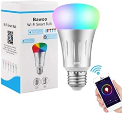
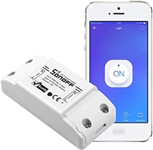
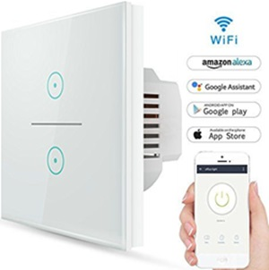
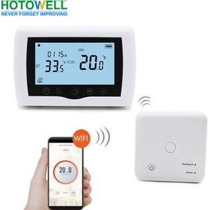
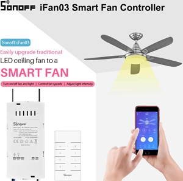
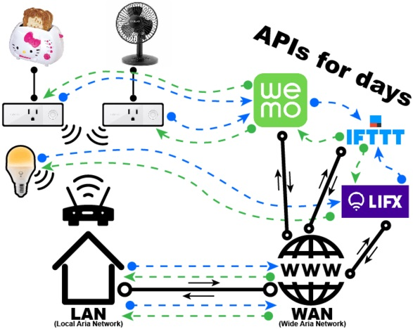

## Domótica

Una vez tenemos una forma de comunicación entre sistemas, sólo necesitamos ir integrando equipos de manera que interaccionen entre ellos, y nosotros podamos controlarlos.

Cuando estos equipos los tenemos en casa, decimos que tenemos una instalación domótica.

En este apartado, voy a contar unos sencillos ejemplos que he utilizado en casa. Los he utilizado para aprender sobre el tema y hay que entender, que son prototipos y pruebas de concepto pero que nos ayudan a entender el funcionamiento, y las posibilidades de este tipo de sistemas.

En los siguientes capítulos, veremos algunos ejemplos de sistemas más profesionales para trabajar la domótica.

### Sistemas comerciales

Existen en el mercado, multitud de elementos domóticos comerciales que podemos comprar por muy pocos euros:

* Bombillas que se activan con el móvil, incluso podemos cambiar el color de la luz que emite.

* Relés genéricos para controlar el encendido de dispositivos por wifi.

* Enchufes, que se controlan por wifi.
* Interruptores, para controlar cualquier dispositivo.

* Termostatos inalámbricos.

* Sistemas para controlar el ventilador desde el móvil.

* ...

Todos ellos, utilizan una aplicación en nuestro móvil que tras emparejarlos, nos permite controlar su funcionamiento. 

Al usar varios de ellos, ya nos encontramos con un primer problema:

* Cada fabricante usa una aplicación diferente.
* Incluso si tenemos equipos de un mismo fabricante pero comprados en diferentes fechas, podemos tener que usar diferentes aplicaciones.

La mayoría de estas aplicaciones nos permiten hacer que unos equipos interaccionen con otros, pero siempre que sean del mismo fabricante.

Por otro lado, algo que nos queda oculto es que aunque estemos junto a nuestro equipo, en la gran mayoría de los casos, los datos viajan hasta los servidores del fabricante y nuestras acciones también han de hacerlo, con lo que nuestros datos, y el uso de los distintos aparatos está moviéndose a través de internet. 

Esto cuando menos, debería de preocuparnos.

Esta imagen de Adafruit, refleja claramente el movimiento de nuestros datos:

Por todo ello, vamos a ver en primer caso, cómo hacer un sencillo sistema doméstico para entender su arquitectura.

En un segundo nivel veremos algunas distribuciones con un acabado más profesional, como Home Assistant.

También veremos de pasada un ejemplo con Google Assistant, para entender la complejidad y dónde están los problemas.

[La serie de vídeos sobre Domótica de Jorge Pascual](https://www.youtube.com/watch?v=IQLFgVg4TjM&list=PLFe_vhJmgS_51XlV_a5Atl1Re4fJA_b-d)son una excelente forma de aprender sobre este apasionante tema.

