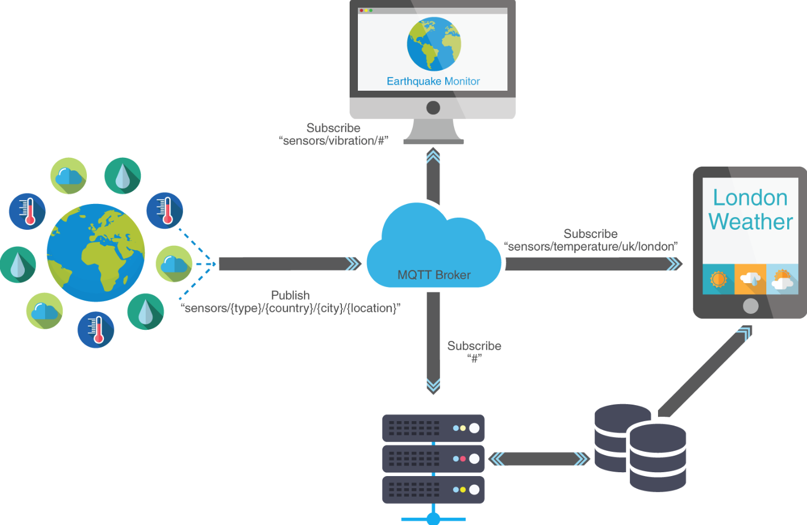

## MQTT

Vamos a ver uno de los protocolos más usados en los sistemas domóticos: el MQTT.

**MQTT** es un protocolo de comunicaciones entre dispositivos sencillo y ligero. Está pensado para que pueda funcionar en equipos con poca capacidad de cálculo pero sin limitar sus características. Podemos ver todos los detalles del protocolo en [su web](https://mqtt.org/) donde se encuentran las especificaciones y versiones de software que lo implementan.

Es un protocolo seguro que soporta autentificación y cifrado SSL, aunque podemos elegir no usar estas características.

También implementa distintos niveles de QoS (Quality of Service) que van desde un nivel 0 sin garantía de entrega de paquetes/notificaciones hasta un nivel máximo donde se asegura que todos los paquetes se reciben.

Todo ello hacen a este protocolo muy versatil y útil, capaz de funcionar entre grandes servidores y entre sistemas de microcontroladores.

Los equipos conetados por **MQTT** envían y reciben mensajes que está formados por un **Topic**, que es como una etiqueta con estructura arbórea y un mensaje o contenido.

Decimos que los topic tienen estructura arbórea porque podemos estructurarlos y ademas usar comodines ('+' y '#'). 

Por ejemplo si decimos que estamos interesados en el topic "/MeteoSalon/#" diremos que nos interesan todos los mensajes que empiecen por "/MeteoSalon/". 

Si decimos que queremos suscribirnos a los topics de la forma "/sensores/+/Temperatura" recibiremos todos los que tenga esa estructura sin importar si son "/sensores/10/temperatura" o "/sensores/9/temperatura" o cualquier otro con ese formato.

Todos los participantes pueden **publicar** mensajes y/o también se pueden **suscribir** a determinados topics, de manera que reciban los mensajes con ese topic.

Utiliza una arquitectura como la que se ve en la imagen, donde el sistema central actúa como **Broker**, recibiendo los mensajes de todos los equipos y notificando a aquellos que se han suscrito a topics.


Al ser un servicio sencillo actúa como transporte en sistemas más complejos. Por ejemplo podemos hacer que un equipo se susbriba todos los topics y los guarde en una base datos. 



Existen brokers accesibles (y gratuitos para cierto número de peticiones) a través de internet como por ejemplo el de [HiveMQ](https://www.hivemq.com/public-mqtt-broker/) o [el de Adafruit](https://io.adafruit.com/) o [este mismo de mosquitto org](https://test.mosquitto.org/). En [esta página](https://diyprojects.io/8-online-mqtt-brokers-iot-connected-objects-cloud/#.XwoEW9_ni-g) tenemos un listado.

## Instalación en Raspberry

Instalamos servidor **mosquitto** que actúa como broker en la Raspberry:

```sh
sudo apt install mosquitto
```

Ejecutamos mosquitto 


Si queremos que se arranque como servicio al iniciar la raspberry, hacemos

```sh
sudo systemctl enable mosquitto.service
```

Para publicar y recibir mensajes necesitaremos las herramientas cliente, que podemos instalar con

```sh
sudo apt install mosquitto-clients
```

Podemos suscribirnos a un tema/topic con el comando 

```sh
mosquitto_sub -h servidorMQTT -t Tema
``` 

Para publicar en un "Topic" un "Mensaje" (siempre son cadenas)

```sh
mosquitto_pub -h servidorMQTT -t "Topic" -m "Mensaje"
```

Para depurar el funcionamiento de mosquitto y ver los logs cuando funciona como servicio podemos usar [MQTT-Explorer](https://github.com/thomasnordquist/MQTT-Explorer). En [esta página](https://community.home-assistant.io/t/how-to-debug-mosquitto-mqtt/107709/20) y en [esta otra](http://www.steves-internet-guide.com/mosquitto-logging/) te explican cómo hacerlo.


## Configuración de puertos y acceso a ips

TODO: REVISAR

Fichero: /etc/mostquitto/mosquitto.conf

listener port IP 


## Ejemplos

Vamos a suscribirnos al topic "MeteoSalon/#", es decir a todos los mensajes que "cuelgen" del topic "MeteoSalon".
La opción **-v** es para que muestre más detalles sobre los mensajes

```sh
mosquitto_sub -h 192.168.1.200 -t "MeteoSalon/#" -v

```

y la aplicación quedará esperando hasta que se reciban mensajes con un topic compatible

Desde el mismo servidor podemos probar que funciona con la utilidad **mosquitto_pub**

```sh
mosquitto_pub -h 192.168.1.200 -t "MeteoSalon/led" -m "On"
```

En el servidor vemos la siguiente traza

```sh
1574598811: New connection from 192.168.1.200 on port 1883.
1574598811: New client connected from 192.168.1.200 as mosqpub/7375-raspberryp (c1, k60).
1574598811: Client mosqpub/7375-raspberryp disconnected.
```

y en la aplicación cliente

```sh
MeteoSalon/led On
```

### Ejemplo de arquitectura de topics

A medida que vamos añadiendo dispositivos y enviado más mensajes se puede complicar el árbol de topics

Para ellos es mejor usar una arquitectura. Por ejemplo esta [tomada del blog de ricardo veal](https://ricveal.com/blog/sonoff-mqtt/)

```sh
    state_topic: "stat/sonoff/1/POWER"
    command_topic: "cmnd/sonoff/1/POWER"
    availability_topic: "tele/sonoff/1/LWT"
```


Telemetría para que cuenten sus cosas ¿Por ejemplo los sensores?
Command para peticiones ¿request?
Stat para confirmaciones de estados


## Recursos

[Instalación de mosquito en la Raspberry](https://randomnerdtutorials.com/how-to-install-mosquitto-broker-on-raspberry-pi/)

https://randomnerdtutorials.com/micropython-mqtt-esp32-esp8266

https://geekytheory.com/tutorial-raspberry-pi-gpio-y-mqtt-parte-1
