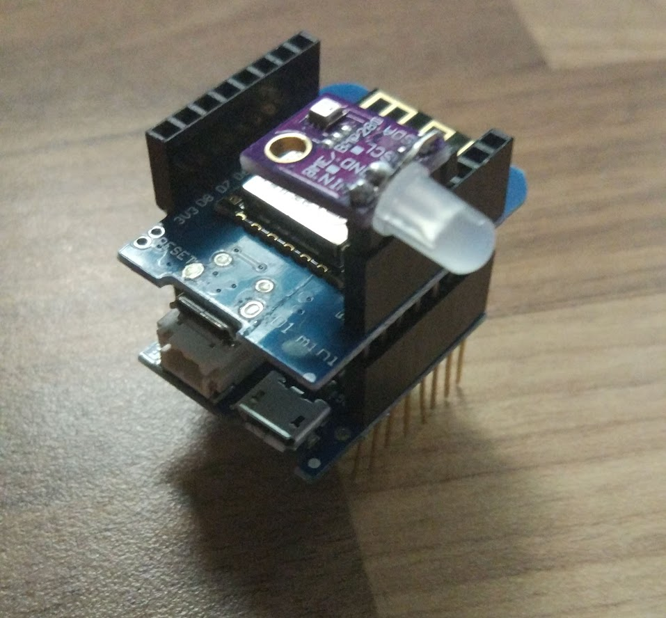
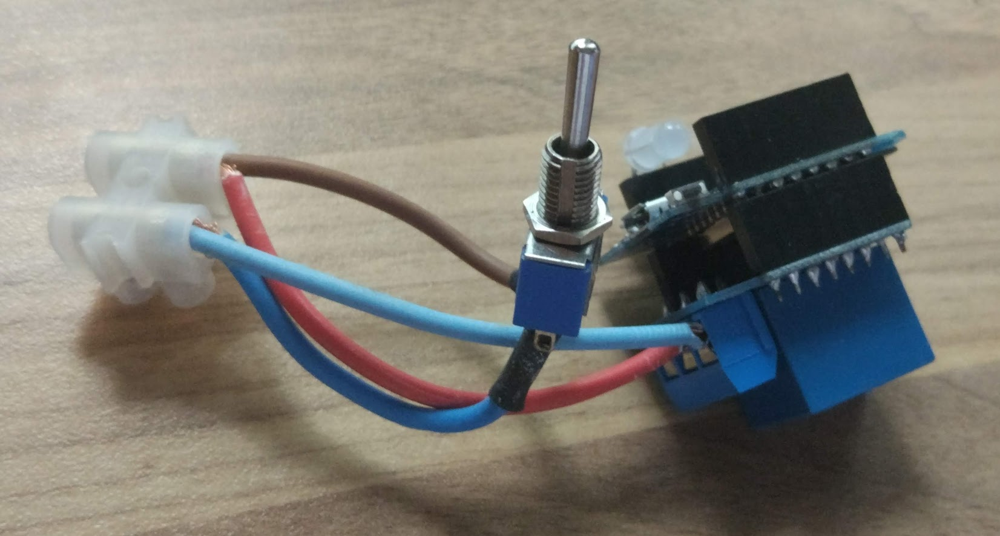
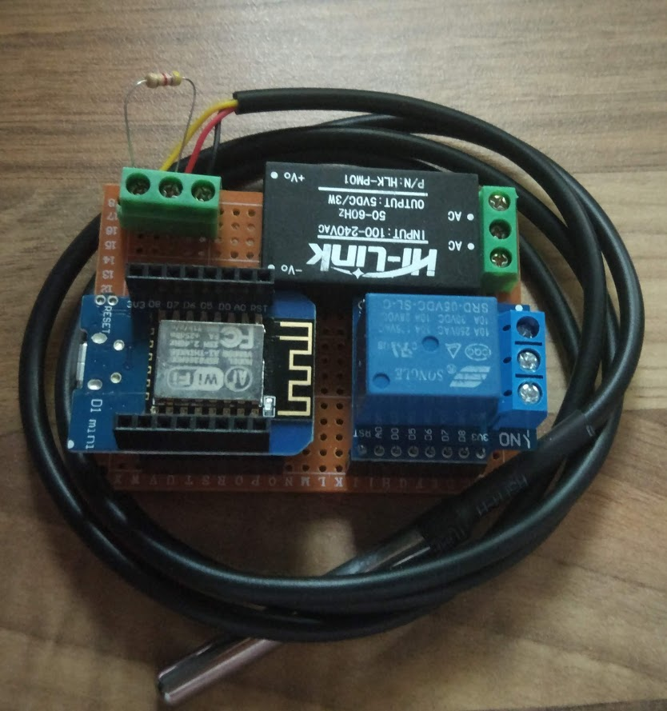

### Arquitectura del sistema doméstico: red de sensores y actuador

Vamos a montar un ejemplo muy sencilo:

* El centro de todo el sistema es una Raspberry Pi 3+ que actúa como broker MQTT (mosquitto) y donde se aloja [un programa en python](https://github.com/javacasm/micropythonTutorial/tree/master/codigo/controlCaldera) que implenta:
    * Un bot de telegram que muestra los datos y permite un control manual del sistema. 
    * Los datos de los distintos sensores se guardan en un fichero de texto. 
    * Dentro de este programa están las programadas las reglas de actuación: if TemperaturaSalon<2 -> envía EncideCaldera
* Sensores de temperatura, humedad y presión (sensor BME280). Implementados en un Wemos D1 mini (ESP12E) y [programados en micropython](https://github.com/javacasm/micropythonTutorial/tree/master/codigo/MeteoSalon). Incluyen un led RGB para mostrar el estado y para depuración del sistema. Cada cierto tiempo envian un mensaje MQTT con los valores de temperatura, humedad, presión y voltaje de la batería. Escuchan los mensajes sobre el color del led. 
    Uno de estos sensores se usa como centralita y muestra en todo momento el estado de encendido de la caldera, así como un "heartbeat" de que todo el sistema está funcionando.

* Actuador de la caldera: un Wemos D1 mini controla un relé con el que se enciende/apaga la caldera de la casa. También se ha conectado un led RGB para mostrar el estado del sistema. Se ha incluído un interruptor para poder puentar manualmente la salida del relé y así poder controlarla en caso de un problema de funcionamiento.

* Sensor de temperatura del circuito de calefacción: (en estado de prototipo) se trata de un equipo que mide con una sonda DS18x20 la temperatura del circuito de calefacción, enviando el valor por MQTT. Se le ha dotado de un relé que en futuras versiones encendería/apagaria la caldera.

En este sistema hemos evitado el problema de la conexión a internet usando un bot de telegram: nuestros datos no pasarán por los ordenadores del fabricante de los equipos pero sí que salen de nuestro casa.

Vamos a ver ahora una implementación completamente profesional, y al mismo tiempo Open Source de un sistema de control doméstico.

