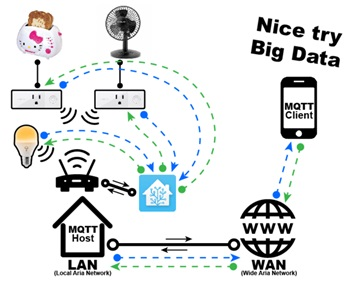
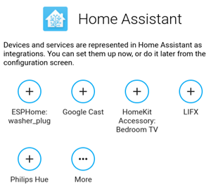
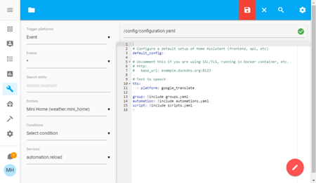

# Domótica Profesional

A medida que vamos integrando distintos equipos en nuestra instalación domótica, vemos que existen multitud de fabricantes, con un gran número de protocolos, distintos sistemas de comunicaciones (wifi, bluetooth, RF433, infrarrojos, ...), y resulta totalmente imposible implementarlos todos.

Afortunadamente, existen distribuciones disponibles que además cuentan con licencias Open Source. 

Una de las más usadas es [Home Assistant](https://home-assistant.io), que actúa como un Smart Home Hub, o concentrador de dispositivos domésticos inteligentes. 

Soporta más de 1.400 equipos distintos y sus correspondientes protocolos y el número va constantemente en aumento. Además, nos permite integrar nuestros equipos DIY (Arduino, Esp, etc...).

La gran ventaja a mi juicio es, que todos los datos se transmiten ¡únicamente entre los dispositivos y nuestro equipo!, sin pasar por los servidores de los fabricantes. Si en un momento dado queremos acceder desde fuera de nuestra red local lo haremos a nuestro propio servidor.

Además, nos va a permitir crear complejos script para automatizar el funcionamiento de nuestro sistema.

En su propia página podemos ver [ejemplos de montajes](https://www.home-assistant.io/cookbook/)

### Domótica con Home Assistant

Vamos a seguir su propia [guía de instalación](https://www.home-assistant.io/getting-started/) (También podíamos haber seguido la [estupenda guía de Adafruit](https://learn.adafruit.com/set-up-home-assistant-with-a-raspberry-pi?view=all)

Se recomienda el siguiente hardware:

* Raspberry Pi 4 con 2GB de RAM.
* Tarjeta de 32GB.
* Lector de tarjetas SD.
* Conexión directa con cable Ethernet. Aunque funciona con wifi, el rendimiento es mucho mayor con cable.

Descargamos la imagen adecuada a nuestro equipo desde su [web](https://www.home-assistant.io/hassio/installation/).

Usaremos [Balena Etcher](https://www.balena.io/etcher/) o el [propio Raspberry Pi Imager](https://www.raspberrypi.com/software/) para grabar la imagen en la tarjeta SD.

Ponemos la SD en la Raspberry y la arrancamos. Se descarga la última versión del software y se actualizará, lo que puede tardar unos 15-20 minutos.

Cuando haya terminado, podemos conectarnos a **http://homeassistant.local:8123** o a **http://homeassistant:8123**

Ahora configuramos nuestra cuenta, las unidades de medida y la ubicación del sistema (para dar la información meteorológica).

En este punto, el sistema comenzará a descubrir algunos de los dispositivos automáticamente, otros tendremos que añadirlos manualmente pulsando el botón "+". En Home Assistant, se llaman **integraciones**.

Organizaremos los dispositivos en **Áreas**, que serían el equivalente a las habitaciones.

El siguiente paso es crear las **automatizaciones**, que son las distintas interacciones entre ellos.

Definiremos su nombre, a qué dispositivos afecta, y cuál es el **trigger** o evento que disparará su ejecución. En [esta página](https://www.home-assistant.io/getting-started/automation/) puede leer mucho más sobre automatización.

Como siempre, tenemos la alternativa de hacer una [instalación manual](https://www.home-assistant.io/docs/installation/raspberry-pi/) sobre nuestro sistema operativo.

También podemos definir **Detectores de presencia** que activarán distintas acciones, como puede ser por ejemplo, que nuestro móvil se conecte al router.

Si queremos personalizar nuestra instalación, por ejemplo usando nuestro propio broker MQTT, podemos hacerlo siguiendo la [siguiente guía](https://learn.adafruit.com/set-up-home-assistant-with-a-raspberry-pi/mqtt-setup)

¿Y qué ocurre si nuestro dispositivo no está entre los soportados o se trata de un dispositivo DIY? pues siempre podremos añadir en el [**Configurador** como vemos en este tutorial](https://learn.adafruit.com/set-up-home-assistant-with-a-raspberry-pi/configuration-yaml) donde tendremos que crear un fichero yaml de configuración.

