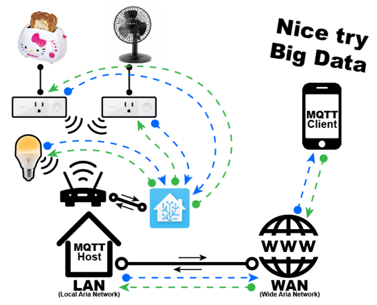

# Home automation

A medida que usando distintos equipos vemos que existen multitud de fabricantes, con un gran número de protocolos, de distintos sistemas de comunicaciones (wifi, bluetooth, RF433, infrarrojos, ...), y resulta totalmente imposible implementarlos todos.

Afortunadamente existen 

# Domótica con Home Assistant

https://learn.adafruit.com/set-up-home-assistant-with-a-raspberry-pi?view=all

[Instalacion de la imagen](https://home-assistant.io/hassio/installation/) usando Balena Etcher https://www.balena.io/etcher/

[Instalacion manual](https://www.home-assistant.io/docs/installation/raspberry-pi/)

[Conexión con Google Assistant](https://www.home-assistant.io/addons/google_assistant/)

[Getting started with Home Assistant](https://randomnerdtutorials.com/getting-started-with-home-assistant-on-raspberry-pi/#more-43192)

https://www.hackster.io/ahmedibrrahim/smart-home-automation-iot-using-raspberry-pi-and-python-47fb62

http://mbrobotics.es/blog/homekit-raspberry-pi-2-v2/

zigbee2mqtt Pasarele zigbee mqtt
integraci'on con Home Assistant https://www.zigbee2mqtt.io/integration/home_assistant.html
