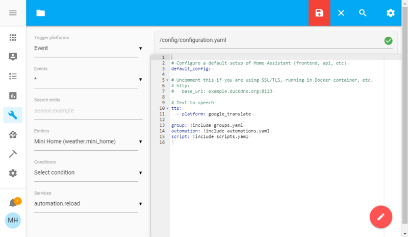

# Home automation

A medida que vamos integrando distintos equipos en nuestra instalación domótica, vemos que existen multitud de fabricantes, con un gran número de protocolos, distintos sistemas de comunicaciones (wifi, bluetooth, RF433, infrarrojos, ...), y resulta totalmente imposible implementarlos todos.

Afortunadamente existen distribuciones disponibles que además con licencias Open Source. 

Una de las más usadas en [Home Assistant](https://home-assistant.io), que actúa como un Smart Home Hub, o concentrador de dispositivos domésticos inteligentes. 

Soporta más de 1400 equipos distintos y sus correspondientes protocolos y el número va consantemente en aumento. Además nos permite integrar nuestros equipos DIY (arduino, esp, etc...)

La gran ventaja a mi juicio es que todos los datos se transmiten ¡únicamente entre los dispositivos y nuestro equipo!, sin pasar por los servidores de los fabricantes. Si en un momento dado queremos acceder desde fuera de nuestra red local lo haremos a nuestro propio servidor.

Además nos va a permitir crear complejos script para automatizar el funcionamiento de nuestro sistema.

En su propia página podemos ver [ejemplos de montajes](https://www.home-assistant.io/cookbook/)

### Domótica con Home Assistant

Vamos a seguir su propia [guía de instalación](https://www.home-assistant.io/getting-started/) (También podíamos haber seguido la [estupenda guía de Adafruit](https://learn.adafruit.com/set-up-home-assistant-with-a-raspberry-pi?view=all)

Se recomienda el siguiente hardware:
* Raspberry Pi 4 con 2Gb de RAM
* Tarjeta de 32Gb
* Lector de tarjetas SD
* Conexión directa con cable Ethernet. Aunque funciona con wifi, el rendimiento es mucho mayor con cable.

Descargamos la imagen adecuada a nuestro equipo desde su [web](https://www.home-assistant.io/hassio/installation/)

Usaremos [Balena Etcher](https://www.balena.io/etcher/) o el [propio Raspberry Pi Imager](https://www.raspberrypi.org/downloads/) para grabar la imagen en la tarjeta SD

Ponemos la SD en la Raspberry y la arrancamos. Se descargará la última versión del software y se actualizará lo que puede tardar unos 15-20 minutos.

Cuando haya terminado podemos conectarnos a **http://homeassistant.local:8123** o a **http://homeassistant:8123**

Ahora configuramos nuestra cuenta, las unidades de medida, la ubicación del sistema (para dar la información meteorológica)

En este punto el sistema comenzará a descubrir algunos de los dispositivos automáticamente, otros tendremos que añadirlos manualmente pulsando el botón "+". En Home Assistant se llaman **integraciones**.

Organizaremos los dispositivos en **Áreas** que serían el equivalente a las habitaciones

El siguiente paso es crear las **automatizaciones** que son las distintas interacciones entre ellos.

Defineremos su nombre a qué dispositivos afecta y cual es el **trigger** o evento que dispará su ejecución. En [esta página](https://www.home-assistant.io/getting-started/automation/) puede leer mucho más sobre automatización

Como siempre tenemos la alternativa de hacer una [instalacion manual](https://www.home-assistant.io/docs/installation/raspberry-pi/) sobre nuestro sistema operativo.

También podemos definir **Detectores de presencia** que activarán distintas acciones, como puede ser por ejemplo que nuestro móvil se conecte al router.

Si queremos personalizar nuestra instalación, por ejemplo usando nuestro propio broker MQTT podemos hacerlo siguiente la [siguiente guía](https://learn.adafruit.com/set-up-home-assistant-with-a-raspberry-pi/mqtt-setup)

¿Y qué ocurre si nuestro dispositivo no está entre los soportados o se trata de un dispositivo DIY? pues siempre prodemos añadir en el [**Configurador** como vemos en este tutorial](https://learn.adafruit.com/set-up-home-assistant-with-a-raspberry-pi/configuration-yaml) donde tendremos que crear un fichero yaml de configuración.

### Recursos

Para aprender más:

* [Conexión con Google Assistant](https://www.home-assistant.io/addons/google_assistant/)

* [Getting started with Home Assistant](https://randomnerdtutorials.com/getting-started-with-home-assistant-on-raspberry-pi/#more-43192)

* [Automation con python](https://www.hackster.io/ahmedibrrahim/smart-home-automation-iot-using-raspberry-pi-and-python-47fb62)

