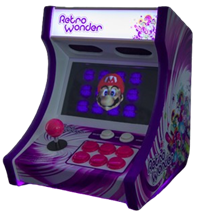

## Jugando con Raspberry Pi: RetroPie o Recalbox

Una de las aplicaciones más comunes de Raspberry es su uso como una bartop o máquina recreativa de sobremesa, donde podemos jugar a juegos antiguos de tipo _Arcade_. Suelen incluir joystick y botones como las máquinas reales y una decoración vistosa.

**RetroPie** es una distribución para Raspberry Pi que nos permite ejecutar una gran cantidad de emuladores, configurar los mandos y gestionar las ROMs de los juegos. 

Está basada en Raspbian, a la que añaden [EmulationStation](EmulationStation.org) y [RetroArch](http://retroarch.com/).

**recalbox** es otro sistema operativo, muy parecido a RetroPie y que también usa [EmulationStation](EmulationStation.org) y [RetroArch](http://retroarch.com/).

Ambos son sistemas operativos bastante similares en cuanto a características y prestaciones pero mientras *RetroPie* es mucho más personalizable, *recalbox* nos proporciona una documentación mucho más detallada y extensa, que nos facilita todo el proceso de la instalación y configuración.

### Instalación de recalbox

Podemos instalar recalbox desde RPI Imager. Seleccionamos "Emulation and g./images/ame OS"  como categoría de Sistema operativo:

Y ya tendremos la opción de elegir recalbox para que se instale en la tarjeta SD:

A partir de este punto, la instalación es como la de cualquier otro sistema operativo.
### Instalación de RetroPie

El proceso de instalación no puede ser más sencillo, aunque no es automático como el de recalbox:

1. Descargamos la imagen de [RetroPie](https://retropie.org.uk/download).
2. Tras descomprimirla, la grabamos en una tarjeta SD, por ejemplo con [Etcher](https://www.balena.io/etcher/).
3. Arrancamos y seguimos el proceso de configuración.
4. Si tenemos conectado algún mando nos pedirá que lo configuremos:

5. Al arrancar, aparecerá solo la opción de ejecutar RetroPie que es donde configuramos todo. Cuando añadamos más juegos, irán apareciendo los restantes emuladores.
6. Dentro de RetroPie, configuraremos el acceso al Wifi.
7. En "RetroPie Setup", seleccionamos "Configuration Tools" y ahí, activamos "Samba" para poder acceder a ficheros externos y así, podremos acceder a él desde otros equipos, que lo verán como "RetroPie".
8. Ahora ya podemos descargar los juegos y copiarlos vía Samba. Por ejemplo, podemos descargar [BladeBuster](http://magpi.cc/bladebuster), y copiamos el fichero zip sin descomprimir en "RetroPie".
9. Al entrar de nuevo veremos que tenemos disponible "NES", y ahí nuestro juego.

El tema de los ficheros ROMs de juegos originales es complicado: a pesar de que la mayoría de los juegos ya no se venden, es ilegal el utilizarlos sin haberlos comprado.

Existen muchas alternativas legales como podemos ver en este [post de los foros de RetroPie](https://retropie.org.uk/forum/topic/10918/where-to-legally-acquire-content-to-play-on-retropie).

También podemos hacer una [instalación manual](https://retropie.org.uk/docs/Manual-Installation/) siguiendo las instrucciones de su página web. 
