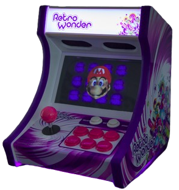
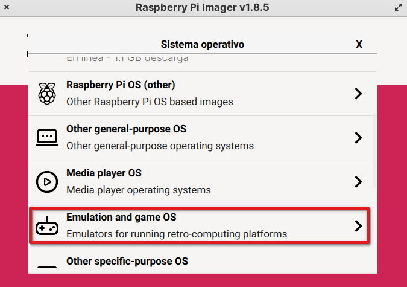
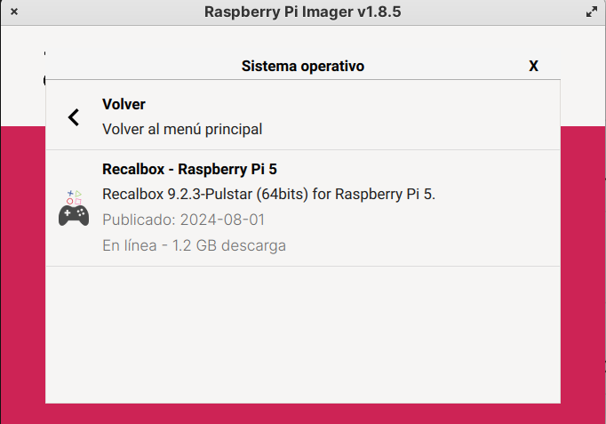
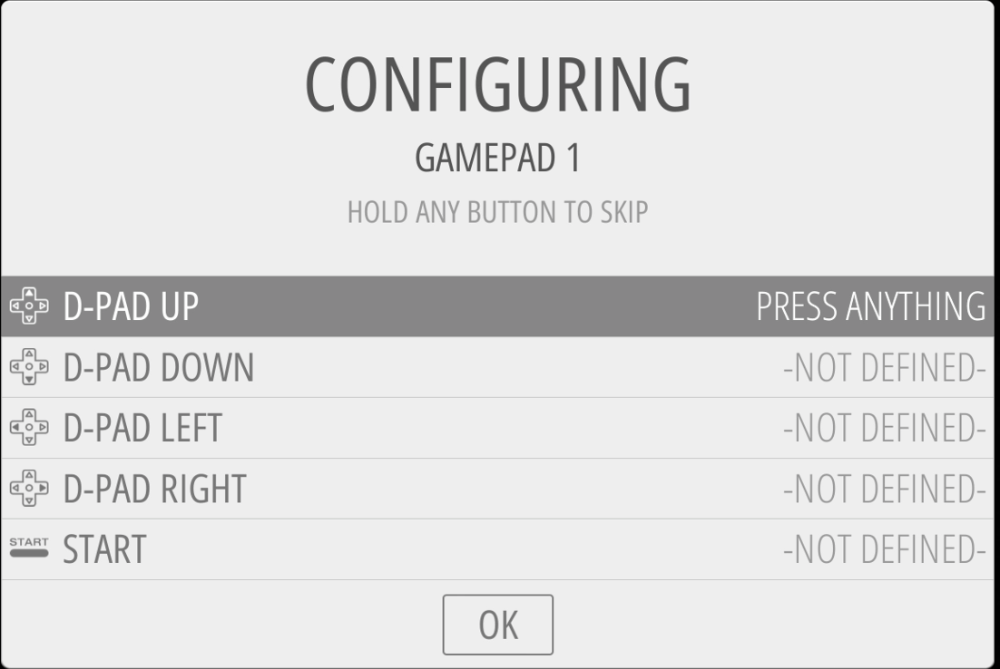

## Jugando con Raspberry Pi: Retropie o Recalbox

Una de las aplicaciones más usadas de Raspberry es usarla como una bartop o máquina recreativa de sobremesa donde podemos jugar a juegos antiguos de tipo arcade. Suelen incluir joystick y botones como las máquinas reales y una decoración vistosa.

**Retropie** es una distribución para Raspberry que nos permite ejecutar una gran cantidad de emuladores, configurar los mandos y gestionar las ROMs de los juegos. 

Está basada en Raspbian, a la que añaden [EmulationStation](https://emulationstation.org/) y [RetroArchs](http://retroarch.com/)

**Recalbox** es otro sistema operativo, muy parecido a Retropie y que también usa [EmulationStation](https://emulationstation.org/) y [RetroArch](https://retroarch.com/)

### Instalación de recalbox

Podemos instalar recalbox desde RPI Imager. Seleccionamos "Emulation and game OS"  como categoría de Sistema operativo 

Y ya tendremos la opción de elegir Recalbox para que se instale en la tarjeta SD

A partir de este punto ya instalación es como la de cualquier sistema operativo
### Instalación de RetroPie

El proceso de instalación no puede ser más sencillo, aunque no es automático como el de recalbox:

1. Descargamos la imagen de [Retropie](https://retropie.org.uk/download)
2. Tras descomprimirla, la grabamos en una tarjeta SD, por ejemplo con [Etcher](https://www.balena.io/etcher/)
3. Arrancamos y seguimos el proceso de configuración
4. Si tenemos conectado algún mando nos pedirá que lo configuremos

5. Al arrancar aparecerá solo la opción de ejecutar Retropie que es donde configuramos todo. Cuando añadamos más juegos irán apareciendo los restantes emuladores.
6. Dentro de Retropie configuraremos el acceso al Wifi
7. En "RetroPie Setup" seleccionamos "Configuration Tools" y ahí activamos "Samba" para poder acceder a ficheros externos y podremos acceder a él desde otros equipos, que lo verán como "Retropie"
8. Ahora ya podemos descargar los juegos y copiarlos vía Samba. Por ejemplo podemos descargar [BladeBuster](http://magpi.cc/bladebuster) y copiamos el fichero zip sin descomprimir en "Retropie".
9. Al entrar de nuevo veremos que tenemos disponible "NES" y ahí nuestro juego.

El tema de los ficheros ROMs de juegos originales es complicado: a pesar de que la mayoría de los juegos ya no se venden, es ilegal el utilizarlos sin haberlos comprado.

Existen muchas alternativas legales como podemos ver en este [post de los foros de retropie](https://retropie.org.uk/forum/topic/10918/where-to-legally-acquire-content-to-play-on-retropie)

También podemos hacer una [instalación manual](https://retropie.org.uk/docs/Manual-Installation/) siguiendo las instrucciones de su página web. 
