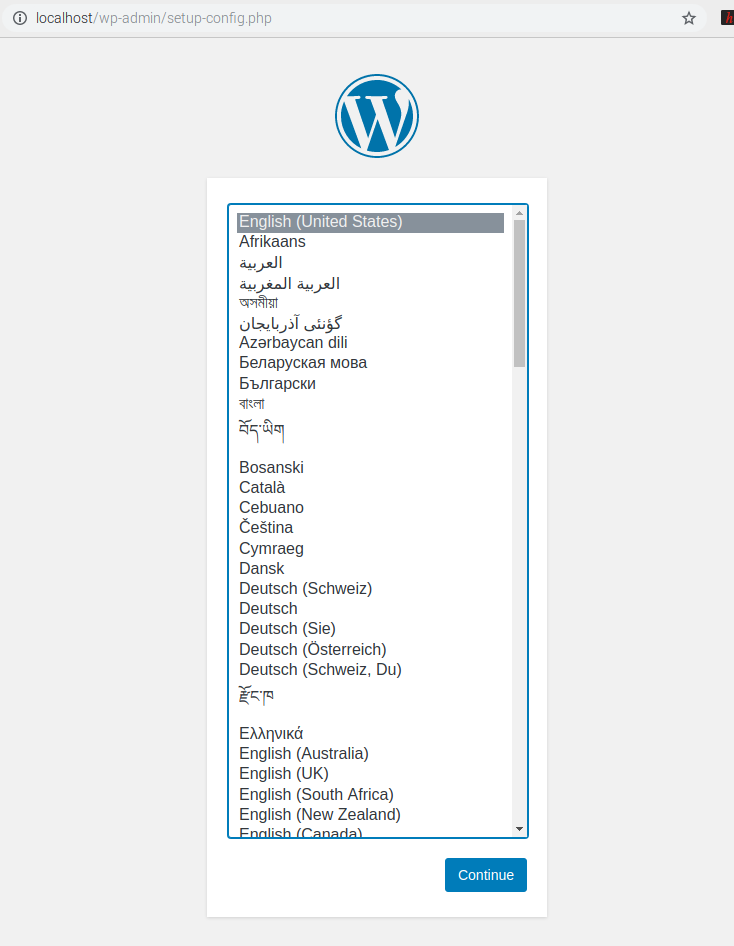
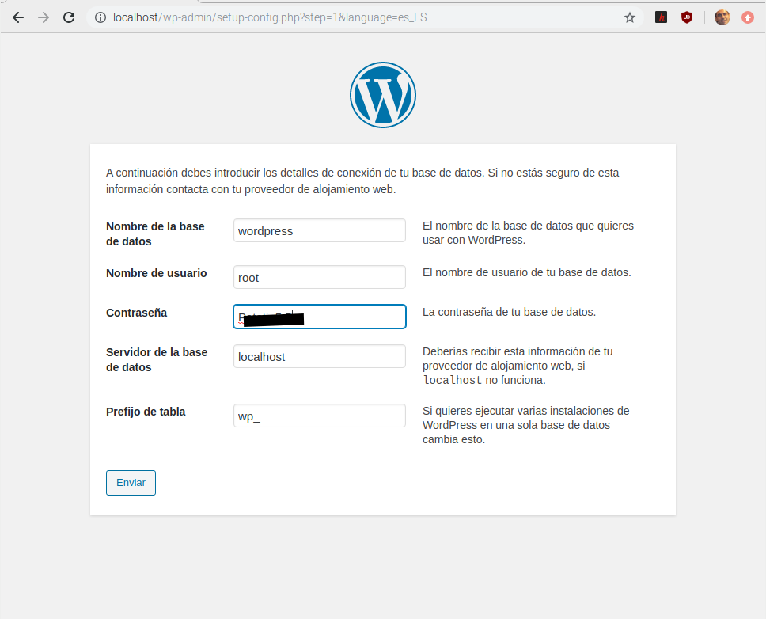
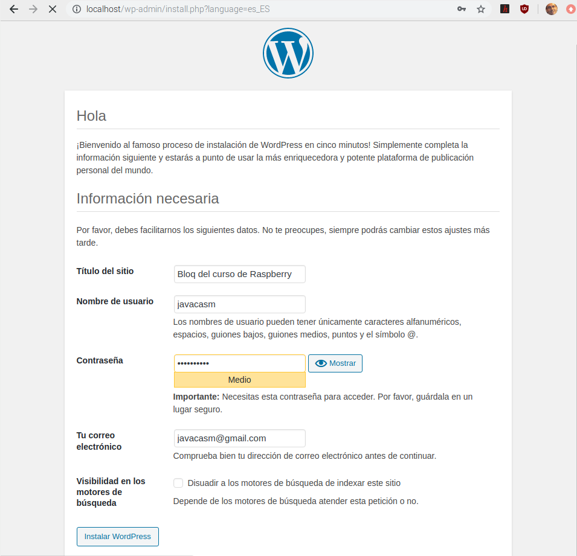

## Instalación de servidor Web (LAMP)

Vamos a instalar un típico servidor servidor LAMP: Linux, Apache, MariaDB (originariamente MySQL) & PHP que es la base de la mayoría de los servidor web que hay en internet.

Para ver que funciona y es compatible instalaremos una instacia del conocido gestor de contenidos Wordpress

1. Instalación de Apache

    Vamos a instalar el servidor Web propiamente dicho. Para instalar el servidor apache 
    ```sh
    sudo apt install apache2 -y
    ```
    Ahora hacemos un test para ver si está bien instalado y funcionando para lo que abriremos un navegador en la propia Raspberry a la dirección local http://localhost

    ```
    http://localhost
    ```

    

2. Acceso remoto

    Vamos a probar ahora si podemos acceder desde otro ordenador. Para ello vamos a ver cuál es nuestra dirección IP. Ponemos en la terminal:

    ```sh
    hostname -I
    ```
   
    Y el resultado será nuestra IP.
    
    Ahora nos conectamos con un navegador desde otro ordenador con la ip resultante http://192.168.1.36

    Si todo va bien veremos la misma página de antes.

3. Cambiar la página inicial

    El contenido HTML del sevidor se encuentra en **/var/www/html/** y por defecto se envía el fichero **index.html**

    

    Vemos que el fichero es propiedad de root, con lo que necesitamos usar sudo para modificarlo. Si controlas HTML puede modificarlo con
    ```sh
    sudo geany index.html
    ```
4. Instalación de PHP

    Una gran parte del código que se ejecuta en el servidor web está escrito en  PHP, con lo que necesitamos instalarlo. Lo hacemos con
    ```sh
    sudo apt install php -y
    ```
    Para probar que funciona vamos a crear un fichero index.php (en el directorio raiz de www)
    ```sh
    sudo geany index.php
    ```
    con el siguiente contenido:
    ```php
    <?php echo date('Y-m-d H:i:s'); ?>
    </br>
    <?php echo "hola Apache y php"; ?>
    </br>
    <?php phpinfo(); ?>
    ```
    Para probar que funciona abriremos en un navegador la página http://192.168.1.36/index.php (ahora añadimos el nombre del fichero ya que por defecto se busca el fichero index.html y de esta manera forzamos a se muestre el fichero _index.php_)

    Si todo va bien veremos el mensaje "hola Apache y php", la hora y fecha actual y un montón de información sobre php y los módulos instalados en el navegador

5. Instalación de la base de datos

    Vamos a instalar ahora la base de datos con el comando
    ```sh
    sudo apt-get install mariadb-server-10.3
    ```
    Instalamos el paquete de conexión php/MariaDB
    ```sh
    sudo apt install php-mysql
    ```
    y rearrancamos el servidor
    ```sh
    sudo service apache2 restart
    ```
6. Wordpress

    Wordpress es uno de los gestores de contenidos de codigo abierto más utilizados. 
    Vamos a descargar un paquete con la 'ultima versión y lo vamos a poner en la carpeta de contenidos de www con
    ```sh
    sudo wget http://wordpress.org/latest.tar.gz
    ```
    Borramos los ficheros index.* con
    ```sh
    sudo rm index.*
    ```
    Lo descomprimimos  con
    ```sh
    sudo tar xvf latest.tar.gz
    ```
    Borramos el fichero comprimdo
    ```sh
    sudo rm  latest.tar.gz
    ```
    y movemos todo el contenido a la caperta raiz del servidor
    ```sh
    sudo mv wordpress/* .
    ```
    Wordpress tiene una estructura compleja que podemos ver con el comando
    ```sh
    tree
    ```
    Por tema de seguridad todos los ficheros deben pertenecer al usuario www-data
    ```sh
    sudo chown -R www-data: .
    ```
7. Configuración de la base de datos

    Vamos a ejecutar el asistente para la instalación segura de la base de datos
    ```sh
    sudo mysql_secure_installation
    ```
    Inicialmente no tiene contraseña pero debemos poner una

    Después contestaremos 'Y' a todas las preguntas para una máxima seguridad

    Ahora vamos a crear la base de datos que necesita Wordpress
    ```sh
    sudo mysql -uroot -p
    ```
    Ponemos nuestra contraseña y ahora creamos la base de datos wordpress con

    ```sh
    create database wordpress;
    GRANT ALL PRIVILEGES ON wordpress.* TO 'root'@'localhost' IDENTIFIED BY 'TUcontraseña';
    FLUSH PRIVILEGES;
    exit
    ```
    

8. Configuración de Wordpress

    Volvemos a entrar con un navegador en nuestro servidor con http://localhost

    Veremos una pagina para seleccionar el idioma

    

    Ahora rellenamos los datos de acceso a la base de datos 

    

    Configuramos los datos del usuario del blog

    

    Y listo!!!

    
