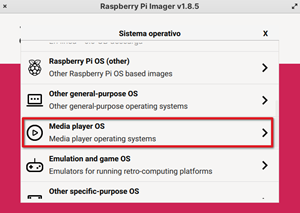
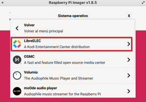
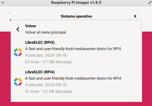

## Raspberry Pi como centro multimedia

Otro uso muy extendido de Raspberry es utilizarla como centro multimedia. En mi caso, una Raspberry Pi 3 colocada tras la TV ha servido como gestor y reproductor multimedia, con todo lo necesario para poder reproducir tanto vídeo, como música o imágenes.

Existen varias distribuciones como LibreElec, openElec, OSMC, xbian,... todas muy similares

De todas ellas, LibreElect viene incluida directamente en RPI Imager y la instalación es directa. Seleccionamos la categoría  "Media player OS" RPI Imager.

	

Y dentro de ella, el sistema operativo en concreto que queramos usar. Personalmente, te recomiendo LibreELEC:

Que tiene versiones específicas para los distintos modelos de Raspberry Pi:

La mayoría de ellas sí incluyen un software llamado _Kodi_, que por supuesto, también podemos instalar como aplicación en cualquier distribución.
