## Raspberry como centro multimedia: Kodi / libreelec

La distribución LibreELEC está pensada para usar nuestra Raspberry como un centro multimedia, conectándola a un Televisor y con todo lo necesario para poder reproducir tanto vídeo, música o imágenes.

El centro de la distribución es Kodi, un reproductor multimedia muy avanzado y por su naturaleza modular podemos adaptar para todo tipo de contenidos. Además podemos personalizarlo instalando Add-ons (complementos) para reproducir y para obtener nuestros contenidos.

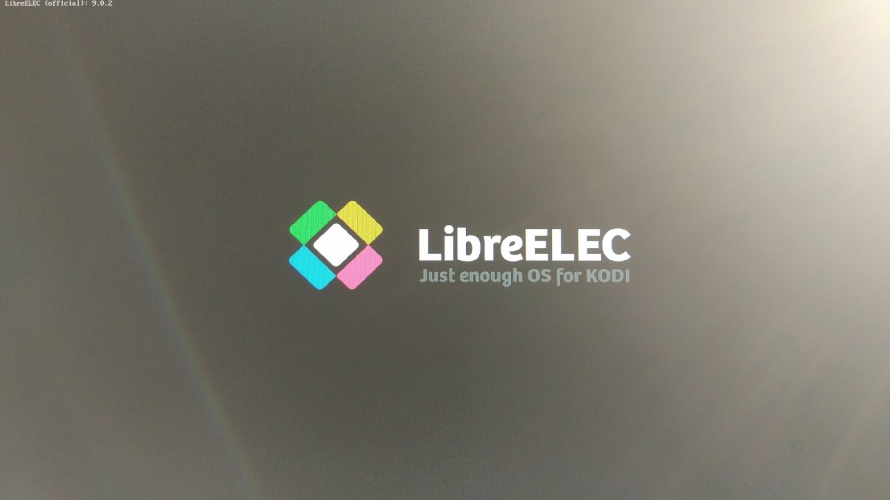

Una vez instalada la distribución LibreELEC la seleccionamos en el arranque y entramos directamente a Kodi
 
 La primera vez tendremos que seleccionar el idioma
 
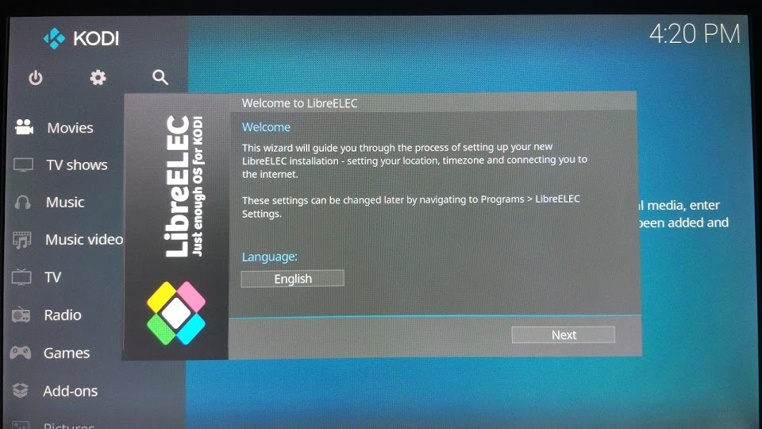

Vemos como el interface está perfectamente adaptado a pantallas grandes y no necesitamos un teclado físico, si no que podemos usar un simple puntero/ratón.

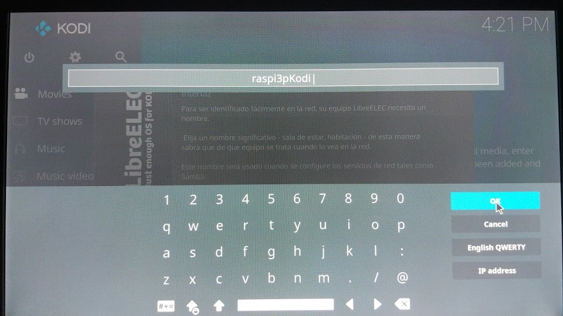

Damos un nombre al equipo y configuramos el acceso remoto por ssh (para acceder desde otro equipo) y por samba (para poder acceder a carpetas compartidas por equipo Windows o NAS), para lo que nos solicitará una contraseña.

Después de ésto se actualizará y estará listo para usarlo

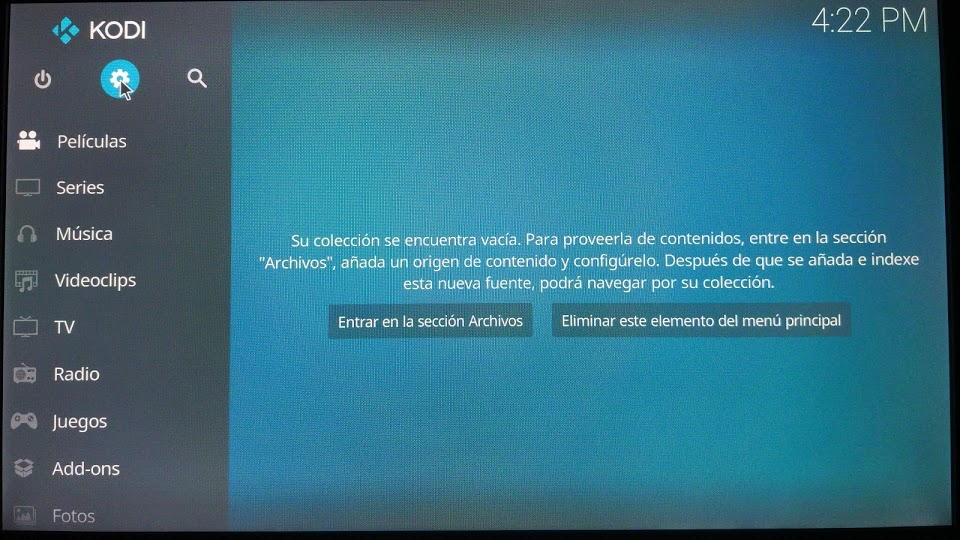

Para añadir las carpetas locales o remotes donde se almacenan los contenidos, entramos en el tipo que queramos (Películas en este ejemplo) y pulsamos sobre "Entrar en la sección de Archivos"

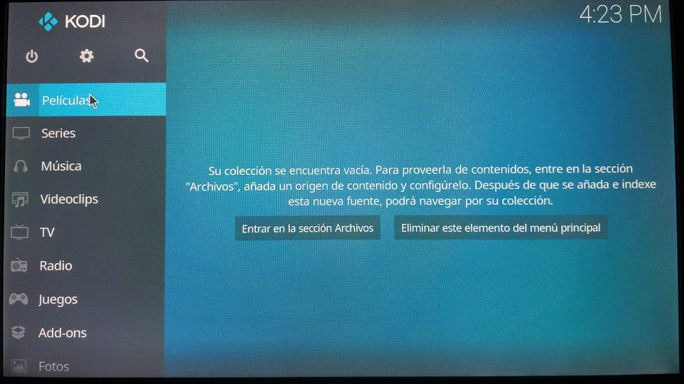

Pulsamos en "Añadir vídeos"

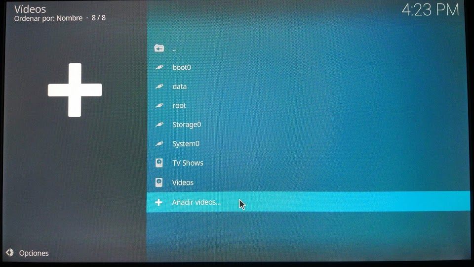

Pulsamos "Buscar"

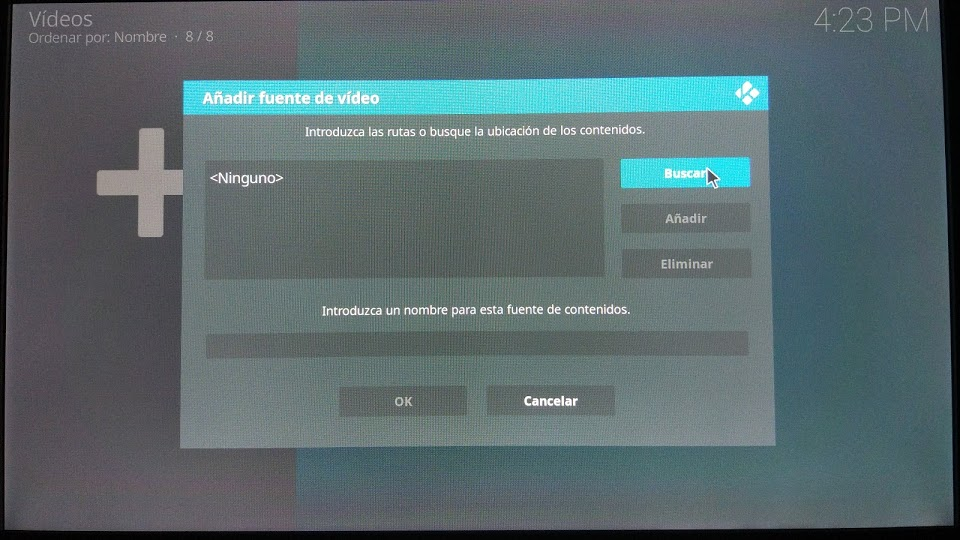

Y luego los buscamos en las opciones de red que nos aparece o pulsamos sobre "Añadir sitio de red" para rellenar los datos de la ip, nombre de carpeta, usuario y password

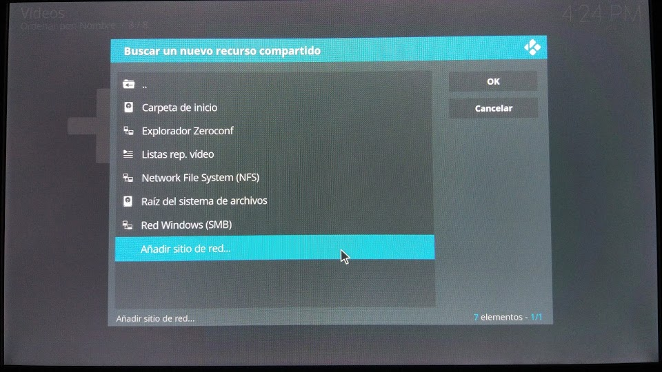

Aceptamos y ya debemos ver la carpeta para incluirla entre  los contenidos multimedia.

También podemos añadir Add-ons entrando en la sección Add-ons y en Descargar. Vamos a ver cómo instalar el Add-ons de youtube

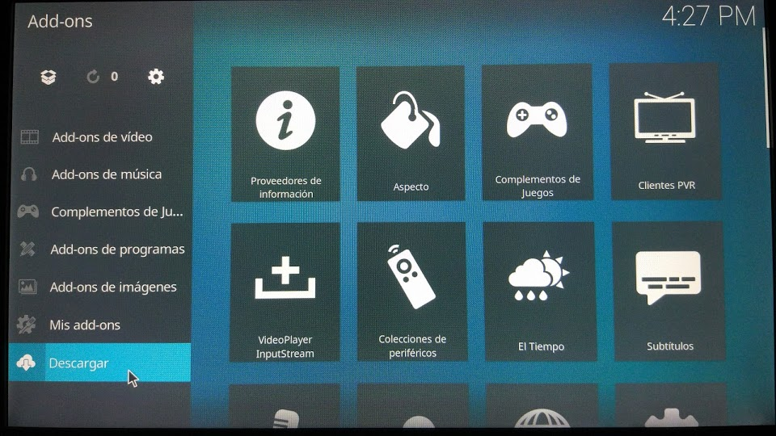

Seleccionamos el tipo (vídeo en nuestro caso) y buscamos el que queramos

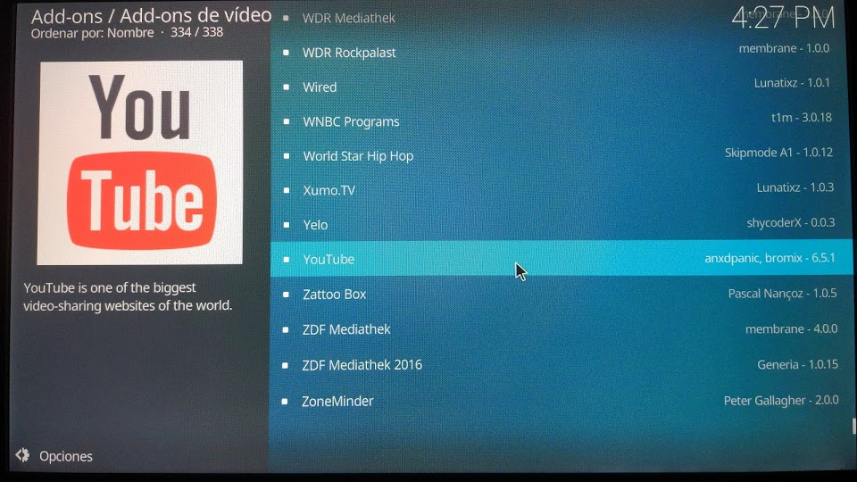

Pulsamos instalar y nos dirá si necesitamos instalar algunos complementos de los que depende. Aceptamos y los tendremos disponibles como nueva fuentes de contenido multimedia.

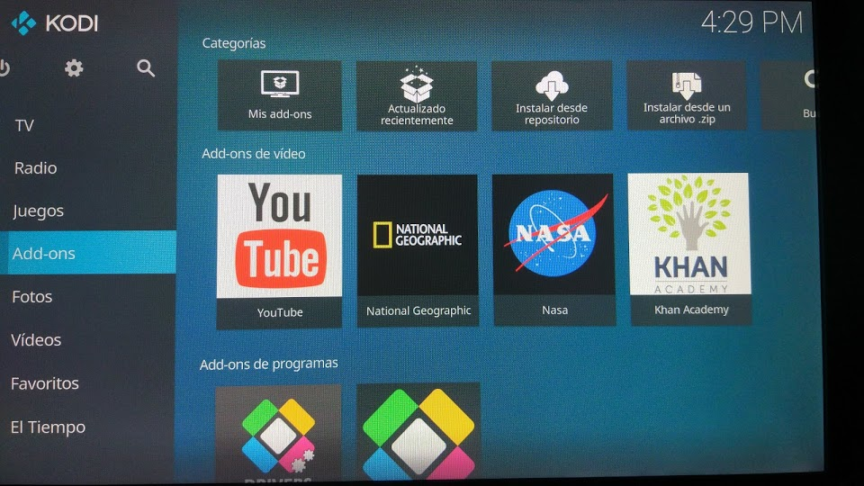

Ahora a disfrutar de nuestro reproductor multimedia

### Referencias

https://libreelec.tv/2019/01/libreelec-leia-v8-95-2-beta/
https://www.raspberrypi.org/magpi/best-raspberry-pi-media-players/
