##  Kodi 

La aplicación que actúa como centro de la distribución multimedia es  Kodi, un reproductor multimedia muy avanzado y por su naturaleza modular, podemos adaptar para todo tipo de contenidos. Además, podemos personalizarlo instalando Add-ons (complementos), para reproducir y para obtener nuestros contenidos.

(Disculpad la calidad de las imágenes, son fotos y no capturas debido a que no se pueden hacer con esta distribución).

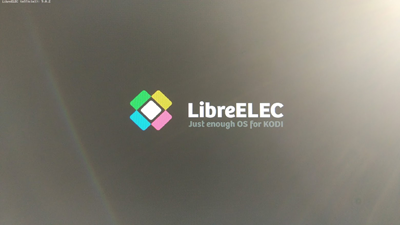

Una vez instalada la distribución LibreELEC, la seleccionamos en el arranque y entramos directamente a Kodi.
 
 La primera vez tendremos que seleccionar el idioma
 
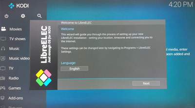

Vemos como la interface está perfectamente adaptada a pantallas grandes y no necesitamos un teclado físico, si no que podemos usar un simple puntero/ratón.

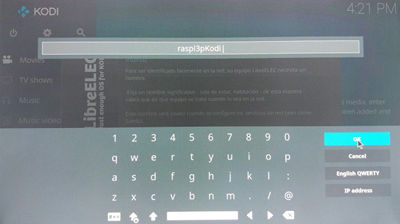

Damos un nombre al equipo y configuramos el acceso remoto por _ssh_ (para acceder desde otro equipo), y por _samba_ (para poder acceder a carpetas compartidas por equipo Windows o NAS), para lo que nos solicitará una contraseña.

Después de ésto, se actualizará y estará listo para usarlo.

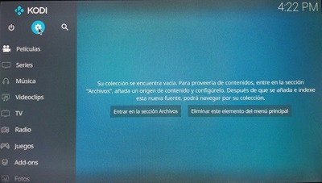

Para añadir las carpetas locales o remotas donde se almacenan los contenidos, entramos en el tipo que queramos (Películas en este ejemplo), y pulsamos sobre "Entrar en la sección de Archivos":

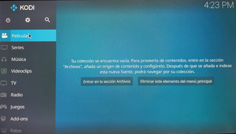

Pulsamos en "Añadir vídeos":

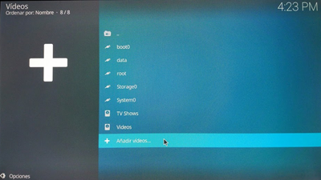

Seleccionamos la opción "Buscar":

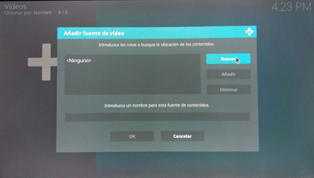

Y luego, buscamos en las _opciones de red_ que nos aparecen o pulsamos sobre "_Añadir sitio de red_" para rellenar los datos de la IP, _nombre de carpeta, usuario y password_.

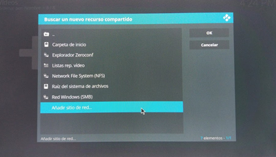

Aceptamos y ya debemos ver la carpeta para incluirla entre  los contenidos multimedia.

También podemos añadir _Add-ons_ entrando en la sección _Add-ons_ y en _Descargar_. Vamos a ver cómo instalar el Add-ons de YouTube.

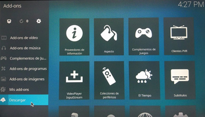

Seleccionamos y buscamos el tipo que queremos, vídeo en nuestro caso:

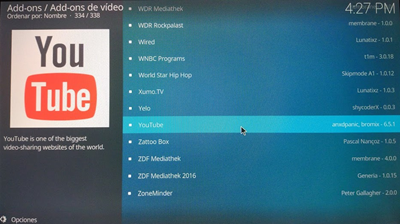

Pulsamos _instalar_, y nos dirá si necesitamos instalar algunos complementos de los que depende. Aceptamos, y los tendremos disponibles como nuevas fuentes de contenido multimedia.

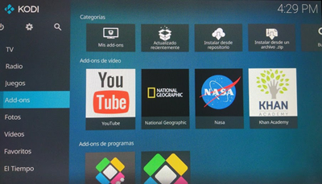

Ahora... ¡A disfrutar de nuestro reproductor multimedia!
