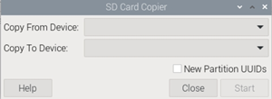

## Aulas con Raspberry Pi

Como ya hemos visto, se usa bastante Raspberry Pi en las aulas informáticas de colegios de todo el mundo:

Desde hace mucho tiempo, recomiendo a los profesores el uso de Raspberry Pi como base de las aulas informáticas por varias razones:

* El coste del equipo es mínimo:
    * Raspberry Pi
    * Alimentación
    * Monitor (que puede ser reciclado)
    * Teclado y ratón USB (que pueden ser reciclados)
    * Tarjeta SD, que en muchos casos, recomiendo que sea del propio alumno, así puede llevársela a casa. 
    * Carcasa transparente para hacer más apetecible el interior y despertar la curiosidad.
* Al estar basado en Linux, nos permite usar casi cualquier herramienta open source, pudiendo crear un laboratorio con todo tipo de servidores.
* Hay una gran cantidad de documentación y de gran calidad sobre su uso.
* Existen infinidad de proyectos publicados de todos los niveles de complejidad.
* El usarla con una carcasa abierta o transparente, incita la curiosidad de los alumnos, incluso hasta el punto de comprarse una propia.
* Podemos usarla en multitud de asignaturas:
    * Como ordenador de propósito general.
    * Para aprender a programar, ya que podemos usarla con casi todos los lenguajes disponibles: Scratch, Python, C, ...
    * Para introducir técnicas más avanzadas como la inteligencia artificial, o el reconocimiento de imágenes. 
    * Para aprender electrónica digital, usando la conectividad de GPIO.
    * Es ideal para hacer proyectos de robótica.
    * Para trabajar todo lo relacionado con redes, creando y configurando routers, servidores, equipos ligeros, ... hasta soluciones en telecomunicaciones como es [Asterisk](https://www.asterisk.org/)
    * Permite una integración muy buena con las herramientas de Google, muy usadas en las clases.

Con la llegada de la Raspberry 5, el panorama ha mejorado aún más:

* Permite arrancar desde USB, por lo que podemos usar un disco SSD barato, de capacidad, velocidad y duración, mucho mayores que las tarjetas SD. 
* La gran cantidad de RAM facilita el uso en el día a día,  4GB son suficientes para un uso normal, pero si te da el presupuesto incluye 8GB.

Algunas ideas para mejorar el funcionamiento:

* El usar teclados y ratones inalámbricos tiene la ventaja de que el consumo por USB es menor.
* Arduino y micro:bit funcionan perfecto, pero hasta donde yo sé, Lego no está soportado.
* Uso de arranque por USB: En la nueva Raspberry Pi 5 podemos arrancar usando un pendrive USB que nos va a durar más que una tarjeta SD. 
* Para mejorar el rendimiento podemos usar discos SSD con USB 3.0. 
* Si vamos a usarla en un aula de propósito general podemos incluir la distribución completa.

## Clonado de tarjetas

Para trabajar con un aula básicamente vamos a necesitar el hardware y un montón de tarjetas SD que podemos clonar directamente a partir de una instalación, salvo que queramos que el propio alumnado se instale su propio SO, lo cual también es interesante.

Aunque existen herramientas más sofisticadas, la misma herramienta **SD Card Copier** incluida en Raspberry Pi OS nos permite crear un clon de un sistema  en funcionamiento. 

El uso es muy sencillo, seleccionando el dispositivo origen y el destino. Para ello necesitamos usar varios dispositivos USB.

Podemos crear un sistema con todo lo necesario y a partir de él clonar las tarjetas del resto.

Recuerda que para hacer pequeñas modificaciones en una tarjeta la puedes abrir en cualquier ordenador y editar o modificar el fichero que queramos (por ejemplo el nombre del equipo),

