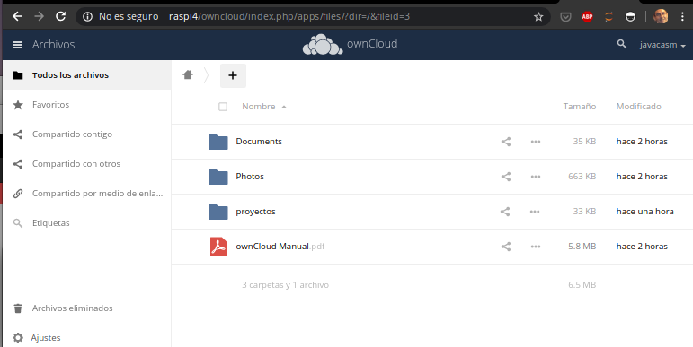
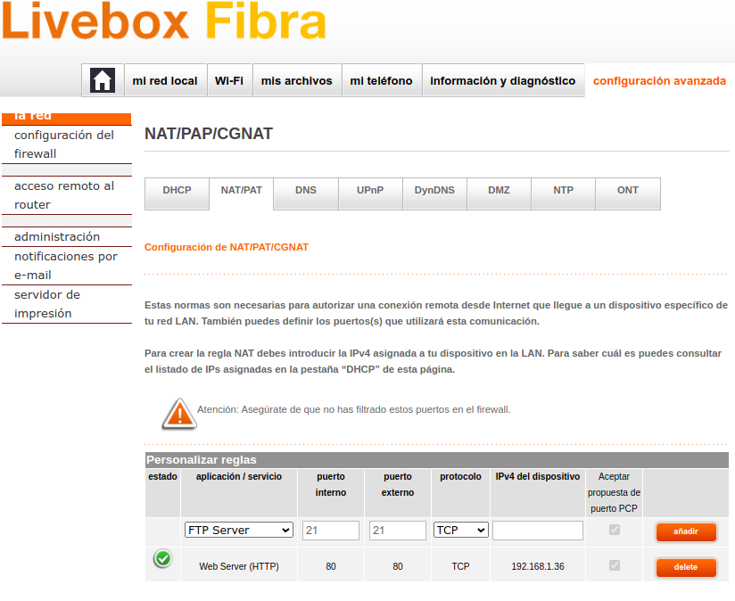

Onwcloud

## Usando SQLite

Actualizamos

```sh
sudo apt update
sudo apt upgrade
```

Requisitos https://doc.owncloud.org/server/10.4/admin_manual/installation/manual_installation.html#prerequisites

SEguimos las instrucxciones de la propia owncloud https://doc.owncloud.org/server/10.4/admin_manual/installation/manual_installation.html#install-the-required-packages

Instalamos apache, php5, curl (Se están usando las ultimas versiones de php a día de hoy 7/5/2020)
```sh
sudo apt-get install apache2 php7.3   php7.3-json php7.3-xml php7.3-gd php7.3-sqlite3 curl libcurl4  php7.3-curl php7.3-common php7.3-zip php7.3-xml php7.3-intl php7.3-mbstring 
```
Descargamos la ultima version de owncloud
wget https://download.owncloud.org/community/owncloud-10.4.1.tar.bz2

Descargamos el fichero md5
```sh
wget https://download.owncloud.org/community/owncloud-10.4.1.tar.bz2.md5
```

Comprobamos la integridad del fichero

```sh
md5sum -c owncloud-10.4.1.tar.bz2.md5 <  owncloud-10.4.1.tar.bz2
```


Descomprimimos
```sh
tar xvf owncloud-10.4.1.tar.bz2 
```
copiamos el contenido en el directorio raiz del servidor apache
```sh
sudo cp -r owncloud /var/www/
```

Creamos el fichero de configuracion del sito en 

```sh
/etc/apache2/sites-available/owncloud.conf
```
con 

```sh
sudo nano /etc/apache2/sites-available/owncloud.conf
```
Poniendo el siguiente contenido

```xml
Alias /owncloud "/var/www/owncloud/"

<Directory /var/www/owncloud/>
  Options +FollowSymlinks
  AllowOverride All

 <IfModule mod_dav.c>
  Dav off
 </IfModule>
</Directory>
```

y ahora creamos un enlace a  /etc/apache2/sites-enabled con 

```sh
sudo ln -s /etc/apache2/sites-available/owncloud.conf /etc/apache2/sites-enabled/owncloud.conf
```

Ahora comprobamos que tenemos todos los módulos  necesarios de apache activos y reiniciamos el servidor apache

```sh
sudo a2enmod headers
sudo a2enmod env
sudo a2enmod dir
sudo a2enmod mime
sudo a2enmod unique_id 
sudo systemctl restart apache2
```


Probamos a acceder
```
http://raspi4/owncloud/
```


Hasta este punto lo tenemos OK

Vamos a ejecutar la configuración para ello le damos permisos para que el servidor pueda modificar los ficheros de configuración de a la carpeta (esto es un potencial problema de seguridad y por eso viene así por defecto)

Para ello hacemos

```sh
sudo chown -R www-data:www-data /var/www/owncloud/
```

Volvemos a acceder a http://raspi4/owncloud y creamos la cuenta del administrador 


Y ya lo tenemos listo



### Instalación de clientes

Ahora vamos a ver algunos de los [clientes disponibles](https://owncloud.org/download/#install-clients)

* Podemos acceder desde cualquier navegador (en este caso desde un móvil)


* Existe una aplicación para sistemas Android, que es de pago


* Instalación del cliente para el escritorio y sincronización en linux. 
  * Lo instalamos
  ```sh
  echo 'deb http://download.opensuse.org/repositories/isv:/ownCloud:/desktop/Ubuntu_18.04/ /' | sudo tee /etc/apt/sources.list.d/isv:ownCloud:desktop.list
  curl -fsSL https://download.opensuse.org/repositories/isv:ownCloud:desktop/Ubuntu_18.04/Release.key | gpg --dearmor | sudo tee /etc/apt/trusted.gpg.d/isv:ownCloud:desktop.gpg > /dev/null
  sudo apt update
  sudo apt install owncloud-client

  ```
  * Aceptamos el certificado en la primera conexión
  
  * Configuramos las carpetas que queremos sincronizar (más adelante podemos modificarlo)
  
  * Ya tenemos sincronización entre nuestra carpeta y nuestro servidor de owncloud
  


### Acceso remoto desde internet

Podemos configurar nuestros sitema para poder acceder a nuestros equipos desde fuera de nuestra red local. Para ello tenemos que configurar adecuadamente nuestro router

* Configuramos el NAT para abrir los puertos necesarios (el 80 en este caso):

* Si intentamos acceder desde internet nos dará un error de seguridad debido a que tenemos que añadir en el fichero de configuración 'config.php' el dominio desde el que vamos a acceder

```php
'trusted_domains' => [
	'demo.example.org',
	'otherdomain.example.org',
  ],
```

