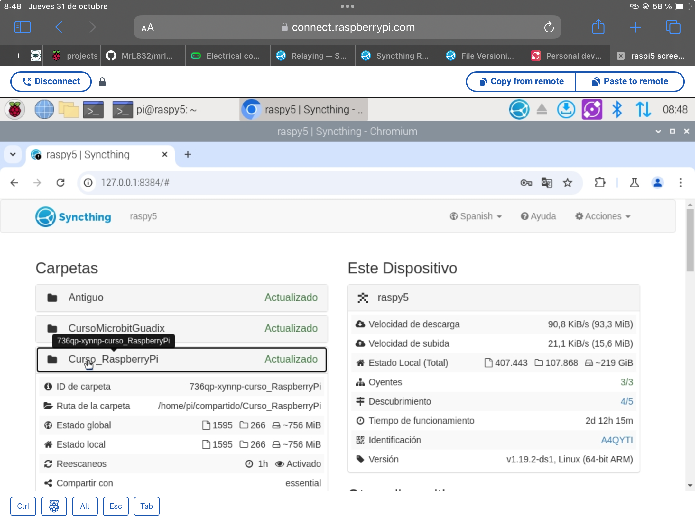

El caso de tener carpetas compartidas entre ellos se visualizarán el estado de las carpetas si hasta sincronizadas y está actualizada si hay si falta o una parte por sincronizar o se mostrarán aquellos ficheros en los que ha habido algún tipo de problema como puede ser que no hay espacio en disco o que haya un conflicto con la sola dispositivo o cuando se fichero

Como se detectan o como intercambian archivos dos dispositivos que no están en la misma red de hay una forma que hemos visto cuando hay conexiones entre en todo tipo de servidores como era VNC o cuando hablamos del acceso remoto a raspberry de la misma manera van a estar disponibles una conexión a través de un servidor de relay á hospedado por la lo mismo desarrolladores de sitg tenemos disponibles ese servidor que va a ser que se va a encargar de estar permanentemente accesible a través online aquí ese ordenador sí que está en Internet directamente no tiene un routers por la pantalla está en un hosting y al estar publicado en internet todos los ordenadores lo tienen accesible es decir tiene una dirección IP a la que se pueda acceder y se puede encontrar con un nombre eso está en los propios servidores de

Si nosotros quisiéramos hacer un servicio 100% independiente de sin fin de los servidores de sin fin podríamos crear nosotros también nuestro propio servidor esa otra aplicación que también por supuesto es de código abierto y que está disponible y que lo que decíamos que encargarnos de hacer que tu vida accesible a todos los otros pensamos que publicaron en Internet y cuando desde configuración deberíamos de decirle a nuestra aplicación que en lugar de conectar con los servicios y el proxy de simsi post

## Configuración avanzada

Como parte de la configuración en todo momento podamos decidir qué porcentaje de disco será el que ya se califique como disco lleno que ahora intenta es conveniente que no se haga que se vaya oblicua sino que antes de seguir lleno y empezamos a tener problemas de almacenamiento en nuestro ordenador debemos pedir establecer un cierto porcentaje de seguridad podemos establecer a través de dónde se hacen las comunicaciones podemos establecer el próximo live podemos establecer cómo funciona el nivel de descubrimiento

Ejemplo de cómo añadir un servidor por ID

Ejemplo de cómo añadir un servidor por detección

Cuando añadimos una carpeta establecemos una etiqueta y un nombre que será con el que ya veamos establecemos con quién queremos compartirla y por supuesto el directorio que se va a compartir

Al equipo al que le hemos compartido la carpeta le aparecerá un aviso en su interfaz indicando que tal equipo quiere compartir con él si lo acepta no os pedirá en que carpeta local se va a almacenar ese contenido

En la configuración básica se puede establecer una carpeta donde por defecto colgarán toda aquella otra que se comparte

Vemos cómo Syncthing está conectado y actualizados los contenidos 

### Arrancar en el inicio

### En Linux

