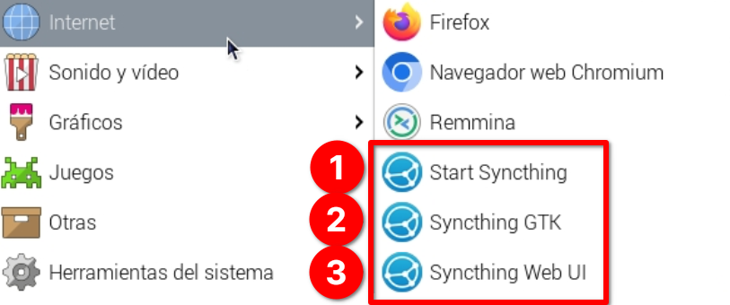
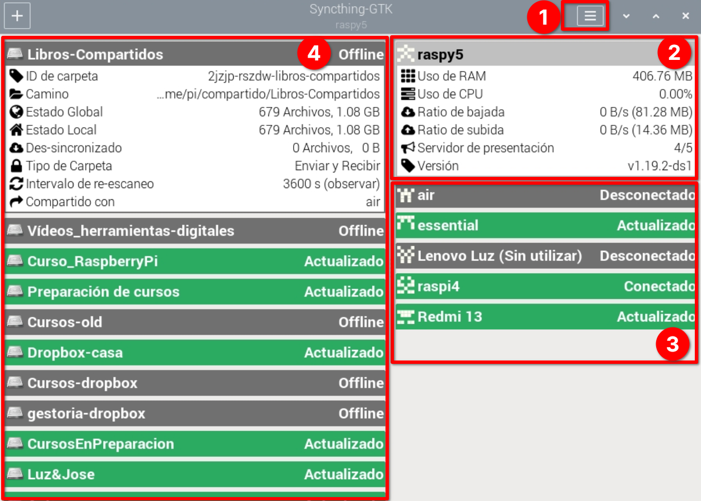
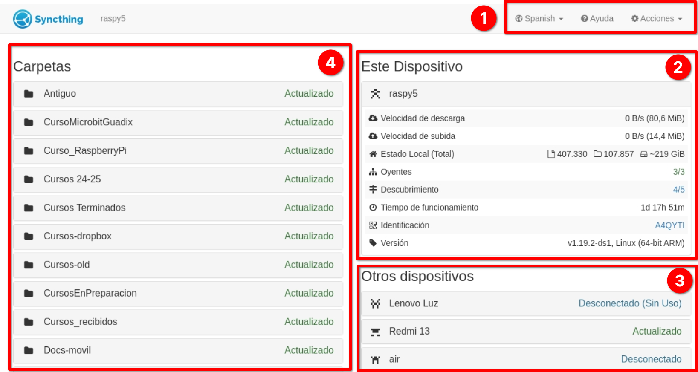
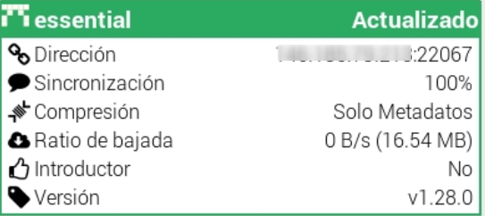

## Nube privada con SyncThing


[SyncThing](https://syncthing.net/) es una aplicación open source disponible para la mayoría de los sistemas operativos, Windows, Linux, Android, MacOS, ... de forma gratuita y también para alguna en forma de pago como por ejemplo para los iPhone/iPad. Su [código fuente](https://github.com/syncthing/) está disponible y dispone de una [gran documentación](https://docs.syncthing.net/).

Syncthing permite la sincronización de contenidos, compartiendo carpetas entre diferentes dispositivos. Para ello, todos los equipos deben estar conectados, tener instalada la aplicación Syncthing y que ésta se esté ejecutando.

Actúa de forma descentralizada es decir, el almacenamiento en la nube se consigue por medio de los diferentes equipos que han de estar conectados para que los ficheros estén disponibles, no existe un almacenamiento centralizado. Por esto decimos que es una red P2P (Peer 2 Peer) o punto a punto.

Por ejemplo, si comparto una carpeta entre mi portátil y el móvil, para el móvil pueda sincronizar el contenido,  necesito que el portátil  esté encendido, conectado y ejecutando Syncthing

La instalación es muy sencilla simplemente tenemos que:
* Descargar la aplicación desde la [página de descargas de Syncthing](https://syncthing.net/downloads/) en los equipos que queramos que  compartan contenido. En el caso de la Raspberry Pi descargaría la versión "ARM (64-bit)"

* La instalamos... En la Raspberry Pi podemos hacerlo con 1 solo comando, instalando el servicio synthing y la aplicación de configuración (el servicio incluye la opción de configuración web sin necesidad de aplicación de configuración)
```sh
	sudo apt install syncthing syncthing-gtk
```
Lo que nos va crear 3 entradas en el menú "Internet"
	

1.  **Start Syncthing** arranca la aplicación para poder compartir y ver lo que otros equipos han compartido. Cuando se ejecuta lo hace como  servicio, es decir, no vemos una ventana de aplicación, si no que se está ejecutando en segundo plano. 
2. **Synthing GTK** arranca la aplicación de configuración de escritorio 
	
	Para ir comprendiendo la interfaz, en verde vemos los recursos disponibles, en gris lo que no.
3. **Syncthing Web UI**  abre la configuración del servicio Syncthing en un navegador 
	

La configuración es la misma independientemente de que usemos la versión aplicación o web. Personalmente encuentro más cómoda la versión web. 

Veamos el interfaz y luego el proceso para compartir contenidos:

1. Menú con las diferentes acciones que podemos hacer
2. Configuración y detalles del servicio en nuestro ordenador
3. Otros dispositivos con Syncthing y su estado. Si pulsamos sobre uno de ellos veremos los detalles
	 
4. Carpetas compartidas. Si pulsamos sobre ella veremos sus detalles.


Para empezar a compartir lo primero que tenemos e

* Tenemos que identificar cada uno de los equipos en la red que tendrán un código de identificación y que los demás dispositivos con los que vamos a compartir archivos han de conocer si estamos trabajando en una red local se produce un autodescubrimiento decirse detectan uno a otro y si no lo que podemos es pasar la información el código de identificación que también se puede pasar por en formato de código QR
* Los contenidos que queramos compartir se organizan en carpetas compartidas a las que seleccionamos a qué dispositivo queremos y qué dispositivo las tengan accesibles
* Se puede elegir si un dispositivo publica contenido o solo lo recibe
* Y también se pueden activar diferentes opciones en cuanto al versionado de ficheros se puede hacer que se mantengan distintas versiones o bien que solamente se guarde la última edición