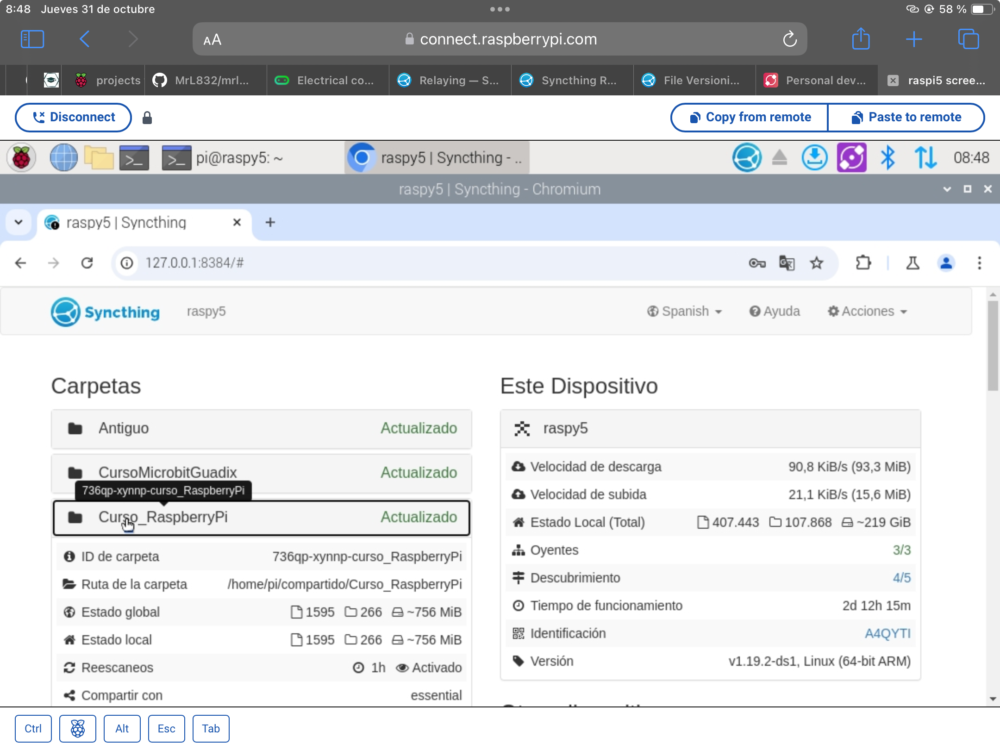

## Nube privada con SyncThing


[SyncThing](https://syncthing.net/) es una aplicación open source disponible para la mayoría de los sistemas operativos, Windows, Linux, Android, MacOS, ... de forma gratuita y también para alguna en forma de pago como por ejemplo para los iPhone/iPad. Su [código fuente](https://github.com/syncthing/) está accesible y además dispone de una [gran documentación](https://docs.syncthing.net/) tanto técnica como para el usuario normal.

Syncthing permite la sincronización de contenidos, compartiendo carpetas entre diferentes dispositivos. Para ello, todos los equipos deben estar conectados, tener instalada la aplicación Syncthing y que ésta se esté ejecutando.

No es necesario que los equipos estén en la misma red, puesto que Syncthing utiliza unos servidores en internet (relay) a los que se conecta siempre la aplicación para localizar los equipos. Una vez que dos equipos se han "encontrado", la comunicación se hará por el método más eficiente: si están en la misma red se hará una conexión directa y si no es posible se utilizarán los servidores de relay para enrutar el tráfico.

Actúa de forma descentralizada es decir, el almacenamiento en la nube se consigue por medio de los diferentes equipos que han de estar conectados para que los ficheros estén disponibles, no existe un almacenamiento centralizado. Por esto decimos que es una red P2P (Peer 2 Peer) o punto a punto.


Por ejemplo, si comparto una carpeta entre mi portátil y el móvil, para el móvil pueda sincronizar el contenido,  necesito que el portátil  esté encendido, conectado y ejecutando Syncthing

Para resolver esto, y que tus  contenidos más importantes  estén siempre disponibles, vas a necesitar que un ordenador esté permanentemente conectado.  Sólo tienes que instalar Syncthing en una Raspberry Pi y que ésta esté encendida todo el tiempo compartiendo esos contenidos.
### Instalación

La instalación es muy sencilla simplemente tenemos que:

* Descargar la aplicación desde la [página de descargas de Syncthing](https://syncthing.net/downloads/) en los equipos que queramos que  compartan contenido. En el caso de la Raspberry Pi descargaría la versión "ARM (64-bit)" que instalaremos

	

* En la Raspberry Pi podemos hacerlo con 1 solo comando, instalando el servicio Synthing y la aplicación de configuración (el servicio incluye la opción de configuración web sin necesidad de aplicación de configuración)

```sh
	sudo apt install syncthing syncthing-gtk
```

Lo que nos va crear 3 entradas en el menú "Internet"


1.  **Start Syncthing** arranca la aplicación para poder compartir y ver lo que otros equipos han compartido. Cuando se ejecuta lo hace como  servicio, es decir, no vemos una ventana de aplicación, si no que se está ejecutando en segundo plano. 
2. **Synthing GTK** arranca la aplicación de configuración de escritorio 

	
	
	Para ir comprendiendo la interfaz, en verde vemos los recursos disponibles, en gris lo que no.

3. **Syncthing Web UI**  abre la configuración del servicio Syncthing en un navegador web.
	
	

La configuración es la misma independientemente de que usemos la versión aplicación o web. Personalmente encuentro más cómoda la versión web. 

Veamos el interfaz y luego el proceso para compartir contenidos:

1. Menú con las diferentes acciones que podemos hacer
2. Configuración y detalles del servicio en nuestro ordenador
3. Otros dispositivos conocidos con Syncthing y su estado. Si pulsamos sobre uno de ellos veremos los detalles

	 

4. Carpetas compartidas. Si pulsamos sobre ella veremos sus detalles.

	
## Dispositivos

Antes de compartir contenidos tenemos que conectar con los otros equipos. Veamos cómo funciona antes de hacerlo.

Todo dispositivo está identificado con un ID, un  dato alfanumérico bastante largo y que lo va a identificar de forma única. Se suele ver mostrar  la primera parte como identificador  y  un pequeño icono asociado formado por el ID en formato binario, para que sea fácil de reconocerlo.


Cuando lo damos de alta, asociamos a ese ID un nombre que será el que veamos.

También tienen asociado un código QR que podemos visualizar en pantalla y escanear desde otros dispositivos móviles.


Para que los dispositivos se conozcan entre sí podemos hacerlo de varias formas:

* Podemos escanear la red automáticamente, la aplicación siempre busca a ver si hay disponibles otros  
* Podemos añadir directamente el ID. En dispositivos móviles  se puede escanear el QR con la cámara.

Cuando ejecutamos una nueva aplicación SyncThing en una red, automáticamente va a buscar si existieran otros dispositivos y nos propondrá si queremos añadirla a nuestra lista de dispositivos.

Cuando nosotros añadimos un dispositivo no tiene que estar en nuestra red,  simplemente al añadir el ID se buscará 

En la zona de de dispositivos de nuestra aplicación aparecerán todos aquellos que se conocen entre sí y indicando si están disponibles online o no

Para empezar a compartir lo primero que tenemos e

* Tenemos que identificar cada uno de los equipos en la red que tendrán un código de identificación y que los demás dispositivos con los que vamos a compartir archivos han de conocer si estamos trabajando en una red local se produce un autodescubrimiento decirse detectan uno a otro y si no lo que podemos es pasar la información el código de identificación que también se puede pasar por en formato de código QR
* Los contenidos que queramos compartir se organizan en carpetas compartidas a las que seleccionamos a qué dispositivo queremos y qué dispositivo las tengan accesibles
* Se puede elegir si un dispositivo publica contenido o solo lo recibe
* Y también se pueden activar diferentes opciones en cuanto al versionado de ficheros se puede hacer que se mantengan distintas versiones o bien que solamente se guarde la última edición
### Cómo se comparten los contenidos

Para compartir una nueva carpeta en el botón **+Agregar Carpeta** debajo de todas las carpetas compartidas en la versión Web

O en la opción correspondiente tras pulsar el botón **+** en la aplicación de configuración:


En la pestaña **General**


1. La etiqueta es el nombre con el que veremos la carpeta compartida
2. El ID es un código con el que identificamos de manera unívoca la carpeta. Personalmente le suelo añadir la etiqueta de la carpeta para reconocerla más fácilmente. El ID es muy importante y servirá para identificar dos carpetas compartidas por dos servidores como un mismo contenido.
3. La ruta donde se almacenan localmente los ficheros compartidos

En la pestaña **Compartiendo** marcaremos los dispositivos con los que queremos compartir la carpeta (en cualquier momento podemos modificarlo, añadiendo o quitando dispositivos de la lista)


En la pestaña de **Versionado de ficheros** podemos elegir qué tipo de versionado de ficheros queremos para esta carpeta, desde "Sin versionado", en el que sólo se guardará la última versión hasta un versionado profesional con una herramienta externa que tendremos que configurar.


Si marcamos alguno de los intermedios, se conservarán copias de las distintas versiones en la carpeta .stversions por defecto (aunque podemos establecer otra carpeta) cuando sean reemplazados o borrados. También podemos establecer un número de días tras los que se borraran las versiones antiguas o un número máximo de versiones que se guardarán.

También podemos establecer patrones de nombres que se ignorarán, como por ejemplo las copias de seguridad que hacen algunos programas o carpetas temporales en la pestaña **Patrones a ignorar**

En la pestaña **Avanzado** vamos a encontrar una gran cantidad de opciones, como por ejemplo:

* Si queremos que se realice un monitoreo contante de cambios
* Cada cuando tiempo se vuelve a escanean la carpeta completa 
* El **Tipo de carpeta** 
* Si se sincronizan permisos o datos sobre el propietario de los archivos

Si dejamos de compartir una carpeta, lo ficheros seg uirán disponibles localmente, en ningún caso se borrarán.
## Conflictos

A veces ocurre que por falta de disponibilidad de alguna de esas carpetas online pues no podemos encontrar que dos ordenadores modifican un mismo fichero en ese caso lo que va a ocurrir cuando vuelvan a estar disponibles online y vuelve a haber conexión entre ellos se van a generar duplicado de los archivos cada uno con las diferentes versiones

El formato será nombre de fichero. Sing conflict la fecha y el nombre del fichero del equipo que lo va a utilizar


El caso de tener carpetas compartidas entre ellos se visualizarán el estado de las carpetas si hasta sincronizadas y está actualizada si hay si falta o una parte por sincronizar o se mostrarán aquellos ficheros en los que ha habido algún tipo de problema como puede ser que no hay espacio en disco o que haya un conflicto con la sola dispositivo o cuando se fichero

Como se detectan o como intercambian archivos dos dispositivos que no están en la misma red de hay una forma que hemos visto cuando hay conexiones entre en todo tipo de servidores como era VNC o cuando hablamos del acceso remoto a raspberry de la misma manera van a estar disponibles una conexión a través de un servidor de relay á hospedado por la lo mismo desarrolladores de sitg tenemos disponibles ese servidor que va a ser que se va a encargar de estar permanentemente accesible a través online aquí ese ordenador sí que está en Internet directamente no tiene un routers por la pantalla está en un hosting y al estar publicado en internet todos los ordenadores lo tienen accesible es decir tiene una dirección IP a la que se pueda acceder y se puede encontrar con un nombre eso está en los propios servidores de

Si nosotros quisiéramos hacer un servicio 100% independiente de sin fin de los servidores de sin fin podríamos crear nosotros también nuestro propio servidor esa otra aplicación que también por supuesto es de código abierto y que está disponible y que lo que decíamos que encargarnos de hacer que tu vida accesible a todos los otros pensamos que publicaron en Internet y cuando desde configuración deberíamos de decirle a nuestra aplicación que en lugar de conectar con los servicios y el proxy de simsi post

## Configuración avanzada

Como parte de la configuración en todo momento podamos decidir qué porcentaje de disco será el que ya se califique como disco lleno que ahora intenta es conveniente que no se haga que se vaya oblicua sino que antes de seguir lleno y empezamos a tener problemas de almacenamiento en nuestro ordenador debemos pedir establecer un cierto porcentaje de seguridad podemos establecer a través de dónde se hacen las comunicaciones podemos establecer el próximo live podemos establecer cómo funciona el nivel de descubrimiento

Ejemplo de cómo añadir un servidor por ID

Ejemplo de cómo añadir un servidor por detección

Ejemplo de aplicación en un móvil

Para iPad tenemos que utilizar existe una aplicación de pago mínimo de 7 euros y que personalmente ya lo he amortizado solamente con un par de viaje

Además esta empresa que comercializa la versión para para iPad soporta económicamente el desarrollo de simply y los servidores a los que nos conectamos

Cuando añadimos una carpeta establecemos una etiqueta y un nombre que será con el que ya veamos establecemos con quién queremos compartirla y por supuesto el directorio que se va a compartir

Al equipo al que le hemos compartido la carpeta le aparecerá un aviso en su interfaz indicando que tal equipo quiere compartir con él si lo acepta no os pedirá en que carpeta local se va a almacenar ese contenido

En la configuración básica se puede establecer una carpeta donde por defecto colgarán toda aquella otra que se comparte

En la aplicación Android tenemos que establecer cada carpeta que recibimos para compartir debemos de establecer dónde se va a almacenar y también hay que estarle permisos de acceso a la aplicación a esa carpeta

## En el móvil

Por defecto en el l móvil solo se sincronizará si estamos conectados a un wifi. 

Podemos seleccionar aquellos wifi en los que queremos que esté activo 

Evidentemente el que esté activo implica un mayor consumo de batería 


Vemos cómo Syncthing está conectado y actualizados los contenidos 



