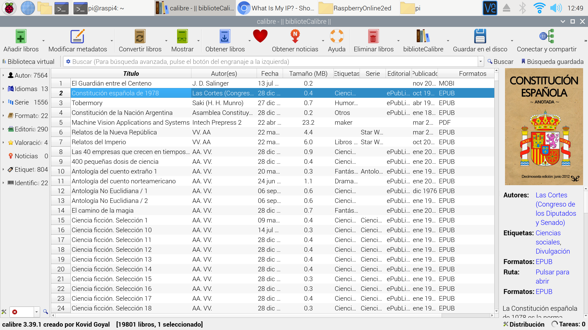
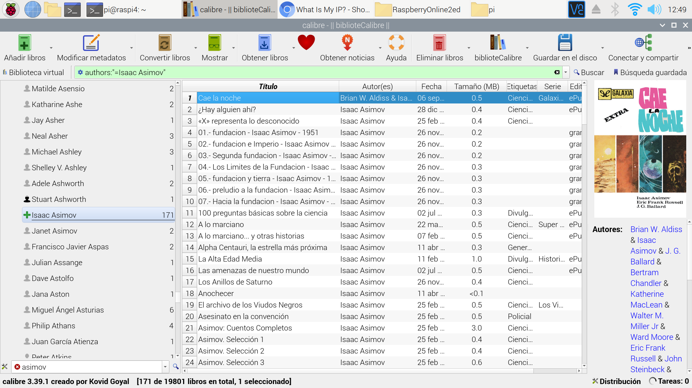
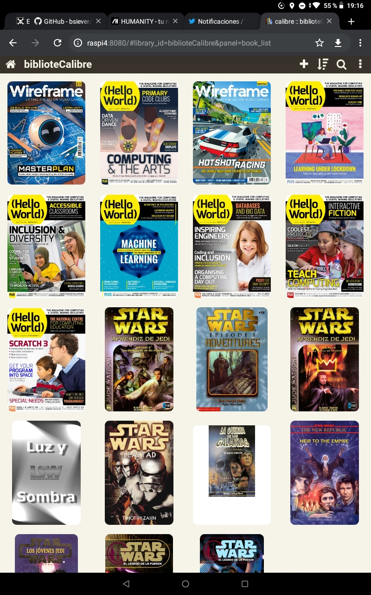
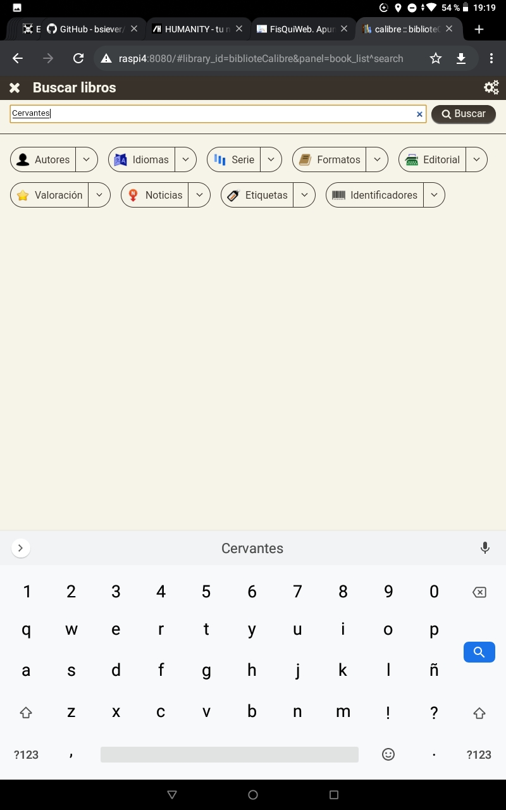
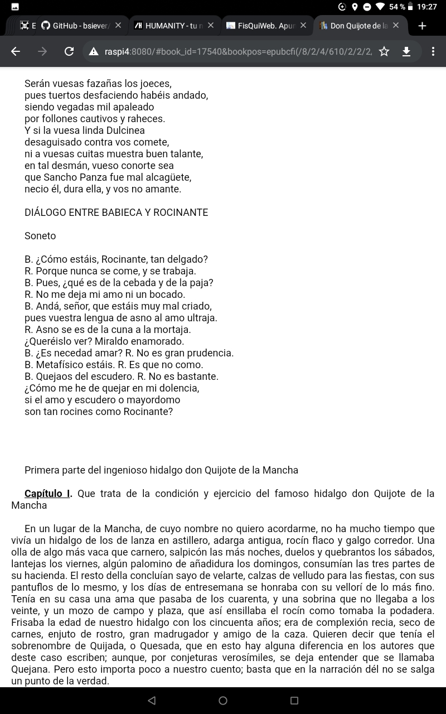
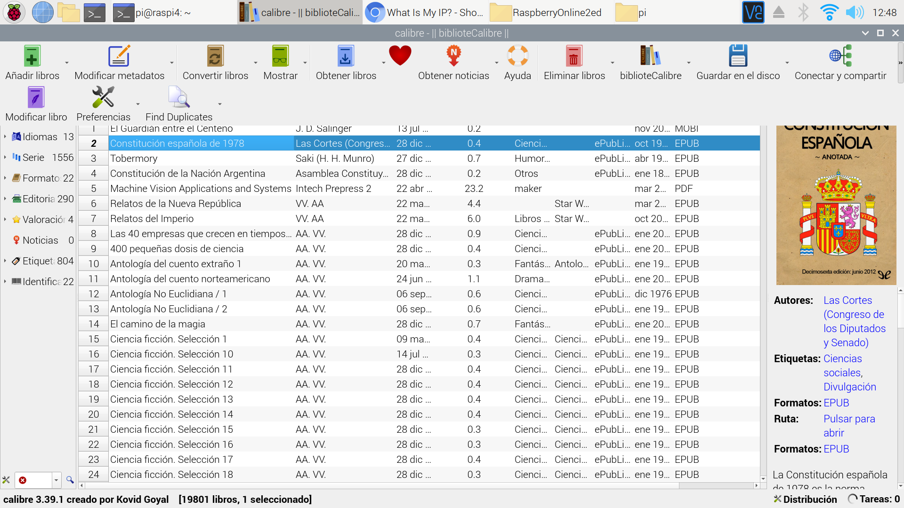
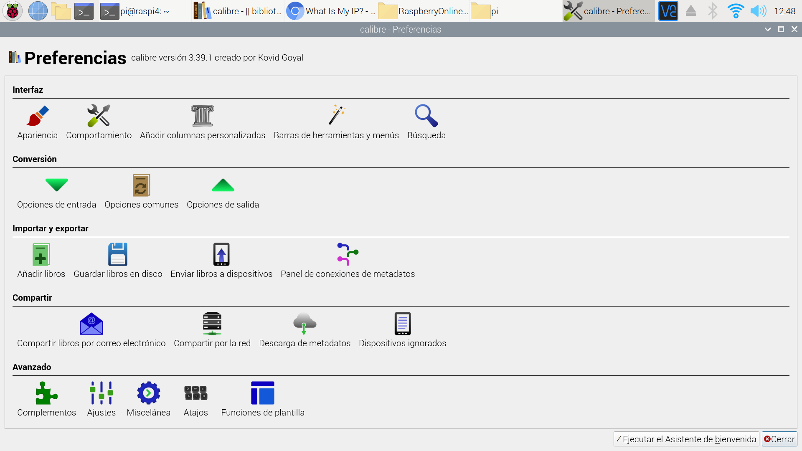
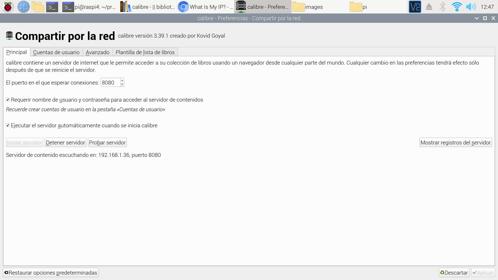
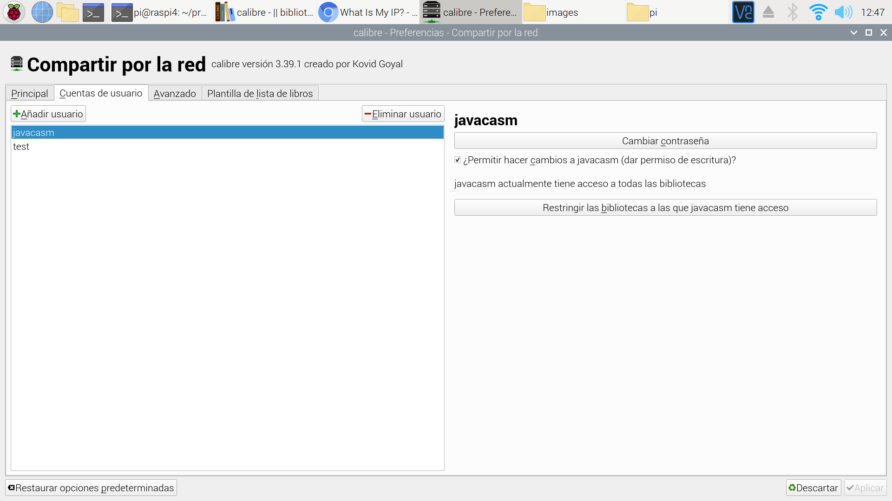

## Servidor de libros electrónicos (BookServer con calibre)

Vamos a instalar un sencillo sistema que nos va a permitir acceder a tu Biblioteca de libros electrónicos desde cualquier parte del mundo:

Usaremos [Calibre](https://calibre-ebook.com/), un gestor de bibliotecas open source que nos permite organizar y almacenar nuestros ebooks.



Podemos filtrar buscando por título, autor, agrupar por colecciones, convertir entre formatos y exportar a nuestros lectores de ebooks




La instalación no puede ser más sencilla
```sh
sudo apt install calibre
```

Importamos nuestros libros y ya lo podemos usar...

Aunque está pensado como una aplicación de escritorio también incluye un Servidor web incorporado con el que podemos acceder a los ebooks. 

Podemos acceder al servidor desde cualquier ordenador o tableta



Incluso haciendo búsquedas



Podemos leer directamente sin necesidad de ninguna aplicación además del navegador



Para activarlos entramos en las preferencias:



Ahora en la configuración de "Compartir por la red" donde vamos a activar el servidor, con su puerto (8080 por defecto) y si así lo queremos marcaremos la opción para se arranca cada vez que abrimos Calibre



Es el momento de configurar los usuarios, a los que le podremos dar permiso o no de escritura para modificar los libros



