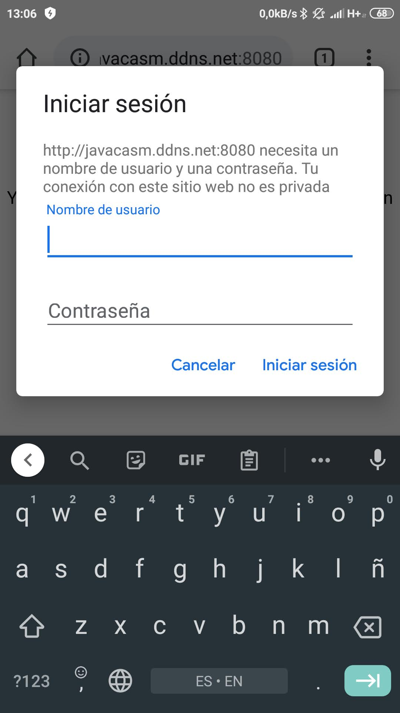

## Servidor de libros electronicos (BookServer con calibre)

Vamos a instalar un sencillo sistema que nos va a permitir acceder a tu Biblioteca de libros electrónicos desde cualquier parte del mundo:

Usaremos [Calibre](https://calibre-ebook.com/), un gestor de bibliotecas open source que nos permite organizar y almacenar nuestros ebooks.


Podemos filtrar buscando por título, autor, agrupar por colecciones, convertir entre formatos y exportar a nuestros lectores de ebooks


La instalación no puede ser más sencilla
```sh
sudo apt install calibre
```

Importamos nuestros libros y ya lo podemos usar...

Aunque está pensado como una aplicación de escritorio también incluye un Servidor web incorporado con el que podemos acceder a los ebooks. 

Podemos acceder al servidor desde cualquier ordenadore o tableta


Incluso haciendo búsquedas


Podemos leer directamente sin necesitad de ninguna aplicación además del navegador


Para activarlos entramos en las preferencias:


Ahora en la configuración de "Compartir por la red" donde vamos a activar el sevidor, con su puerto (8080 por defecto) y si así lo queremos marcaremos la opción para se arranca cada vez que abrimos Calibre


Es el momento de configurar los usuarios, a los que le podremos dar permiso o no de escritura para modificar los libros


## Acceso desde internet

Si queremos acceder desde fuera de nuestra red, configuraremos el router en la opción de NAT para el puerto usado


Para poder acceder remotamente sin saber nuestra IP  configuraremos un servicio de Dynamic DNS (DDNS) 

Estos son algunos proveedores gratuitos de servicios de DDNS


En mi caso usaré el servicio de NoIP


Ahora configuramos en el router la cuenta para que automáticamente se refresque


Y ya podremos acceder remotamente tras logarnos




