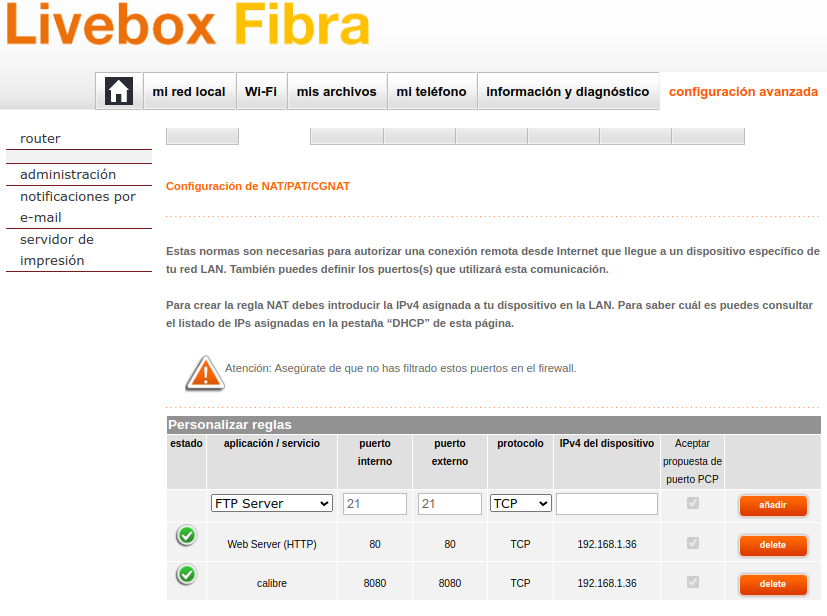
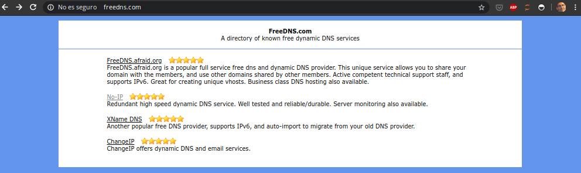
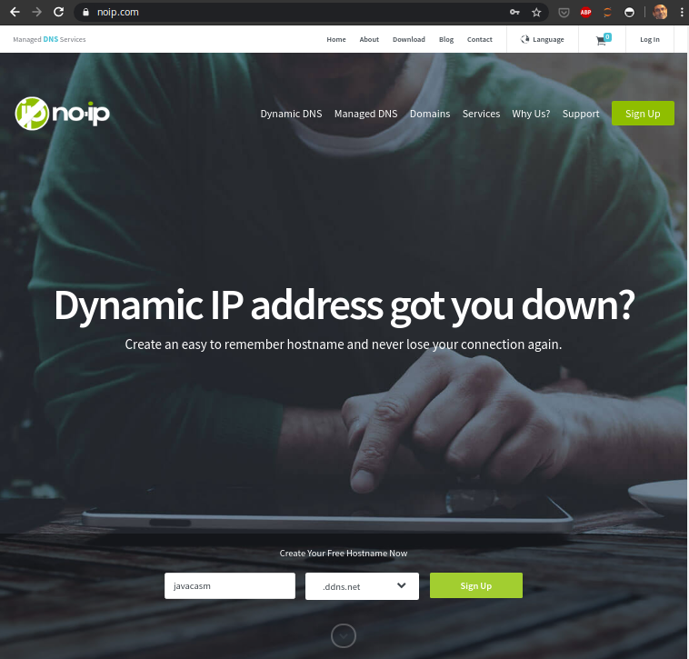
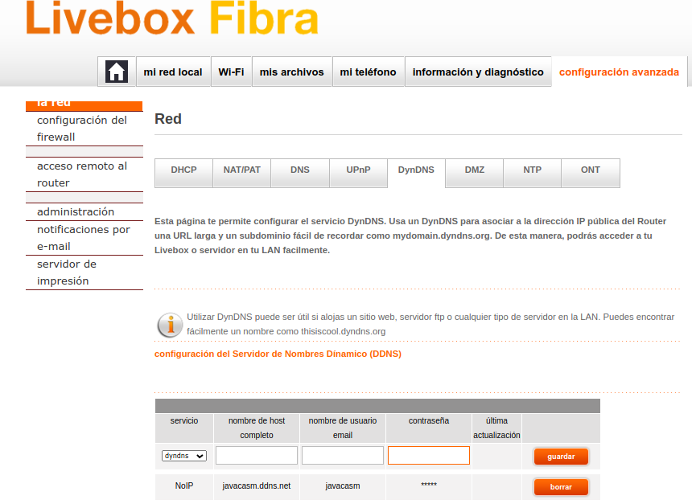
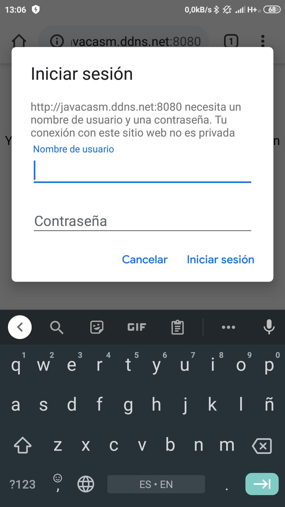

## Acceso desde internet

Si queremos acceder desde fuera de nuestra red, configuraremos el router en la opción de NAT para el puerto usado

Para poder acceder remotamente sin saber nuestra IP  configuraremos un servicio de Dynamic DNS (DDNS) 

Estos son algunos proveedores gratuitos de servicios de DDNS

En mi caso usaré el servicio de NoIP

Ahora configuramos en el router la cuenta para que automáticamente se refresque

Y ya podremos acceder remotamente tras logarnos

