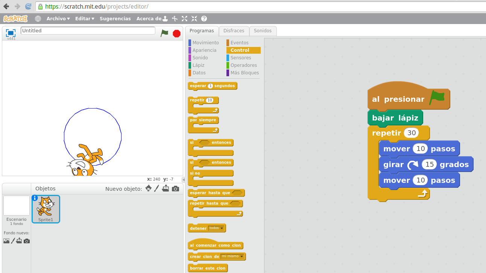
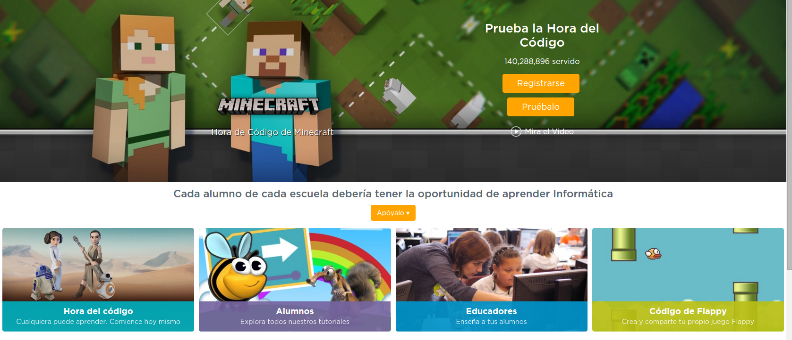

## Scratch

Es un entorno de programación gráfico que nos permite hacer programas usando bloques.

Podemos probarlo [online](https://scratch.mit.edu/projects/editor/), y además nuestra Raspberry incluye diferentes versiones en forma de aplicaciones para las versiones 1, 2 y 3

Es un entorno potente y está pensado para enseñar a programar sin la complejidad de la sintaxis del código.

(Sin duda para empezar a programar lo mejor es empezar por [Code.org](Code.org) )

### Scratch en la Raspberry Pi

Raspberry Pi OS trae instalado  Scratch, en las últimas versiones ya está disponible Scratch 3.0

[Vídeo sobre cómo programar con Scratch en Raspberry Pi](https://youtu.be/6veM85OpsKI)

Para usar la aplicación Scratch 3, es necesario una gran cantidad de RAM, al menos 1Gb sólo para la aplicación por lo que no se recomienda de momento su uso salvo en la Raspberry 4 con al menos 2 Gb de RAM

[Vídeo de Scratch 3 en un Raspberry 4](https://youtu.be/mMYKjVri3QI) 
