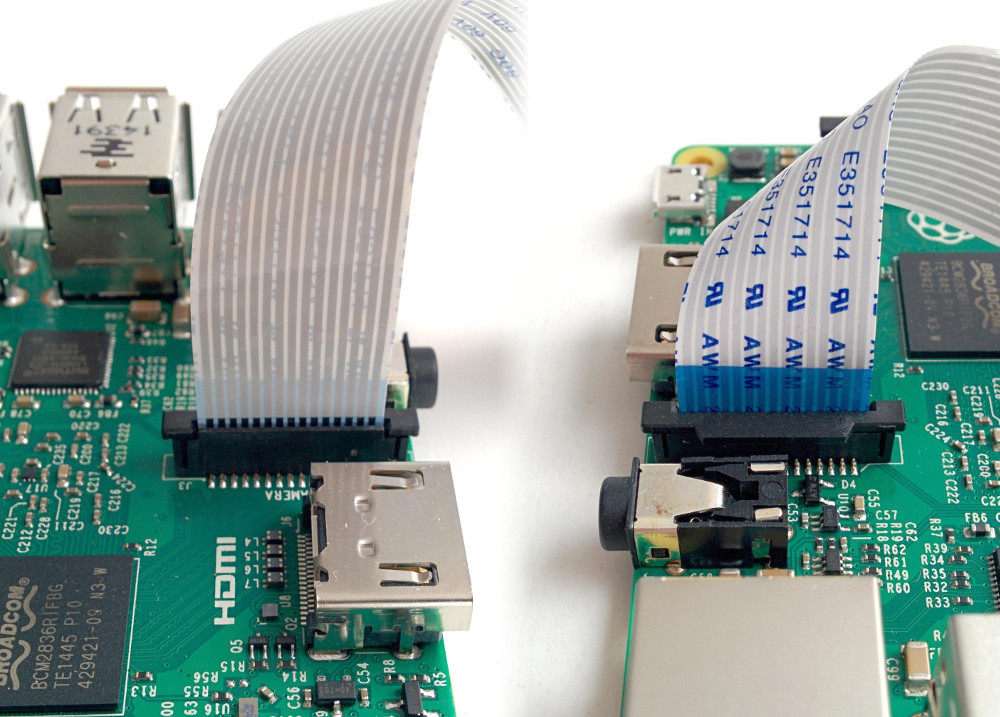
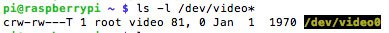

## Programación en Shell Scripts

Los scripts son ficheros donde introducimos distintas órdenes que se irán ejecutando de forma consecutiva una tras otra

Vamos a ver algunos ejemplos de cómo utilizarlos junto con la cámara. Para ellos usaremos algunos de los comandos que tenemos para usar la cámara

### Usando la cámara

Empezaremos conectando la cámara


La cámara tiene su propio conector, junto al conector HDMI

Para conectarla pondremos el cable de la manera que se ve en la imagen




Antes de poder utilizarla tenemos que activarla
```sh
sudo raspi-config
```


Necesitamos reiniciar para que arranquen adecuadamente los drivers.

Podemos probarla con este comando
```sh
raspistill -v -o test.jpg
```        
Que mostrará lo que enfoca la cámara durante 5 segundos y luego guardará una imagen en el fichero test.jpg


Tenemos 2 aplicaciones para usar la cámara
```sh
raspistill
```

Tomará imágenes fijas
```sh
raspivid
```
grabará un vídeo

### Imágenes estáticas

Si queremos cambiar el retardo con el se captura, usamos la opción -t indicando el tiempo en milisegundos:

		raspistill -o myimage.jpg -t 3000

Este programa tiene muchas opciones que podemos ver:

		raspistill | less
		-?, --help
		: This help information
		-w, --width
		: Set image width <size>
		-h, --height : Set image height <size>
		-q, --quality : Set jpeg quality <0 to 100>
		-o, --output : Output filename <filename>
		-v, --verbose : Output verbose information during run
		-t, --timeout : Time (in ms) before taking picture
		(if not specified, set to 5s)
		-th, --thumb
		: Set thumbnail parameters (x:y:quality)
		-d, --demo
		: Run a demo mode
		-e, --encoding : Output format (jpg, bmp, gif, png)
		-tl, --timelapse : Timelapse mode. Takes a picture every <t>ms
		-p, --preview : Preview window settings <'x,y,w,h'>
		-f, --fullscreen : Fullscreen preview mode
		-n, --nopreview : Do not display a preview window
		-sh, --sharpness : Set image sharpness (-100 to 100)
		-co, --contrast : Set image contrast (-100 to 100)
		-br, --brightness : Set image brightness (0 to 100)
		-sa, --saturation : Set image saturation (-100 to 100)
		-ISO, --ISO
		: Set capture ISO
		-vs, --vstab
		: Turn on video stablisation
		-rot, --rotation : Set image rotation (90,180,270)
		-hf, --hflip
		: Set horizontal flip
		-vf, --vflip
		: Set vertical flip

Entre estas opciones podemos encontrar **-tl** que nos va a permitir tomar una imagen cada cierto tiempo. Con ello podemos generar una secuencia de imágenes con una sola línea de comando

		raspistill -o myimage_%d.jpg -tl 2000 -t 25000

Una imagen cada 2 segundos durante 25 segundos Cada foto tendrá un número de secuencia

		myimage_1.jpg
		myimage_2.jpg
		myimage_3.jpg
		myimage_4.jpg
		...

 Si deseamos utilizar un formato de nombre más complejo, siempre podemos usar un script como el siguiente que además guardará las imágenes en una carpeta

		SAVEDIR=/var/tlcam/stills
		while [ true ]; do
		filename=$(date -u +"%d%m%Y_%H%M-%S").jpg
		/opt/vc/bin/raspistill -o $SAVEDIR/$filename
		sleep 4;
		done;

[Vídeo: Trabajando con Shell  Scripts Raspberry pi](https://youtu.be/L5HfjbKyth0)

### Vídeo

raspivid  nos va a permitir grabar vídeos. Para capturar 5s de vídeo en formato h264 utilizaremos:

	raspivid -o video.h264

Si queremos capturar 10 segundos usaremos:

	raspivid -o video.h264 -t 10000

Para ver todas las opciones disponibles podemos hacer

	$raspivid | less

Para una documentación más detallada sobre las opciones del ejecutable se puede consultar el siguiente [enlace](https://www.raspberrypi.org/documentation/raspbian/applications/camera.md)

### Webcam

También podemos usar cámaras USB compatibles  como  la PS3 Eye.

Veremos si se ha detectado con:

	$ ls -l /dev/video*

Si se detecta



Instalamos fswebcam

	 sudo apt-get install fswebcam

Que nos permitirá tomar una imagen con

	 fswebcam -d /dev/video0 -r 640x480 test.jpeg

Hagamos ahora un script para hacer un timelapse, que nos es otra cosa que un programa que ejecuta comandos de una forma determinada.

Primero creamos un fichero con este contenido. Por ejemplo con el editor geany

	geany ~/runtimelapse.sh 

El contenido será el siguiente

	#!/bin/bash
	# Timelapse controller for USB webcam
	DIR=/home/pi/timelapse
	x=1
	while [ $x -le 1440 ]; do
		filename=$(date -u +"%d%m%Y_%H%M-%S").jpg
		fswebcam -d /dev/video0 -r 640x480 $DIR/$filename
		x=$(( $x + 1 ))
		sleep 10;
	done;

Una vez guardado, vamos a darle permiso para ejecutarlo.

	chmod u+x ~/runtimelapse.sh

Lo ejecutamos con

	~/runtimelapse.sh

Podemos ver que se están realizando capturas de imágenes cada 10 segundos y como mucho se guardarán 1440 imágenes.


### Control remoto de cámaras


También podemos controlar cámaras profesionales que suelen admitir conexión USB (como por ejemplo una Canon Rebel T4i / 650D)

Utilizaremos el software gphoto2 que  instalaremos con

	 	sudo apt-get install gphoto2

Podemos controlar casi todos los valores de exposición, ISO, etc de nuestra cámara remotamente, pero para no complicarnos vamos a suponer que la usamos en modo automático.

Podemos capturar una imagen, que se mantendrá en la cámara con:

		$ gphoto2 --capture-image

Para tomar una imagen y enviarla a la raspberry usaremos

		$ gphoto2 --capture-image-and-download

La librería gphoto2 por defecto guarda las imágenes en la memoria RAM de la Raspberry (no en la SD) con lo que es necesario que lo configuremos para evitar perderlas al cortar la alimentación.

		$ gphoto2 --get-config /main/settings/capturetarget

Para establecer nuestro almacenamiento usaremos:

		$ gphoto2 --set-config /main/settings/capturetarget=NuestroDirectorio

Veamos ahora como hacer un time-lapse, es decir capturar las imágenes cada
cierto tiempo. Usaremos el siguiente comando.

		$ gphoto2 --capture-image -F 1440 -I 30

Que almacenará en la cámara un máximo de 1440 imágenes tomadas cada 30
segundos

### Convertir fotos a vídeo

Una vez tengamos todas las imágenes podemos generar un vídeo con ellas.

Instalamos un software llamado mencoder que será el que genere el vídeo.

		$ sudo apt-get install mencoder

 Ahora generamos un fichero que contenga todas las imágenes que queremos unir en el vídeo

		$ cd timelapse
		$ ls *.jpg* > list.txt


Y ejecutamos memcoder con los parámetros adecuados (es una sóla línea)

		$ mencoder -nosound -ovc lavc -lavcopts vcodec=mpeg4:aspect=16/9:vbitrate=8000000 -vf scale=640:480 -o timelapse.avi -mf type=jpeg:fps=24 mf://@list.txt

Con esto generaremos un vídeo de 640x480 de resolución, con nombre timelapse.avi codificado en mpeg4, a 24 frame por segundo y con las imágenes cuyos nombres se incluyen en el fichero list.txt

Si queremos hacer un vídeo a partir de las imágenes tomadas con la cámara original de Raspberry usaremos el siguiente comando

		$ mencoder -nosound -ovc lavc -lavcopts vcodec=mpeg4:aspect=16/9:vbitrate=8000000 -vf scale=1920:1080 -o tlcam.avi -mf type=jpeg:fps=24 mf://list.txt

Hay que tener cuidado de no llenar el almacenamiento, puesto que este proceso consume mucho espacio

