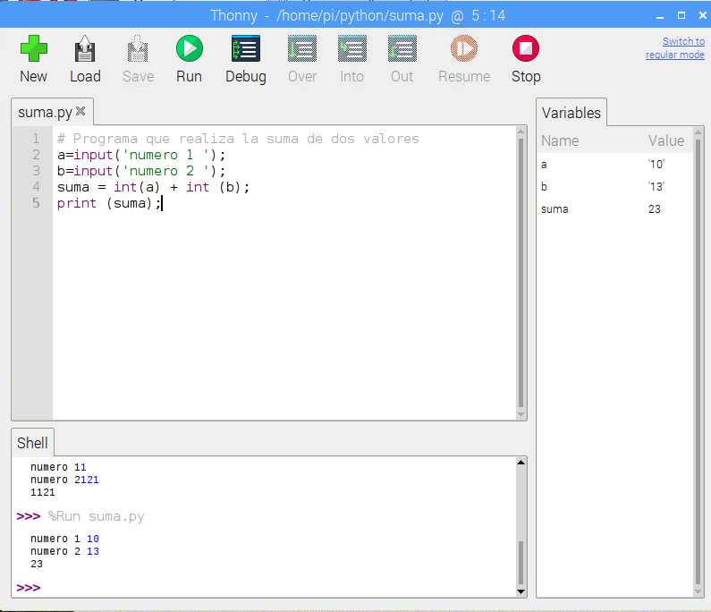

## Python

Es un lenguaje interpretado moderno de gran productividad, sencillo, potente y con millones de líneas ya desarrolladas que se pueden usar directamente por medio de paquetes instalables

Se utiliza en la web, en aplicaciones de escritorio, etc... Gran parte del interface de linux lo utiliza

Existen dos versiones de python ahora mismo: la rama 2.x y la 3.x
Por sencillez vamos a usar la sintaxis de la rama 2.x

[](https://youtu.be/Yy2oad1Xnoo)


[Video: Python en Raspberry Pi](https://youtu.be/Yy2oad1Xnoo)

Podemos utilizar varias herramientas para programar con python como Idle, Thonny un simple editor de texto o trabajar directamente sobre el intérprete python y directamente programar con él.


En las últimas versiones se incluye el editor Thonny, que nos permite trabajar con pyhton con facilidad



También podemos programar python con Geany o incluso podemos [instalar](https://pimylifeup.com/raspberry-pi-visual-studio-code/) Visual Studio Code, el entorno de microsoft.

Podemos trabajar en modo interactivo sin más que ejecutar el intérprete:

```
~/ $ python3
>>>

```

Aunque es más sencillo si escribimos nuestro código en un fichero (con cualquier editor de texto) y luego lo ejecutamos o bien abriéndolo con idle, thonny o haciendo:

```
python3 fichero.py
```


Aunque éste no pretende ser un curso sobre python, veamos algunos ejemplos:

## Operaciones numéricas y petición de datos al usuario

Es sencillo crear variables, que el usuario les de valores y hacer operaciones entre ellos:

[Código de Suma](https://github.com/javacasm/RaspberryOnline2ed/raw/master/codigo/suma.py)

```python
# Programa que realiza la suma de dos valores
a = input('numero 1 ')  # pedimos el primer numero
b = input('numero 2 ')  # pedimos el segundo numero
suma = int(a) + int (b)  # calculamos la sumas
print (suma)  # imprimimos su valor
```

**Ejercicio**: cambia la operación a realizar

### Sentencias de control condicionales

[Código de Bisiesto](https://github.com/javacasm/RaspberryOnline2ed/raw/master/codigo/bisiesto.py)

```python
# Programa que determina si un año es o no bisiesto
year = input('Introduzca el anio: ')
if ((year%400)==0  or (year % 100) ==0 or (year%4)==0): # la regla para saber si es bisiesto
  print('Es bisiesto!!')
else:
  print ('No es bisiesto!!')
```

[Código de días por mes](https://github.com/javacasm/RaspberryOnline2ed/raw/master/codigo/diasMes.py

```python
# Nos da los dias que tiene el mes seleccionado
mes = input('Introduce el mes:')
year = input('Introuce el anio:')
# Comprobamos si es entero
if type(mes) == int:
  # Comprobamos si esta entre 1 y 12
  if (mes >= 1) and (mes <= 12):
    if mes == 2:
      if(year % 400 == 0) or (year % 100 == 0) or (year % 4 == 0):
        dias = 29
      else:
        dias =28
    elif (mes == 4) or (mes == 6) or (mes == 9) or (mes == 11):
      dias = 30
    else:
      dias = 31
    print ('El mes '+str(mes) +' del anio '+str(year)+' tiene '+str(dias)+ ' dias')
  else:
    print ('El mes debe ser entre 1 y 12')
else:
  print ('El mes debe ser entero')
```

### Sentencias de control de repetición

[Código de Buscando Caracteres](https://raw.githubusercontent.com/javacasm/RaspberryOnline2ed/master/codigo/buscaCaracter.py)

```python
# Cuenta las veces que se repite un caracter en una palabra
word= 'palabra' 
caracter = 'a' 
contador=0
mensaje = 'No se ha encontrado el caracter :('
for i in range(len(word)):
  if (word[i]==caracter):
    mensaje='se ha encontrado el caracter!!!'
    contador=contador + 1

print (mensaje)
print ('Se encontrado '+str(contador)+' veces')
```

**Ejercicio**: haz que el usuario pueda introducir la cadena donde buscar y el carácter

## Python y la cámara

Veamos un par de sencillos ejemplos sobre cómo utilizar la cámara de python

Empecemos mostrando la previsualización y luego guardando una imagen en [este ejemplo](https://github.com/javacasm/RaspberryOnline2ed/raw/master/codigo/T5_camara_captura_imagen.py)

```python
# Ejemplo basico de previsualizacion y captura con la camara
# captest_basico_imagen.py
# Mas detalles en https://projects.raspberrypi.org/en/projects/getting-started-with-picamera

from picamera import PiCamera
from time import sleep

camera = PiCamera()

camera.start_preview() # muestra la previsualizacion
sleep(5) # espera 5 segundos
camera.capture('/home/pi/Desktop/image.jpg') # guarda la imagen
camera.stop_preview() # cierra la previsualizacion
```

Si lo que queremos es grabar vídeo, el código sería [el siguiente](https://github.com/javacasm/RaspberryOnline2ed/raw/master/codigo/T5_camara_captura_video.py)

```python
from picamera import PiCamera
from time import sleep

camera = PiCamera()

camera.start_preview()
camera.start_recording('/home/pi/Desktop/video.h264')
sleep(5)
camera.stop_recording()
camera.stop_preview()
```
Estos ejemplos están explicados con mucho detalle en [este proyecto](https://projects.raspberrypi.org/en/projects/getting-started-with-picamera)

Sin entrar en muchos detalles, vamos a ver un sencillo [ejemplo](https://github.com/javacasm/RaspberryOnline2ed/raw/master/codigo/T5_pygame_camara.py) de cómo integrar la cámara dentro de nuestro programa python usando la librería pygame

```python
import picamera
import pygame
import io

# Init pygame 
pygame.init()
screen = pygame.display.set_mode((0,0))

# Init camera
camera = picamera.PiCamera()
camera.resolution = (1280, 720) # resolución de la camara
camera.crop = (0.0, 0.0, 1.0, 1.0) #¿recortamos?

x = (screen.get_width() - camera.resolution[0]) / 2 # centramos en el eje x
y = (screen.get_height() - camera.resolution[1]) / 2 # centramos en el eje y

# Init buffer
rgb = bytearray(camera.resolution[0] * camera.resolution[1] * 3) # necesitamos 3 bytes por cada pixel de la camara

# Bucle principal
exitFlag = True
while(exitFlag):
    for event in pygame.event.get():
        if(event.type is pygame.MOUSEBUTTONDOWN or 
           event.type is pygame.QUIT):
            exitFlag = False
# para evitar parpadeos, se lee en una imagen y luego se copia a la pantalla
    stream = io.BytesIO()
    camera.capture(stream, use_video_port=True, format='rgb')
    stream.seek(0)
    stream.readinto(rgb) # leemos la informacion de la camara
    stream.close()
    img = pygame.image.frombuffer(rgb[0:
          (camera.resolution[0] * camera.resolution[1] * 3)],
           camera.resolution, 'RGB') # pasamos los datos leidos a una imagen

    screen.fill(0) # ponemos el fondo de la pantalla en negro
    if img: # si la imagen es valida la pasamos a pantalla
        screen.blit(img, (x,y))

    pygame.display.update() # actualizamos la pantalla

camera.close()
pygame.display.quit()

```
