## Entornos virtuales

### ¿Qué es un entorno virtual?

Un entorno virtual es una instalación minima de un intérprete de Python y los paquetes que este necesita.

Se realiza una copia (en los sistemas operativos que lo permiten se hacen enlaces, accesos directos, links) a los ejecutables, librerías y paquetes o módulos python mínimos que se necesitan para ejecutarlo.

Los paquetes o módulos que instalamos se quedan en el entorno virtual y no afectan a otros entornos ni al sistema operativo.

Podemos verle similitudes con lo que sería un "máquina virtual" de Python

Desde hace algunas versiones del sistema operativo Raspberry Pi, se hace obligatorio para el usuario por tema de seguridad, el trabajar con entornos virtuales en Python. De esta manera cuando instalamos algún paquete Python, no va a influir en el sistema operativo.

### ¿Por qué usar entornos virtuales en Python en una Raspberry Pi?

Los entornos virtuales permiten crear espacios aislados para cada proyecto de Python, donde puedes instalar versiones específicas de librerías sin afectar el sistema global ni otros proyectos. Esto es especialmente útil en Raspberry Pi porque:

- **Aislamiento de dependencias:** Cada proyecto puede tener sus propias versiones de paquetes, evitando conflictos entre proyectos.
- **Mayor seguridad y limpieza:** No modificas el entorno global del sistema, lo que reduce riesgos y mantiene tu Raspberry Pi ordenada.
- **Portabilidad:** Facilita compartir y migrar proyectos, ya que puedes replicar fácilmente el entorno en otro dispositivo.
- **Facilita la gestión:** Puedes trabajar en varios proyectos simultáneamente, cada uno con sus propias dependencias, sin interferencias.

#### Utilidad

* Tenemos un entorno limpio en el que sólo tendremos los paquetes necesarios
* La instalación de paquetes es totalmente de otros entornos virtuales
* Podemos generar las instrucciones necesarias para que cualquiera pueda replicar nuestro entorno
* Podemos probar y usar distintas versiones de un módulo (en diferentes entornos) para ver su compatibilidad 
* Generar una copia de un entorno para  hacer pruebas

#### Sobrecoste de usar un entorno virtual

El único sobrecoste de usar varios entornos virtuales es que ocuparemos espacio de disco extra.

En mi instalación actual de Linux, el directorio de un entorno virtual ocupa sólo 7Mb, un espacio ridículo para las ventajas que aporta.

Evidentemente, a medida que vamos añadiendo módulos y paquetes irá ocupando más espacio.

Los paquetes que  vamos instalando sí que ocuparán un espacio extra al replicarse.


### Cómo crear y usar un entorno virtual en Raspberry Pi desde consola

Un entorno virtual es un directorio donde se va a instalar todo lo necesario para ejecutar nuestro proyecto.

Podemos tener todos los entornos virtuales que queramos y los tendremos que activar antes de utilizarlos y desactivarlos cuando terminemos.

#### 1. Verifica que tienes las herramientas necesarias de Python 3 instaladas:

En la terminal, ejecuta:

```sh
sudo apt update sudo apt install python3 python3-pip
```

#### 2. Crea un entorno virtual

Crearemos el directorio donde vamos a  instalar y trabajar con nuestro  proyecto haremos

```sh
python3 -m venv mi_entorno
```

Esto creará una carpeta llamada `mi_entorno` en el directorio actual, que contendrá el entorno virtual.

## 3. Activa el entorno virtual

En la terminal:

```sh
source mi_entorno/bin/activate`
```

Verás que el prompt de la terminal cambia, mostrando el nombre del entorno al inicio, lo que indica que está activo.

#### 4. Instala las dependencias necesarias

Con el entorno activado, instala los paquetes que tu proyecto necesita usando `pip`:

```sh
pip3 install nombre_paquete`
```

Por ejemplo:

```sh
pip3 install requests`
```

Estos paquetes sólo se instalarán dentro del entorno virtual, no afectando el sistema global.

#### 5. Trabaja en tu proyecto

Todos los comandos de Python y pip que ejecutes mientras el entorno esté activado usarán las dependencias y configuraciones de ese entorno.

#### 6. Desactiva el entorno virtual

Cuando termines, puedes salir del entorno con:

```sh
deactivate
```

Esto te regresará al entorno global del sistema.

## Resumen de comandos principales

|Acción|Comando|
|---|---|
|Crear entorno virtual|`python3 -m venv mi_entorno`|
|Activar entorno virtual|`source mi_entorno/bin/activate`|
|Instalar paquetes|`pip install nombre_paquete`|
|Desactivar entorno virtual|`deactivate`|

### Creando un entorno virtual en Thonny

Thonny es un entorno de desarrollo integrado (IDE, por sus siglas en inglés) para Python que incluye una herramienta para crear y gestionar entornos virtuales. Para utilizar esta herramienta, debes seleccionar la opción "Create new virtual environment" en el menú "Tools" de Thonny. Luego, se te pedirá que especifiques la ubicación en la que se creará el entorno virtual y la versión de Python que se utilizará en él.

Una vez que hayas creado el entorno virtual, puedes comenzar a trabajar en tu proyecto de Python en él. Cada vez que abres un archivo de Python en Thonny, se te preguntará si quieres utilizar el entorno virtual que has creado o la instalación global de Python en tu sistema. Si eliges utilizar el entorno virtual, Thonny cargará esa versión de Python y te permitirá instalar paquetes y módulos en él de forma aislada.

Para gestionar los paquetes y módulos de un entorno virtual en Thonny, puedes utilizar el menú "Tools" y seleccionar la opción "Manage packages for current virtual environment". Allí podrás ver una lista de los paquetes y módulos instalados en el entorno virtual, así como opciones para instalar o desinstalar paquetes.

En resumen, Thonny es una herramienta muy útil para trabajar con entornos virtuales en Python, ya que te permite crearlos fácilmente y gestionar sus dependencias de manera sencilla. Si quieres saber más sobre cómo utilizar entornos virtuales en Thonny, puedes consultar la documentación oficial en el [siguiente enlace](https://thonny.org/doc/html/virtualenv.html).

Al seleccionar el intérprete seleccionamos el entorno virtual

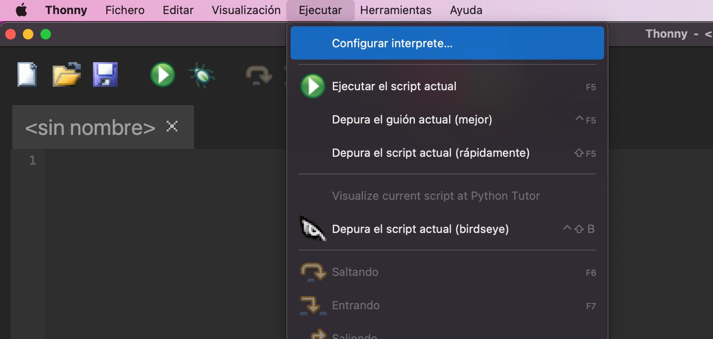


Ahora cuando queramos instalar un paquete

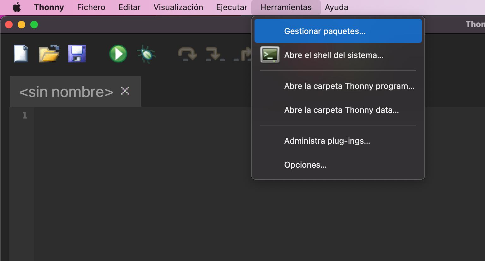


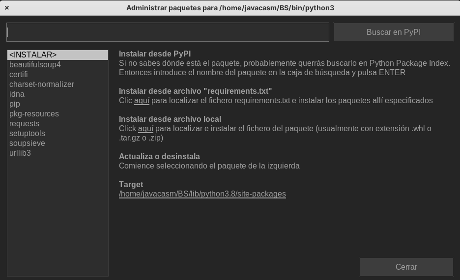


Usando el menú de Ejecutar -> Configurar Intérprete


Accedemos a la configuración del intérprete que usaremos

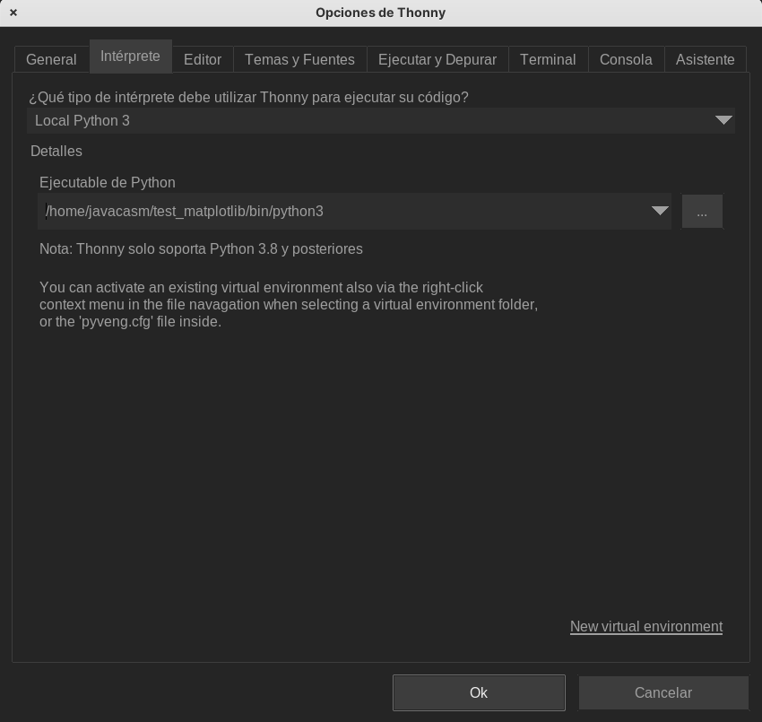

Donde un desplegable nos permite seleccionar entre los distintos intérpretes disponibles y los entonos virtuales ya creados

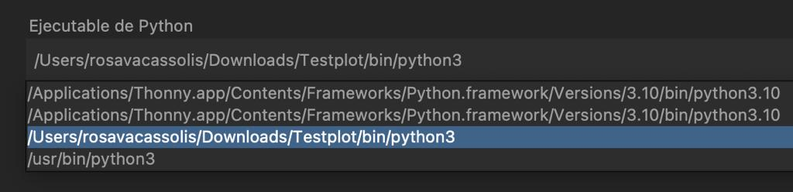

También podemos abrir un entorno virtual desde la pestaña de "Archivos", pulsando con el botón derecho sobre la opción, activar un entorno virtual

## Entornos virtuales desde Visual Studio Code

Desde la carpeta donde queremos crearlos

Pulsamos Ctrl + Shift + P para desplegar la paleta de acciones y escribimos "Python: create env"

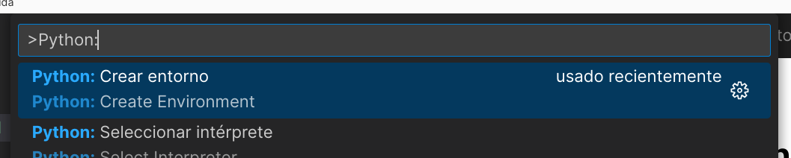

Seleccionamos el tipo de entorno virtual, venv en nuestro caso

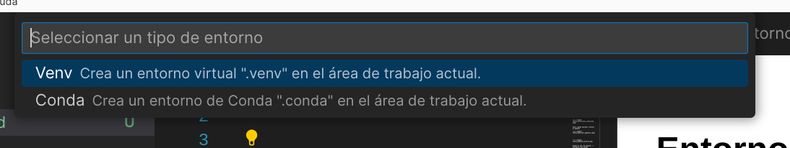

Seleccionamos el intérprete que queremos usar

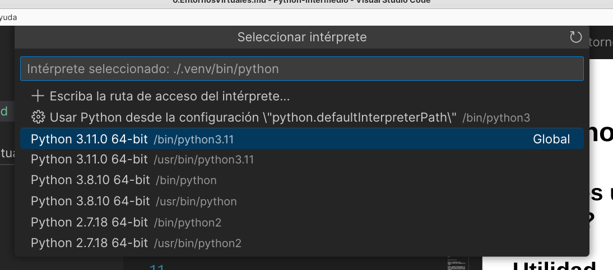

Ahora para seleccionar uno de ellos

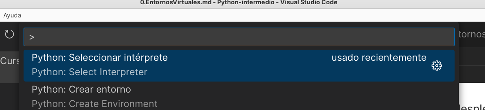

y seleccionamos el que queramos entre los disponibles

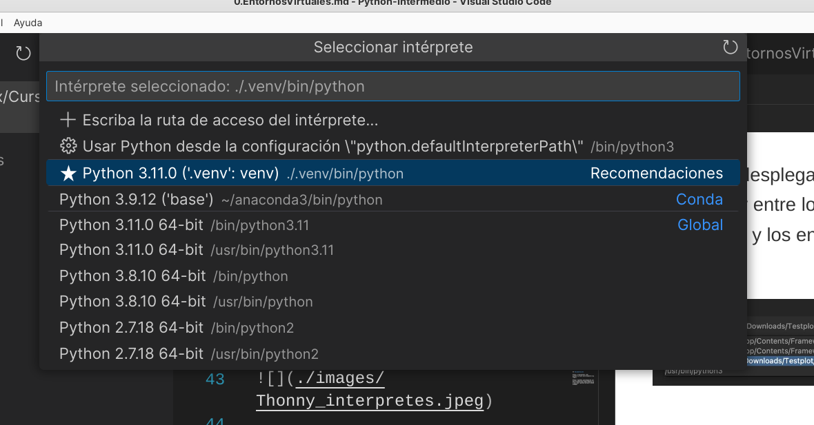

Cuando abramos un fichero python desde dentro de un entorno virtual, lo veremos indicado en la barra de estado

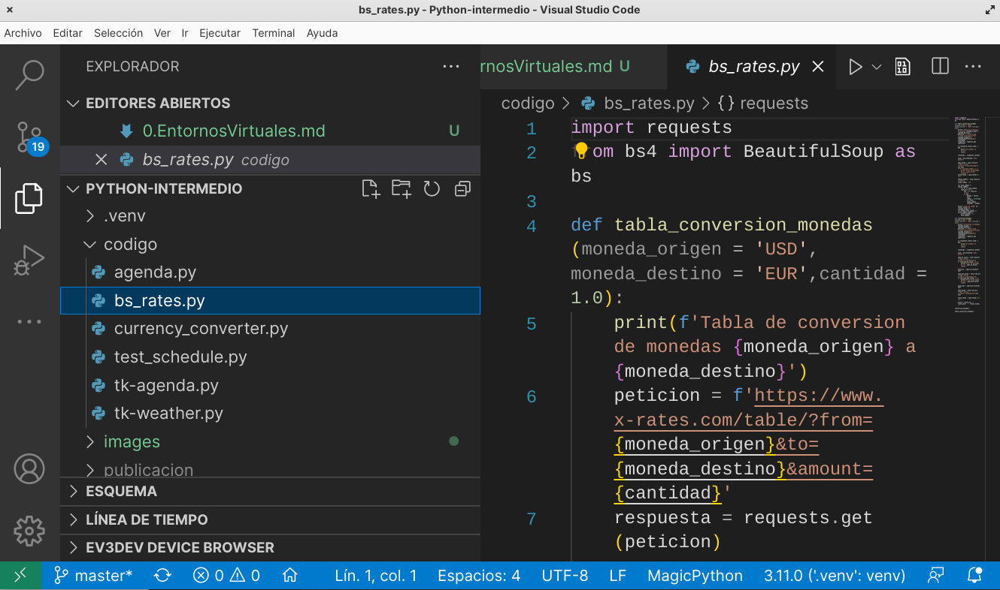

### Generando la lista de paquetes de un proyecto: requeriments.txt

- Puedes tener varios entornos virtuales para distintos proyectos y activarlos según lo necesite.
- Si necesitas gestionar diferentes versiones de Python, considera herramientas como `pyenv`3.
- Para proyectos colaborativos, guarda un archivo `requirements.txt` con las dependencias usando:
    
```sh
    pip freeze > requirements.txt`
```
    
Y luego, para instalar todas las dependencias en otro entorno:
    
```sh
  pip install -r requirements.txt`
```  

Los entornos virtuales son una herramienta esencial para cualquier desarrollador de Python en Raspberry Pi, permitiendo mantener tus proyectos organizados, seguros y fácilmente portables.

Desde Thonny podemos abrir una shell (consola o terminal) del sistema operativo que nos permite usar el intérprete Python incluído en Thonny y sus herramientas. Lo abriremos desde el menú "Herramientas" -> "Abrir shell"

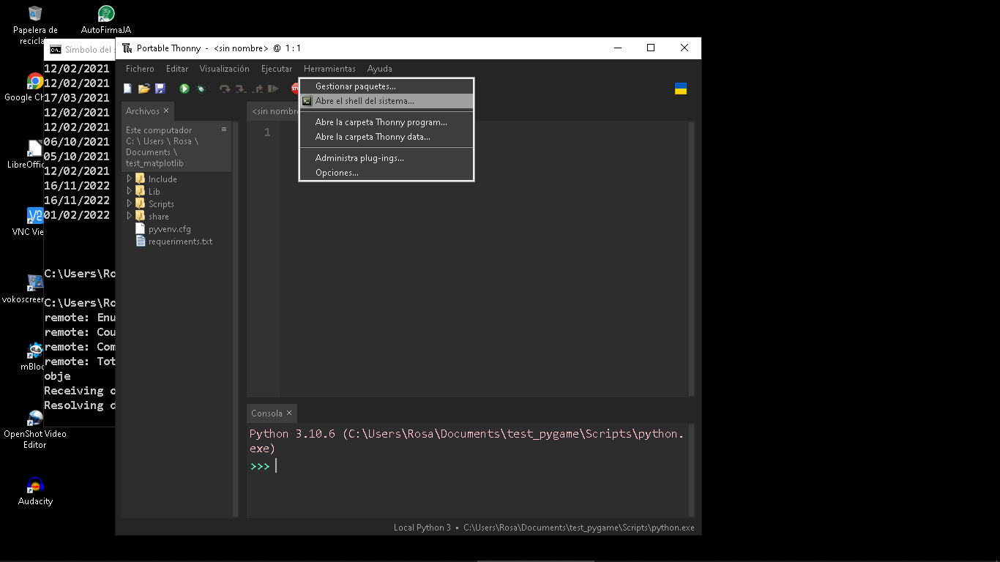 

Una vez abierto la shell 

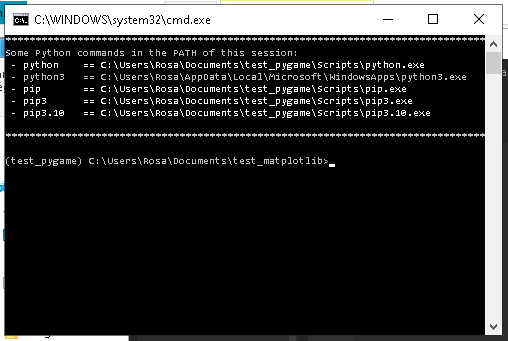

Podemos ejecutar pip paa generar el fichero __requeriments.txt__

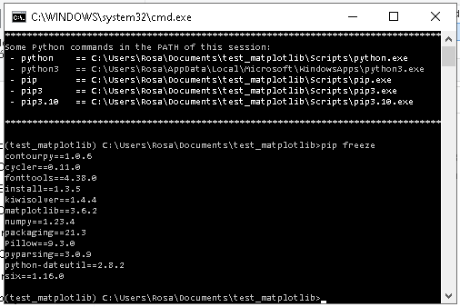

Del mismo modo también podemos replicar un entorno teniendo el fichero con el listado de paquetes.

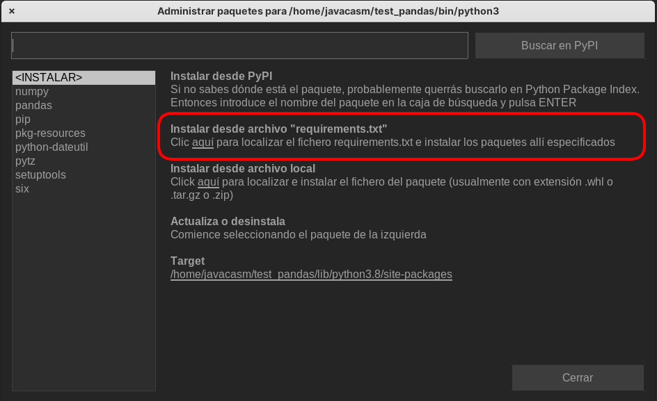

