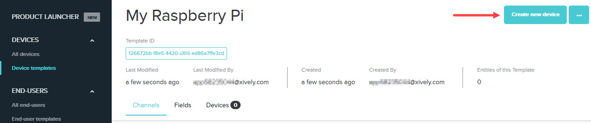
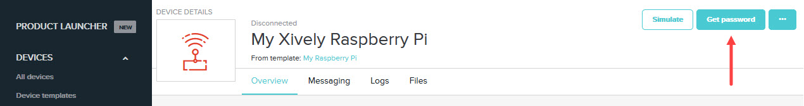
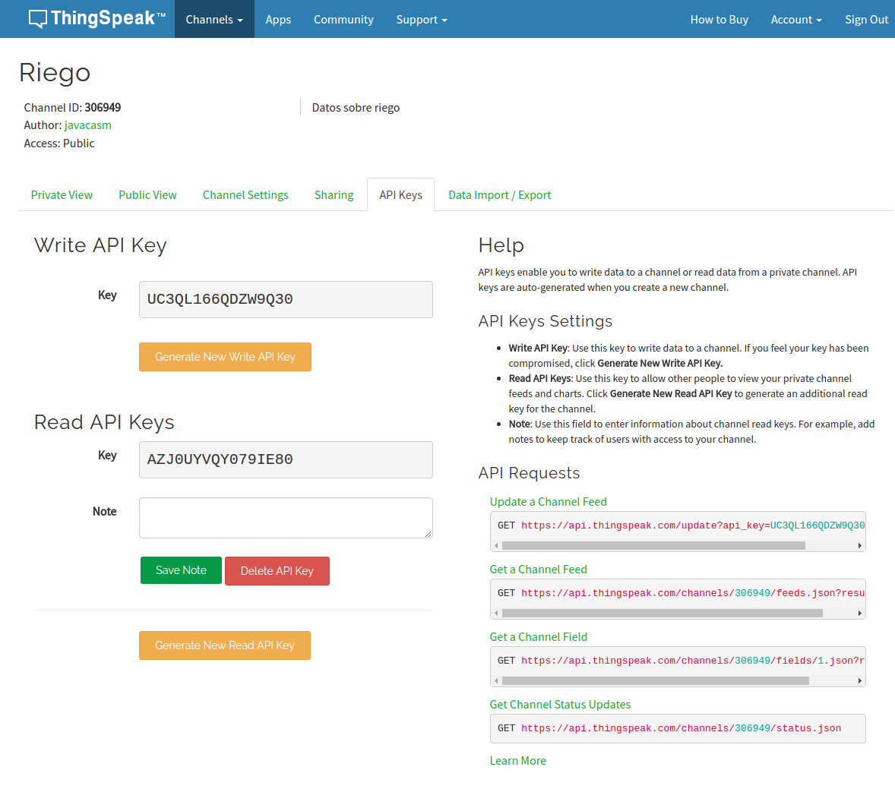
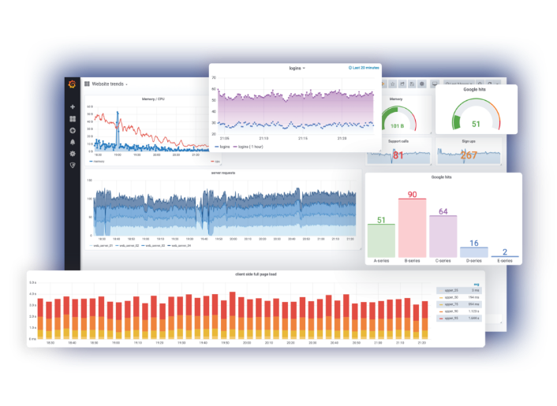
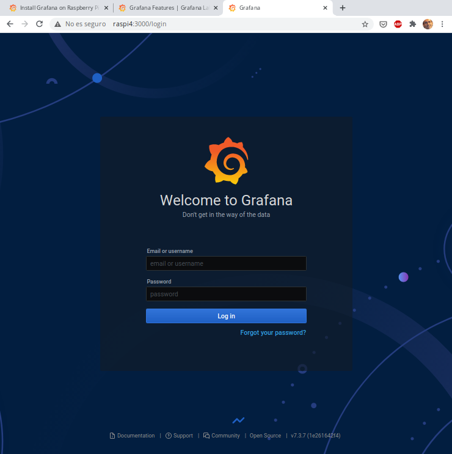
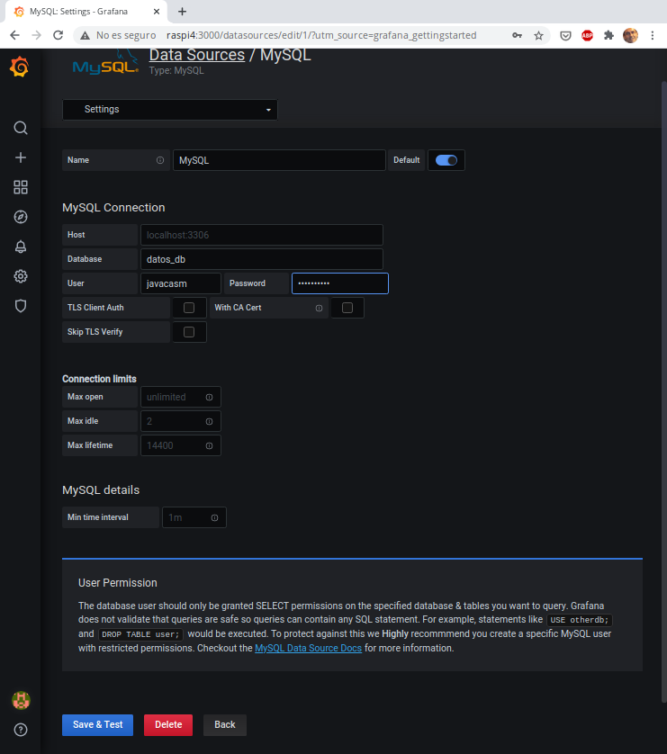
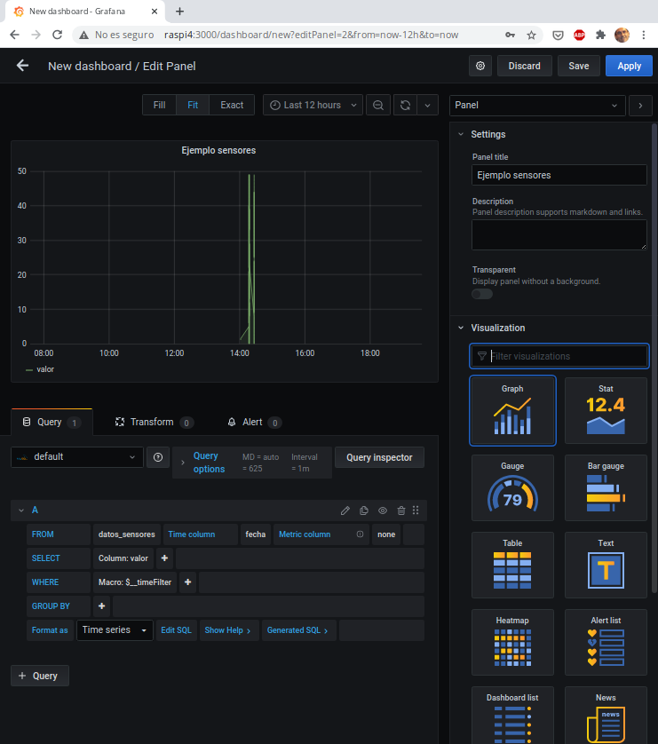

## Publicación de datos de IOT en servicios externos

Vamos a aprovechar nuestros conocimientos de python para trabajar en proyectos IOT.

Existen muchos servicios externos donde podemos publicar nuestros datos y representarlos gráficamente.

Estos servicios online, o en la nube como ahora se suele decir, exponen una serie de reglas para acceder a ellos.

Es lo que se conoce de forma genérica como un API (Application Programming Interface). 

Existen multitud de estos servicios, algunos nos permite publicar contenidos en redes sociales (como Twitter y Facebook) otros nos facilitan el almacenar nuestros datos y mostrarlos como gráficas. Además estos servicios  dan una dimensión social a nuestros datos pudiendo compartirlos con otros usuarios.


### Plataformas de publicación de datos

La mayoría de estas plataformas nos permiten subir nuestros datos y obtener gráficas con ellos


Casi todas tienen una versión limitada (limitación en la frecuencia de envío de los datos o en el volumen de estos) gratuita y otra profesional de pago.

Además algunas nos permiten establecer disparadores (trigger) para vigilar que algún dato tome cierto valor, en cuyo caso envían un aviso a nuestro sistema.

* Adafruit IO https://io.adafruit.com/
* Blynk  https://blynk.io/
* Cayenne https://mydevices.com/ 
* Grafana https://grafana.com/
* Connect2me https://www.c2m.net
* All Things Talk https://www.allthingstalk.com/
* Thingspeak https://thingspeak.com/
* Xively https://www.xively.com/


## Plataforma Xively

Uno de los más conocidos servicios que nos permiten gestionar y visualizar nuestros datos es el antes gratuito y conocido como Pachube, luego llamado Cosm y de momento [Xively](https://xively.com/).

Veamos cómo acceder a este servicio:

* Accedemos a la página de desarrolladores https://www.developerxively.com
* Buscamos los detalles para nuestro hardware, https://www.developerxively.com/docs/raspberry-pi. Vemos que en el listado no aparece ninguna de las placas Arduino, eso se debe a que Google, el actual dueño de Xively considera que ninguna de las placas Arduino puede garantizar comunicaciones seguras.

Aquí nos indica como configurar nuestra placa y descargar un ejemplo en el que cambiaremos nuestro API Key (código que obtenemos al registrarnos).

Instalamos la librería de xively con
```sh
pip3 install --user --pre xiP
```

Creamos un dispositivo en la plataforma 



Damos de alta nuestro dispositivo para obtener las credenciales en forma de fichero MQTTCredentials.txt 



Descargamos la aplicación de ejemplo con
```sh
wget https://s3.amazonaws.com/xipy-examples/xively_pub.py
```

Probamos a publicar contenidos con (tenemos el código python y el fichero MQTTCredentials.txt en la misma carpeta)

```sh
python xively_pub.py --message 'Hola desde nuestra Raspberry Pi'
```

Si todo ha ido bien podremos ver nuestro mensaje en la pestaña de del navegador de uestro canal.

[Documentación](https://www.developerxively.com/docs/raspberry-pi#create-a-device-template)

## Publicación en ThingSpeak

ThingSpeak es una servicio web que nos permite publicar datos de las medidas de nuestros dispositivos IOT (o de cualquier otro).


Es gratuito para cierto número de datos y nos permite de manera muy sencilla subir datos.

### Creación del canal (Channel)

* Nos hacemos una cuenta en ThingSpeak, recibiremos un email y lo verificamos.

* Entramos en Channels->My Channels y pulsamos en "New Channel".


* Configuraremos el canal, indicando los datos que se van a enviar. Podemos añadir una descripción y datos como la web, canal de youtube, etc...


* Para poder enviar datos al canal necesitamos el API KEY que lo identifica que incluiremos en nuestro código.



* Para que cualquiera pueda ver los datos, podemos hacer que el canal sea público, desde la pestaña Sharing.


* Una vez creado el canal podemos configurar los detalles de cada gráfico, para lo que pulsaremos sobre el icono "lápiz" de cada uno.

* En cualquier momento podemos importar/exportar los datos de un gráfico dado.


### Código Raspberry 

Éste es el [código de ejemplo para Raspberry Pi](https://iotdesignpro.com/projects/how-to-send-data-to-thingspeak-cloud-using-raspberry-pi) que nos va a enviar datos sobre el uso de CPU de nuestra Raspberry


```py
import httplib
import urllib
import time
key = "ABCD"  # Put your API Key here
def thermometer():
    while True:
        #Calculate CPU temperature of Raspberry Pi in Degrees C
        temp = int(open('/sys/class/thermal/thermal_zone0/temp').read()) / 1e3 # Get Raspberry Pi CPU temp
        params = urllib.urlencode({'field1': temp, 'key':key }) 
        headers = {"Content-typZZe": "application/x-www-form-urlencoded","Accept": "text/plain"}
        conn = httplib.HTTPConnection("api.thingspeak.com:80")
        try:
            conn.request("POST", "/update", params, headers)
            response = conn.getresponse()
            print temp
            print response.status, response.reason
            data = response.read()
            conn.close()
        except:
            print "connection failed"
        break
if __name__ == "__main__":
        while True:
                thermometer()
```

Para ejecutarlo necestiamos tener instalados los módulos **httplib** y **urllib**

```sh
sudo apt-get install httplib
sudo apt-get install urllib
```
Ahora si lo ejecutamos

```sh
python cpu.py
```
 podremos ver el gráfico en su correspondiente canal


## Instalación y uso de Grafana

[Grafana](https://grafana.com/) es una herramienta open source de representación gráfica y procesado de datos.



La instalación es sencilla y vamos a seguir los pasos que nos recomiendan en la [web de Grafana](https://grafana.com/tutorials/install-grafana-on-raspberry-pi/#3)

Añadimos la clave APT del repositorio de Grafana y luego de haber actualizado el sistema, instalamos el paquete grafana:

```sh
wget -q -O - https://packages.grafana.com/gpg.key | sudo apt-key add -
echo "deb https://packages.grafana.com/oss/deb stable main" | sudo tee -a /etc/apt/sources.list.d/grafana.list
sudo apt update
sudo apt full-upgrade
sudo apt install grafana
```

Activamos ahora el servidor de Grafana y lo arrancamos

```sh
sudo /bin/systemctl enable grafana-server
sudo /bin/systemctl start grafana-server
```

Si todo ha ido bien, podremos acceder a la página inicial de desde un navegador poniendo http://ip_raspberry:3000



Accederemos con el usuario 'admin' y contraseña 'admin', y que nos pedirá que cambiemos al entrar.

Ahora configuramos nuestra fuente de datos, en este ejemplo usarmos una base de datos mysql/mariaDB



Ahora configuramos la consulta que haremos sobre la base de datos y seleccionamos el tipo de gráficos



Podemos ver [tutoriales más detallados en la web de grafana](https://grafana.com/tutorials/)

### Tutoriales para otras plataformas

La mayoría de las plataformas tienen tutoriales detallados, y muchas de ellas como por ejemplo Blynk incluso generan el código necesario para utilizarlas, con lo que nosotros sólo tenemos que personalizarlo con nuestro sensores y preferencias.

[Blynk](https://blynk.io/en/getting-started) [Instructable](https://www.instructables.com/id/Blynk-JavaScript-in-20-minutes-Raspberry-Pi-Edison/)

[Cayenne](https://www.instructables.com/id/Platform-IoT-Cayenne-Mydevices-ESP8266-12E-NodeMCU/) ([Librería mqtt](https://github.com/myDevicesIoT/Cayenne-MQTT-ESP))

[Grafana](https://www.spainlabs.com/foros/tema-SpainLabsIoT2018-Grafana-Dashboard-Open-Source)

Más adelante, cuando ya sepamos programar haremos otros ejemplos de publicación como por ejemplo vía Telegram.

