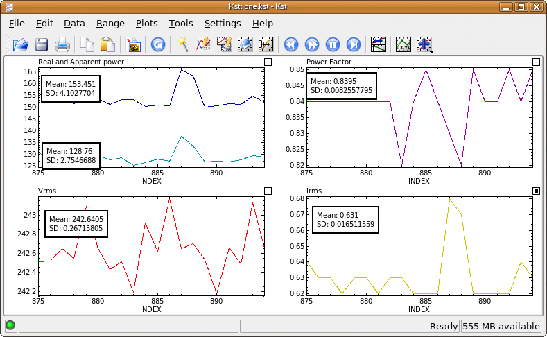
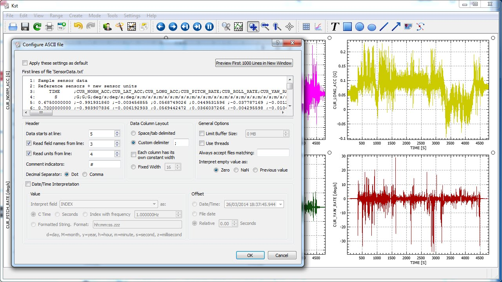

## Datalogger para Arduino con Raspberry

Ya hemos comentado que Arduino y Raspberry se complementan perfectamente.

Vamos a ver cómo comunicarlos usando el puerto serie. De esta manera podemos
* Lectura valores en Raspberry de sensores conectados físicamente a Arduino
* Guardarlos en bd o ficheros
* Gráficos
* Controlar actuadores que están conectados a Arduino

## Controlando Arduino

Vamos a hacer un ejemplo muy sencillo en el que vamos a controlar la iluminación del led del pin 13 de una placa Arduino desde un programa Python. Exactamente el mismo programa nos permitiría controlar relés.

Programaremos la placa Arduino usando el ejemplo PhysicalPixel que está en el menú Ejemplos->Comunicaciones

Una vez subido a nuestro Arduino podemos probarlo desde el monitor serie enviando las letras 'H' para encender y 'L' para apagar el led:

```C++
// Ejemplo PhysicalPixel

const int ledPin = 13; // the pin that the LED is attached to
int incomingByte;      // a variable to read incoming serial data into

void setup() {
  // initialize serial communication:
  Serial.begin(9600);
  // initialize the LED pin as an output:
  pinMode(ledPin, OUTPUT);
}

void loop() {
  // see if there's incoming serial data:
  if (Serial.available() > 0) {
    // read the oldest byte in the serial buffer:
    incomingByte = Serial.read();
    // if it's a capital H (ASCII 72), turn on the LED:
    if (incomingByte == 'H') {
      digitalWrite(ledPin, HIGH);
    }
    // if it's an L (ASCII 76) turn off the LED:
    if (incomingByte == 'L') {
      digitalWrite(ledPin, LOW);
    }
  }
}

```

Vamos a hacer ahora el programa Python que nos va a pedir un comando y actuará sobre Arduino.

Necesitamos tener instalado el módulo pySerial en nuestra Raspberry. Podemos instalarla con:

```sh
pip3 install pySerial
```

Este sencillo programa nos pide un comando y actúa sobre arduino, bien enviando un único comando, bien enviando varios en bucle


```python
import serial
import time

commandHIGH = b'H' # Los definimos como bytes, no unicode
commandLOW = b'L' # Los definimos como bytes, no unicode
commandQuite = 'Q'
comandBlink = 'P'

# según el fabricante puede ser también '/dev/ttyACM0'
serial_port = '/dev/ttyUSB0'
serial_baud = 9600

try:
    arduinoPort = serial.Serial(serial_port, serial_baud)
except:
    print('Error conectando a Arduino por ' + serial_port)
    exit(-1)

bRunning = True
while bRunning:
    comamnd = input(' H Encender, L Apaga, P Parpadea, Q Sale ')
    if comamnd == commandQuite:
        print ('bye')
        bRunning = False
    elif comamnd == comandBlink:
        for i in range(0,10):
            arduinoPort.write(commandHIGH)
            time.sleep(0.2)
            arduinoPort.write(commandLOW)
            time.sleep(0.2)
    else:
        arduinoPort.write(comamnd.encode()) # Encode transforma unicode a bytes

```

### Leyendo datos de Arduino

Vamos a hacer ahora que Arduino envíe los valores que lee de sus sensores a la Raspberry. Para ello sólo tenemos que usar **Serial.print** en Arduino. 

He ampliado el ejemplo anterior para que envíe los valores de 3 sensores analógicos cada cierto tiempo a la Raspberry. Además podemos cambiar el estado del Led 13 igual como en el ejemplo anterior

Este sería el [programa Arduino](https://github.com/javacasm/RaspberryOnline2ed/blob/master/codigo/sendData2Raspi.ino)

```C++
#define VERSION "V:1.0"

#define SEPARADOR_SERIE ";"
#define PERIODO_LECTURA_SENSORES 5000

#define CMD_RETURN_ERROR -1
#define CMD_RETURN_OK     0
#define CMD_RETURN_UNKOWN 1

#define CMD_PIN_HIGH   'H'
#define CMD_PIN_LOW    'L'

int sensor1,sensor2,sensor3;

int mostrarDatosSerie() {
  Serial.print(sensor1);
  Serial.print(F(SEPARADOR_SERIE));
  Serial.print(sensor2);
  Serial.print(F(SEPARADOR_SERIE));
  Serial.print(sensor3);

  Serial.println();
  return CMD_RETURN_OK;
}

int leerPuertoSerie(){
  if (Serial.available() > 0) {
    int incomingByte = Serial.read();
    if (incomingByte == CMD_PIN_HIGH) {
      digitalWrite(LED_BUILTIN, HIGH);
    }
    if (incomingByte == CMD_PIN_LOW) {
      digitalWrite(LED_BUILTIN, LOW);
    }
  }
  
}

void setup() {
  pinMode(LED_BUILTIN,OUTPUT);
  Serial.begin(9600);
}
int  leerSensores() {
  sensor1 = analogRead(A0);
  sensor2 = analogRead(A1);
  sensor3 = analogRead(A2);
  return CMD_RETURN_OK;
}

long tiempoUltimoDato;

void loop() {
long tiempoActual = millis();

  leerPuertoSerie();

  if (tiempoActual - tiempoUltimoDato > PERIODO_LECTURA_SENSORES ) {
    leerSensores();
    mostrarDatosSerie();
    tiempoUltimoDato = tiempoActual;
  }

}
```

El programa python escuchará lo que llega por el puerto serie y lo muestra en pantalla y lo escribe en un fichero. Lo ejecutaremos con 'python3 ReadArduinoData.py'

[Código de ReadArduinoData](https://github.com/javacasm/RaspberryOnline2ed/blob/master/codigo/ReadArduinoData.py)

```python
import serial
import time

commandHIGH = b'H' # Los definimos como bytes, no unicode
commandLOW = b'L' # Los definimos como bytes, no unicode


# según el fabricante puede ser también '/dev/ttyACM0'
serial_port = '/dev/ttyUSB0'
serial_baud = 9600

try:
    arduinoPort = serial.Serial(serial_port, serial_baud)
except:
    print('Error conectando a Arduino por ' + serial_port)
    exit(-1)

ficheroDatos = "datos.txt"

output_file = open(ficheroDatos, "w+")
bRunning = True
while bRunning:

    while arduinoPort.inWaiting()>0 :   # Hay datos pendientes
        datos = arduinoPort.readline()
        linea = datos.decode("utf-8")   # Convertimos de bytes a unicode
        print(linea)
        output_file.write(linea)        # escribimos en el fichero
        time.sleep(0.1)

    time.sleep(0.1)


```

Podemos visualizar esos datos en tiempo real con un programa como [kst](https://kst-plot.kde.org/) que está disponible para Raspberry. Lo podemos instalar con 
```sh
sudo apt install kst
```



Mientras tengamos en program ReadArduinoData.py en ejecución, el fichero 'datos.txt' se irá actualizando con los nuevos datos

Abrimos Kst y con él el fichero 'datos.txt' y lo configuramos con el separador y el tiempo de refresco necesario para que sea actualicen los gráficos



Más detalles sobre la configuración de KST en [esta página](https://miscircuitos.com/using-kst-plot-visualize-data-real-time/)

### Usando más comandos: Firmata

Esta forma de controlar remotamente nuestro arduino es tan potente y está tan extendida que ya existe un estándar de comandos de control. Se llama Firmata y permite controlar totalmente Arduino incluso acceder a dispositivos conectados como sensores y servos.

Para utilizarlo necesitamos que Arduino tenga instalado el firmware de Firmata. Desde Raspberry lo controlaremos con el módulo [pyFirmata](https://pypi.org/project/pyFirmata/) que instalaremos con 
```sh
pip3 install pyFirmata
```

Una vez instalado podemos controlar arduino con en [este ejemplo](https://github.com/javacasm/RaspberryOnline2ed/blob/master/codigo/test_firmdata.py)

```python
from pyfirmata import Arduino, util

board = Arduino('/dev/ttyUSB0') # Conectamos con la placa conectada al puerto serie

board.digital[2].write(1)  # accedemos al pin digital 2 y escribimos el valor 1 == digitalWrite(2,HIGH)
print(board.digital[2].read()) # leemos el valor del pin digital 2

# otra forma más sistemática de acceder
pin2 = board.getpin('d:2:o') # creamos una variable que representa al pin digital 2 como salida
pin2.write(1)                # ahora usamos esa variable


# acceso a pines analógicos
it = util.Iterator(board)
it.start()                  # se encarga de actualizar el valor analógico
board.analog[0].enable_reporting()
print (board.analog[0].read()) # imprimimos el valor

# La otra forma de acceder
analog_0 = board.get_pin('a:0:i') # Leemos el valor analogico de A0
print(analog_0.read())

# Acceso a PWM
pin3PWM = board.get_pin('d:3:p')  # Pin 3 con acceso PWM
pin3.write(0.6)                 # Ponemos el pin al 60%

```

Más detalles en la [página de pyFirmata](https://github.com/tino/pyFirmata)

