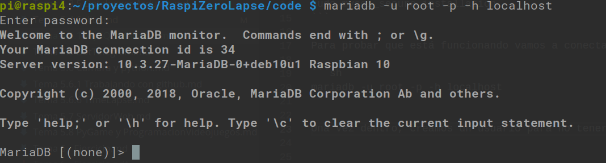
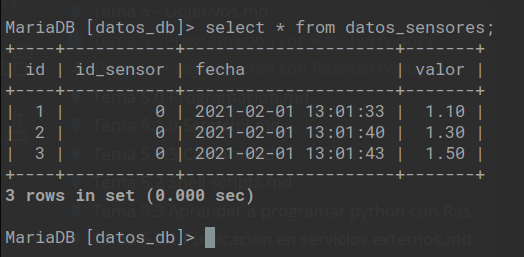

## Instalación de MySQL/MariaDB

Empecemos por aclarar el tema del nombre: originariamente la base de datos se llamaba MySQL, pero tras ser adquirida por Oracle, su creador Michael Monty Widenius, decidió hacer una versión libre derivada (un fork) llamada MariaDB, en honor a su hija.

La instalación es muy sencilla. Una vez nos hemos asegurado de que tenemos el sistema actualizado (con el clásico sudo apt update), instalamos el paquete MariaDB con 

```sh
sudo apt install mariadb-server
```

Y para configurarla con un acceso más seguro ejecutamos el siguiente script

```sh
sudo mysql_secure_installation
```

La configuración segura por defecto sólo permite que nos podamos conectar desde el propio equipo. Si queremos permitirlo sólo tenemos que comentar la línea 'bind-address' del fichero '/etc/mysql/mariadb.conf.d/50-server.cnf' que quedará así:

```
# bind-address            = 127.0.0.1
```
En nuestro ejemplo seguiremos usando todo en local.

Para probar que está funcionando vamos a conectarnos y crear una base de datos de ejemplo

```sh
mariadb -u root -p -h localhost
```

Una vez dentro, creamos un usuario para no tener que usar siempre el usuario root con 




```SQL
CREATE USER 'javacasm'@'localhost' IDENTIFIED BY 'my_password';
```

Ahora creamos una base de datos y le damos acceso al usuario que hemos creado

```SQL
CREATE DATABASE datos_db;
GRANT ALL PRIVILEGES ON datos_db.* TO 'javacasm'@'localhost';
FLUSH PRIVILEGES;
```
Si queremos que el usuario acceda desde otro ordenador tendríamos que cambiar 'localhost' por '%' en la sentencia anterior, quedando así:

```SQL
CREATE DATABASE datos_db;
GRANT ALL PRIVILEGES ON datos_db.* TO 'javacasm'@'%';
FLUSH PRIVILEGES;
```

Y salimos con 'quit;'


Ahora reiniciamos la base de datos para que se actualicen los cambios en los permisos

```sh
sudo service mariadb restart    
```

Si todo ha ido bien ya podremos crear una tabla e insertar datos. Entramos con nuestro usuario

```sh
mariadb -u javacasm -p -h localhost
```

Creamos la tabla 'datos_sensores' en la base de datos 'datos_db' con

```SQL
use datos_db;
CREATE TABLE datos_sensores (
  id bigint(20) UNSIGNED NOT NULL AUTO_INCREMENT PRIMARY KEY,
  id_sensor int NOT NULL,
  fecha datetime NOT NULL DEFAULT '0000-00-00 00:00:00',
  valor decimal(10,2)
);
```
Para insertar algunos valores podemos hacer:

```SQL
INSERT INTO datos_sensores (id_sensor,fecha,valor) values (0,now(),1.3);
INSERT INTO datos_sensores (id_sensor,fecha,valor) values (0,now(),1.5);
INSERT INTO datos_sensores (id_sensor,fecha,valor) values (0,now(),1.2);
```

Que podemos recuperar con un sencillo 'select'

```SQL
select * from datos_sensores
```



Veamos ahora un sencillo código python para insertar datos. Antes instalamos el módulo pymqsl con

```sh
pip3 install pymysql
```

El código sería:

```python
# Ejemplo sencillo de acceso a base de datos mariaDB 
# T5_mariadb
import time
import pymysql as mariadb

def insertarDato(id_sensor, valor):
    db = mariadb.connect(host='raspi4',
                            user='javacasm',
                            passwd='mi_contraseña',
                            db='datos_db')

    cursor = db.cursor() # abrimos el cursor

    insertSql = 'INSERT INTO datos_sensores (id_sensor,fecha,valor) values ({},now(),{});'.format(str(id_sensor),str(valor))

    try:
        cursor.execute(insertSql) # Executamos la sentencia insert
        db.commit() # si todo va bien la confirmamos
        print('Insertado valor:' + str(valor))
    except Exception as e:
        print('Error en la sentencia({}):{}'.format(insertSql,str(e)))
        db.rollback() # Si hay un error cancelamos la transacción

    cursor.close() # Cerramos el cursor
    db.close() # Cerramos el acceso a la db


for i in range (0,50):
    insertarDato(0,i)
    time.sleep(0.5)
    
```
[Ejemplo de inserción de datos en mariaDB con python](./codigo/T5_mariadb.py)

