## Python y la cámara

En un capítulo anterior vimos cómo conectar y configurar la cámara

Veamos un par de sencillos ejemplos sobre cómo utilizar la cámara de python

Empecemos mostrando la previsualización y luego guardando una imagen en [este ejemplo](https://github.com/javacasm/RaspberryOnline2ed/raw/master/codigo/T5_camara_captura_imagen.py)

```python
# Ejemplo básico de previsualización y captura con la camara
# T5_camara_captura_imagen.py
# Mas detalles en https://projects.raspberrypi.org/en/projects/getting-started-with-picamera

from picamera import PiCamera
from time import sleep

camera = PiCamera()

camera.start_preview() # muestra la previsualización
sleep(5) # espera 5 segundos
camera.capture('/home/pi/Desktop/image.jpg') # guarda la imagen
camera.stop_preview() # cierra la previsualización
```

Hay que recordar que dado que la cámara está conectada directamente a la GPU y la captura pasa directamente a la memoria de vídeo, la previsualización de la cámara **no se ve cuando nos conectamos por VNC**.

Si lo que queremos es grabar vídeo, el código sería [el siguiente](https://github.com/javacasm/RaspberryOnline2ed/raw/master/codigo/T5_camara_captura_video.py)

```python
# Ejemplo básico de previsualización y captura de video con la camara
# T5_camara_captura_video.py
# Mas detalles en https://projects.raspberrypi.org/en/projects/getting-started-with-picamera

from picamera import PiCamera
from time import sleep

camera = PiCamera()

camera.start_preview() # comenzamos la previsualización
camera.start_recording('/home/pi/Desktop/video.h264') # empezamos a grabar
sleep(5) # esperamos 5 segundos que durara la grabación
camera.stop_recording() # paramos la grabación
camera.stop_preview() # paramos la previsualización
```

Estos ejemplos están explicados con mucho detalle en [este proyecto](https://projects.raspberrypi.org/en/projects/getting-started-with-picamera)

Una de las ventajas de usar python es que tenemos control total sobre cada una de las tomas. La cámara permite que controlemos cada uno de sus parámetros como puede ser la ISO (equivalente a la sensibilidad ante la luz), la resolución, el tiempo de exposición etc.

El uso de todos estos parámetros está perfectamente explicado en la [documentación de piCamera](https://picamera.readthedocs.io/en/release-1.13/)

Una forma de experimentar con estos parámetros y de aprender a usarlos en python es usar la app PiCameraApp de @Billwilliams1952 que encontramos en [su github](https://github.com/Billwilliams1952/PiCameraApp)

Para usarla descargamos el [fichero zip](https://github.com/Billwilliams1952/PiCameraApp/archive/master.zip) o clonamos el repositorio con 

```sh
git clone https://github.com/Billwilliams1952/PiCameraApp.git
``` 

Y desde la carpeta source ejecutamos la app

```sh
python3 PiCameraApp.py
```

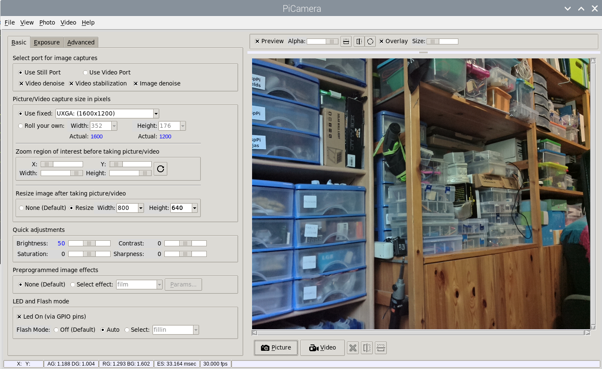

Desde la aplicación tenemos control total sobre todos los parámetros de la cámara y podemos experimentar con ellos. Además su código está muy bien estructurado y comentado con lo que puede ser un buen punto para aprender a programar.

### Algunos ejemplos

Veamos algunos ejemplos de ajustes de la cámara y como sería el código python

* Añadir texto a una imagen

```python
from picamera import PiCamera, Color
from time import sleep

camera = PiCamera()
camera.annotate_background = Color('white') # Color del fondo del texto
camera.annotate_foreground = Color('black') # Color del texto
camera.annotate_text_size = 30 # Tamaño del texto
camera.annotate_text = 'Esto es un texto de ejemplo'
camera.start_preview() # muestra la previsualización
sleep(5) # espera 5 segundos
camera.capture('/home/pi/Desktop/image.jpg') # guarda la imagen
camera.stop_preview() # cierra la previsualización
```

* Podemos aprovechar "annotate_text" para mostrar la fecha en la que se tomó la imagen 

```python
from picamera import PiCamera, Color
from time import sleep
from datetime import datetime

camera = PiCamera()
camera.annotate_background = Color('white') # Color del fondo del texto
camera.annotate_foreground = Color('black') # Color del texto
camera.annotate_text_size = 30 # Tamaño del texto
camera.annotate_text = datetime.now().strftime('%Y/%m/%d %H:%M:%S')
camera.start_preview() # muestra la previsualización
sleep(5) # espera 5 segundos
camera.capture('/home/pi/Desktop/image.jpg') # guarda la imagen
camera.stop_preview() # cierra la previsualización
```

* Añadir efectos a la cámara: vamos a añadir algunos efectos a la imagen tomada. Estos son los [efectos disponibles](https://picamera.readthedocs.io/en/release-1.13/api_camera.html#picamera.PiCamera.image_effect): 'none' , negative', 'solarize', 'sketch', 'denoise', 'emboss', 'oilpaint', 'hatch', 'gpen', 'pastel', 'watercolor', 'film', 'blur', 'saturation', 'colorswap', 'washedout', 'posterise', 'colorpoint', 'colorbalance', 'cartoon', 'deinterlace1', 'deinterlace2'.


```python
# Ejemplo básico de aplicación de efectos a la camara
# T5_camara_efectos.py
# Mas detalles en https://picamera.readthedocs.io/en/release-1.13/api_camera.html#picamera.PiCamera.image_effect

from picamera import PiCamera
from time import sleep
import random

camera = PiCamera()
efectos = ['none' , 'negative', 'solarize','sketch','denoise','emboss','oilpaint','hatch','gpen','pastel','watercolor','film','blur','saturation','colorswap','washedout','posterise','colorpoint','colorbalance','cartoon','deinterlace1','deinterlace2']
camera.start_preview() # muestra la previsualización
while True:
    efectoUsado = efectos[ random.randint(0, len(efectos)-1) ]
    print('Efecto ' + efectoUsado)
    camera.image_effect = efectoUsado
    sleep(5) # espera 5 segundos
    camera.capture('/home/pi/Desktop/image' + efectoUsado + '.jpg') # guarda la imagen
camera.stop_preview() # cierra la previsualización

```

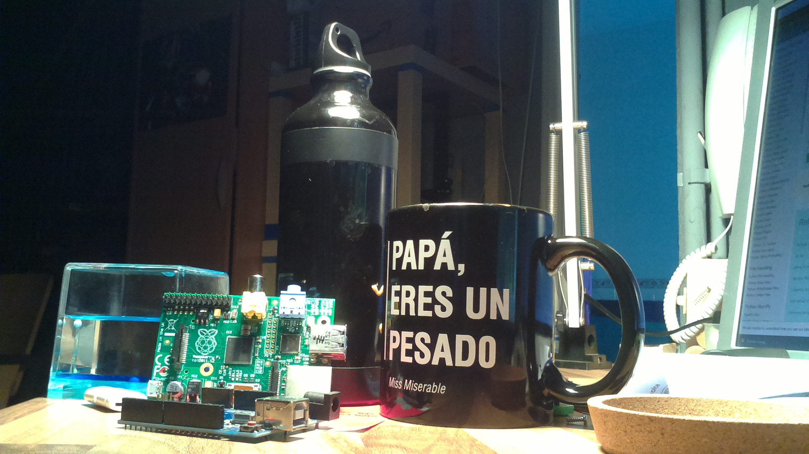

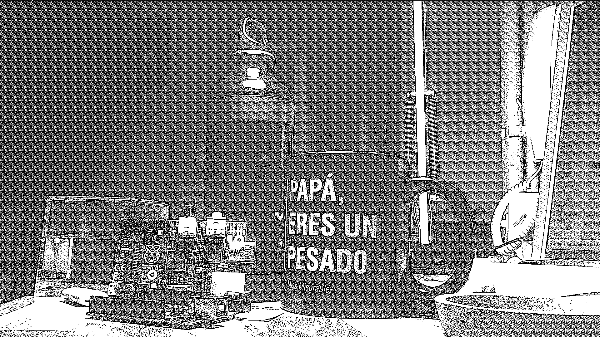
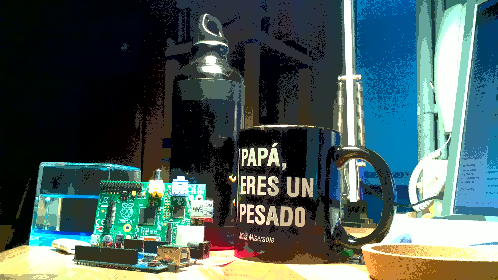       
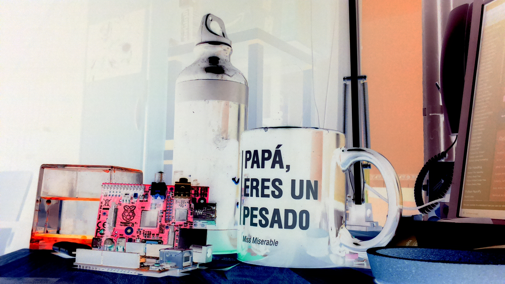
  
    
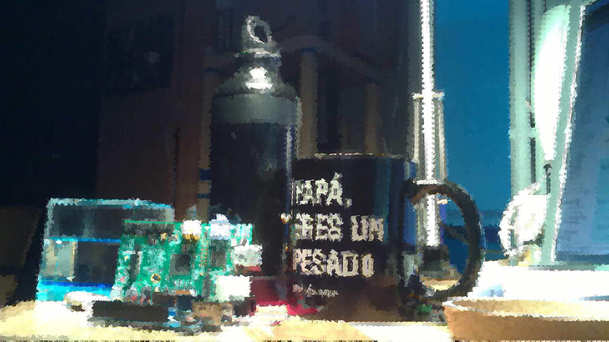
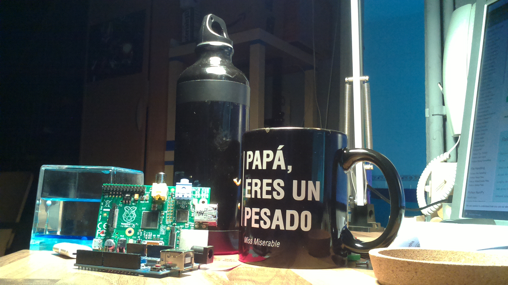     
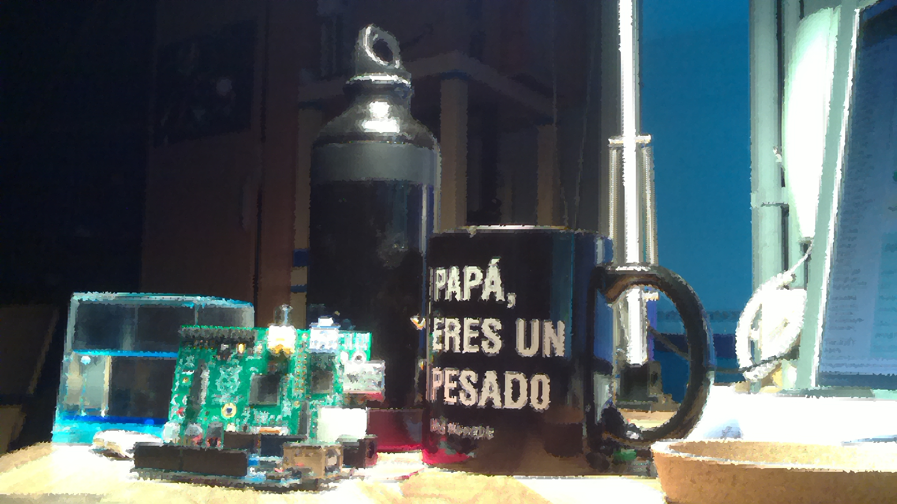
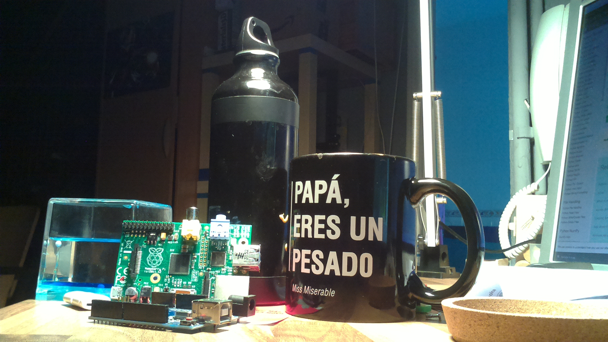  
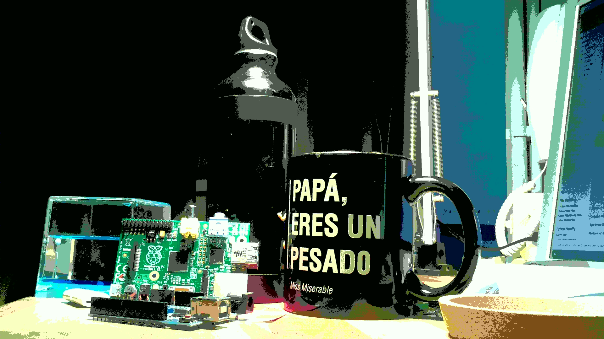
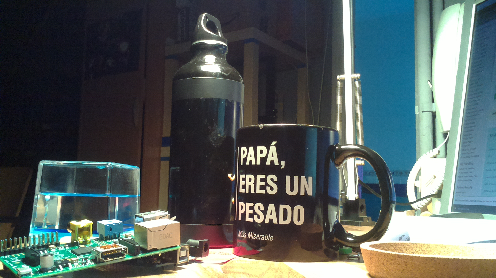  
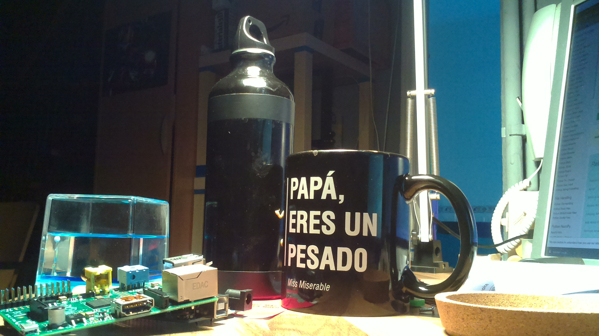
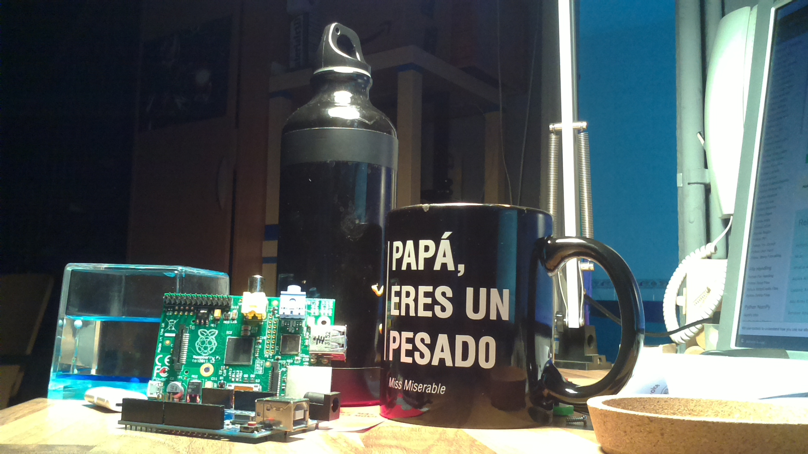       

        
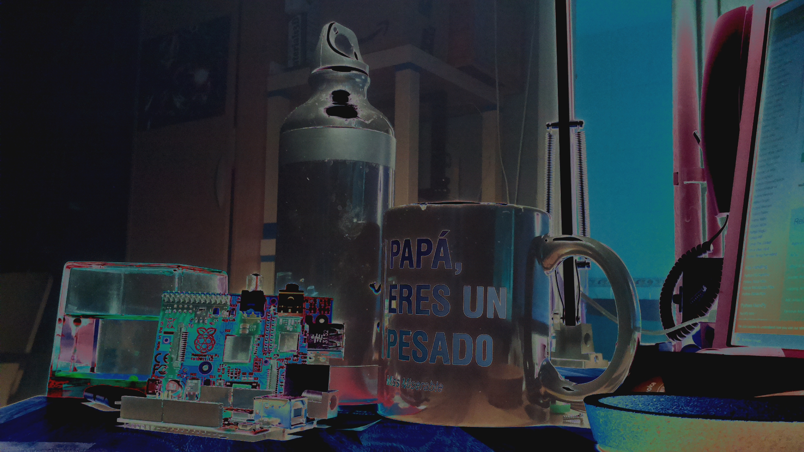
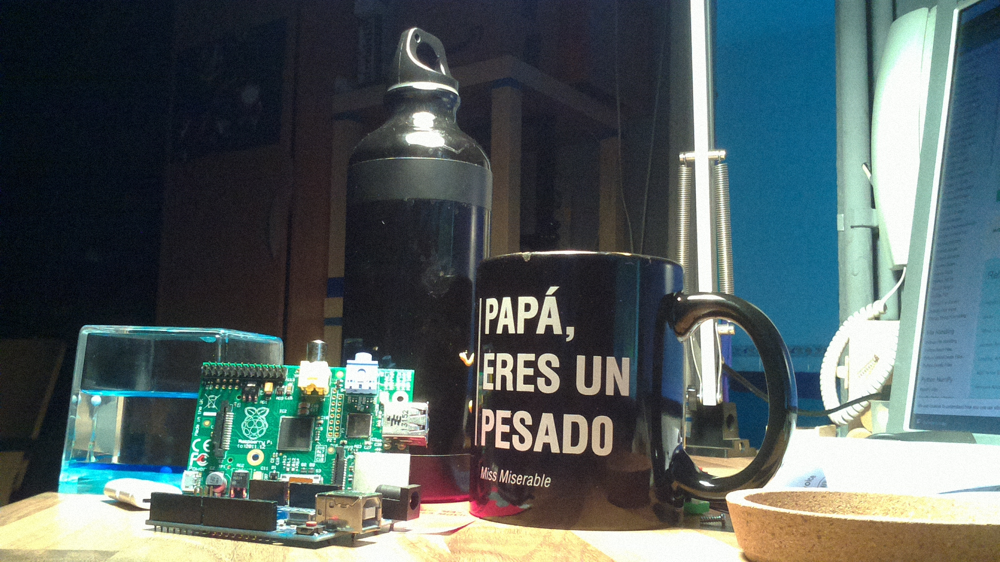          
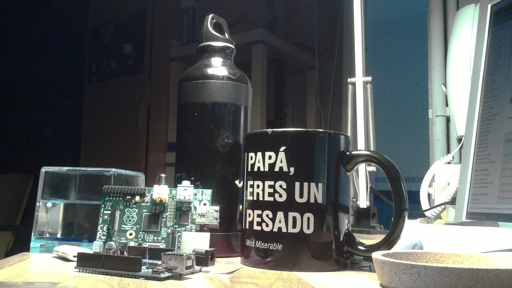
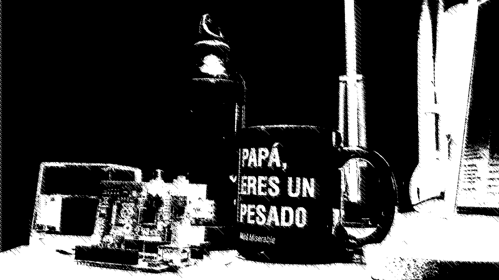          
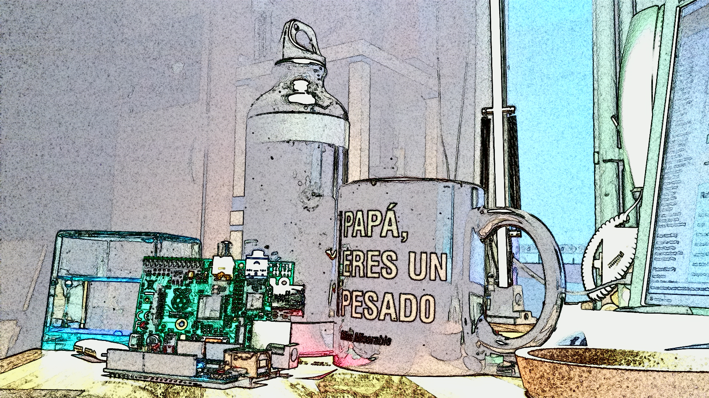


* Cambiar la sensibilidad con el parámetro ISO: al cambiar este parámetros vamos a conseguir fotos más o menos luminosas.
Hay otros muchos parámetros con los que podemos modificar la fotografía resultante.

```python
from picamera import PiCamera
from time import sleep

camera = PiCamera()

camera.annotate_background = Color('white') # Color del fondo del texto
camera.annotate_foreground = Color('black') # Color del texto
camera.annotate_text_size = 30 # Tamaño del texto

camera.start_preview() # muestra la previsualización

for iso in range(100,900,100):
    message = 'ISO:' + str(iso)
    camera.annotate_text = message
    camera.iso = iso
    sleep(5) # espera 5 segundos
    camera.capture('/home/pi/Desktop/imageISO{}.jpg'.format(ison)) # guarda la imagen

camera.stop_preview() # cierra la previsualización
```

* Cambiar resolución: podemos establecer diferentes resoluciones:

```python
from picamera import PiCamera
from time import sleep

camera = PiCamera()
camera.resolution = (2592, 1944)
camera.start_preview() # muestra la previsualización
sleep(5) # espera 5 segundos
camera.capture('/home/pi/Desktop/imageHD.jpg') # guarda la imagen
camera.stop_preview() # cierra la previsualización
```
* Utilizando las distintas opcione podemos conseguir un modo nocturno con imágenes más luminosas

```python
from picamera import PiCamera
from time import sleep

camera = PiCamera()
camera.resolution = (2592, 1944)
camera.framerate = Fraction(1,6)
camera.sensor_mode = 3
camera.shutter_speed = 6000000
camera.iso = 800
# Vamos a darle tiempo a que se ajusten los parámetros
sleep(5)
camera.exposure_mode = 'off'
camera.start_preview() # muestra la previsualización
sleep(5) # espera 5 segundos
camera.capture('/home/pi/Desktop/imageNight.jpg') # guarda la imagen
camera.stop_preview() # cierra la previsualización
```

Puedes encontrar más recetas de este estilo [en la documentación de la cámara](https://picamera.readthedocs.io/en/release-1.13/recipes1.html#)

## Recursos

[The camera guide](https://magpi.raspberrypi.com/books/camera-guide)

[The camera module](https://magpi.raspberrypi.com/books/camera-guide)

[Documentación de piCamera](https://picamera.readthedocs.io/en/release-1.13/index.html)


