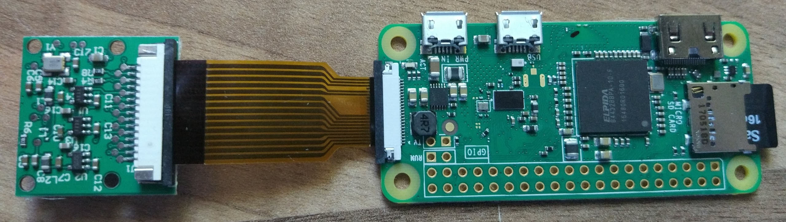
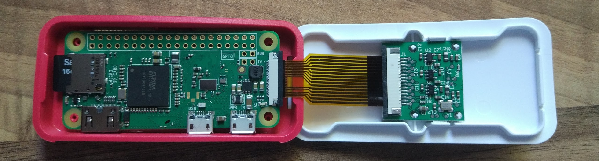
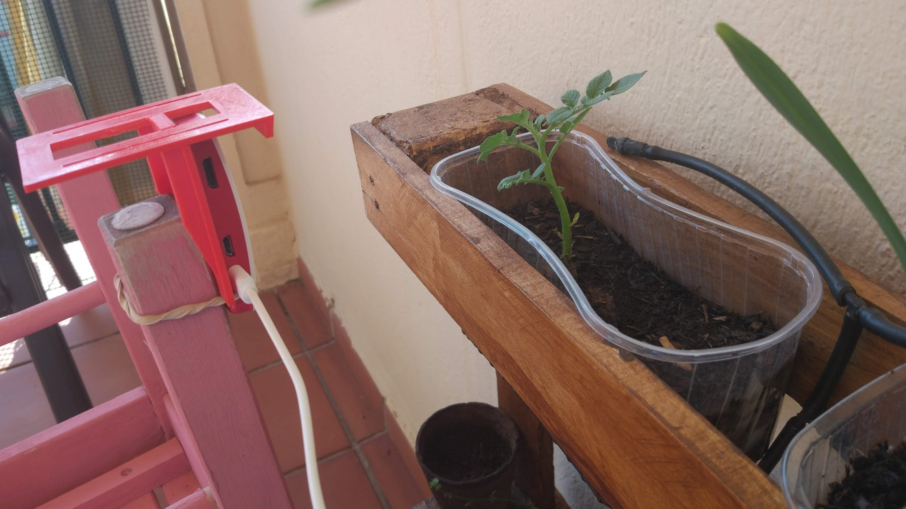

### timeLapse

El equipo estarḉa conecta vía wifi y no tendrá conectado ningún períferico, sólo la alimentación que vendrá de adaptador USB (también podemos alimentarlo desde los pines de GPIO como ya vimos)

Por ello vamos a instalar Raspberry Pi OS Lite

[](https://www.youtube.com/watch?v=rhzX1TbOddY)


Instalamos los módulos necesarios de python

sudo apt install python3-picamera


scp para copiar fotos

scp pi@raspiLapse:~/proyectos/RaspiZeroLapse/code/images/image20200707-10*


TODO: MOVER AL APARTADO CORRESPONDIENTE







https://projects.raspberrypi.org/en/projects/raspberry-pi-zero-time-lapse-cam/2


Cuidado con la alimentación, al usa una batería que daba poca potencia fallaba al encender/apagar la cámara




TODO: Comentar el tema del espacio en disco


## acceso SSH y SCP

scp pi@raspiLapse:~/proyectos/RaspiZeroLapse/code/images/* .


### Creación del vídeo

```sh
ffmpeg -framerate 30 -r 30 -pattern_type glob -i 'image*.jpg' -c:v libx264 ajo.mp4
```


### Recursos 

https://projects.raspberrypi.org/en/projects/raspberry-pi-zero-time-lapse-cam/2


### Ejemplos

Timelapse creado con una raspberry pi Zero
Más información en https://cursoraspberrypi.es/

Licencia CC by SA by @javacasm

[](https://youtu.be/fERbhBKDMPw)

[](https://youtu.be/RWBErTv-6BY)

[](https://youtu.be/IkCq2M1CAfQ)

[](https://youtu.be/e1enNTsTPHM)
 
[](https://youtu.be/L63nfxi4e6E)

[](https://youtu.be/uhzFmH66MGE)
