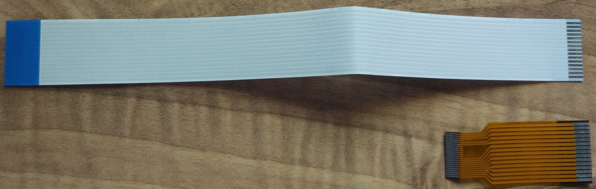
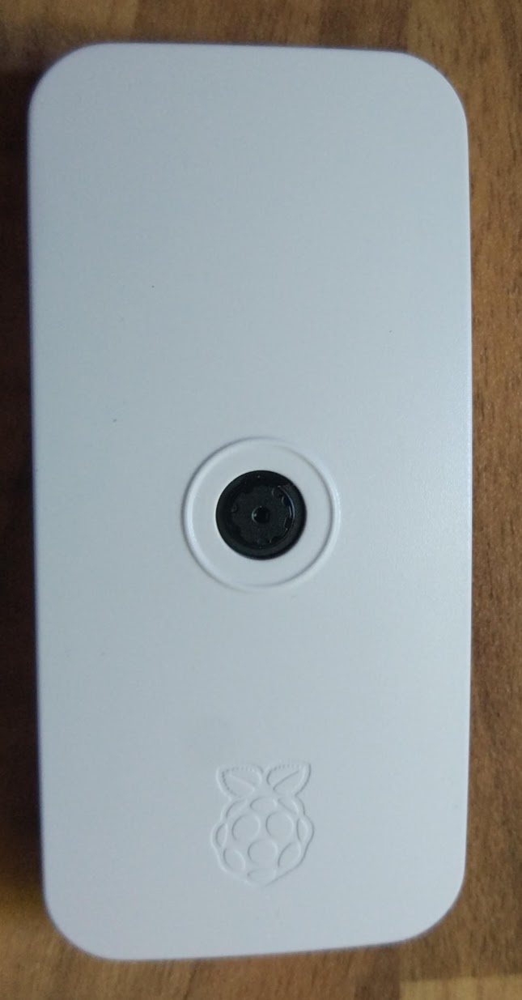

### Grabación de Time Lapse

Ya hemos visto un par de formas de crear Time Lapse:
* Con el comando raspistill y el **-tl**
* Usando un shell script

Ahora vamos a crearlos de una forma distinta: con Python. Para ello sólo vamos a tener que juntar algunas de las partes que ya hemos elaborado:
* Usaremos un bot de Telegram como sistema de control y de comunicaciones
* Capturaremos imagenes con la cámara controlando los parámetros para poder hacer fotos de día y de noche
* Como no necesitamos mucho procesamiento utilizaremos una Rasperry Pi Zero W conectada vía wifi y no tendrá conectado ningún períferico, sólo la alimentación que vendrá de adaptador USB (también podemos alimentarlo desde los pines de GPIO como ya vimos)

Por ello vamos a instalar Raspberry Pi OS Lite, como vimos en un capítulo anterior

[](https://www.youtube.com/watch?v=rhzX1TbOddY)

Ahora vamos a instalar los módulos necesarios de python

```sh
sudo apt install python3-picamera
sudo apt install python3-pip

pip3 install python-telegram
pip3 install python-telegram-bot
```

Descargamos el código del ejemplo, basado en los anteriores ejemplos al que le hemos añadido:
* Medida de la temperatura de la CPU **/temp**
* Medida del espacio en disco **/df**
* Creamos un time lapse con el comando /TTiempoEntreImagenes, con /T0 se termina el time lapse
* Podemos establecer un modo noche **/night** y día **/day**
* Podemos tomar una foto con **/foto**
* Recuperar la última foto con **/last**

### Cómo recuperar las fotos

Desde el bot de telegram podemos recuperar las imágenes, pero una a una. Para descargar varias de golpe podemos usar el comando **scp** pensado para copiar ficheros entre equipos que están conectados por ssh.

Para copiar al directorio local todas las imágenes del día 7 podemos hacer:
```sh
scp pi@raspiLapse:~/proyectos/RaspiZeroLapse/code/images/image20200707-* .
```


TODO: MOVER AL APARTADO CORRESPONDIENTE







https://projects.raspberrypi.org/en/projects/raspberry-pi-zero-time-lapse-cam/2


Cuidado con la alimentación, al usa una batería que daba poca potencia fallaba al encender/apagar la cámara


TODO: Comentar el tema del espacio en disco


### Creación del vídeo

```sh
ffmpeg -framerate 30 -r 30 -pattern_type glob -i 'image*.jpg' -c:v libx264 ajo.mp4
```


### Recursos 

https://projects.raspberrypi.org/en/projects/raspberry-pi-zero-time-lapse-cam/2


### Ejemplos

Timelapse creado con una raspberry pi Zero
Más información en https://cursoraspberrypi.es/

Licencia CC by SA by @javacasm

[](https://youtu.be/fERbhBKDMPw)

[](https://youtu.be/RWBErTv-6BY)

[](https://youtu.be/IkCq2M1CAfQ)

[](https://youtu.be/e1enNTsTPHM)
 
[](https://youtu.be/L63nfxi4e6E)

[](https://youtu.be/uhzFmH66MGE)
