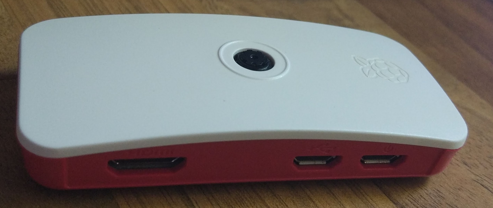

### Grabación de Time Lapse

Ya hemos visto un par de formas de crear Time Lapse:
* Con el comando raspistill y el **-tl**
* Usando un shell script

Ahora vamos a crearlos de una forma distinta: con Python. Para ello sólo vamos a tener que juntar algunas de las partes que ya hemos elaborado:
* Usaremos un bot de Telegram como sistema de control y de comunicaciones
* Capturaremos imagenes con la cámara controlando los parámetros para poder hacer fotos de día y de noche
* Como no necesitamos mucho procesamiento utilizaremos una Rasperry Pi Zero W conectada vía wifi y no tendrá conectado ningún períferico, sólo la alimentación que vendrá de adaptador USB (también podemos alimentarlo desde los pines de GPIO como ya vimos)

Por ello vamos a instalar Raspberry Pi OS Lite, como vimos en un capítulo anterior

### Montaje


Para conectar la cámara a la Rasperry Zero, necesitamos un cable especial que suele venir incluido con el kit.


Lo conectamos de esta forma (ojo a la posición del cable )


Y lo integramos en la caja con la tapa que tiene el hueco para la cámara.


Que queda perfectamente integrada y muy compacta


Ahora sólo nos falta conectar la alimentación al usb marcado como "Power"



Y nos queda un equipo muy, muy compacto


[](https://www.youtube.com/watch?v=rhzX1TbOddY)

### Instalación

Ahora vamos a instalar los módulos necesarios de python

```sh
sudo apt install python3-picamera
sudo apt install python3-pip

pip3 install python-telegram
pip3 install python-telegram-bot
```

Usaremos un código basado en los anteriores ejemplos al que le hemos añadido:
* Medida de la temperatura de la CPU **/temp**
* Medida del espacio en disco **/df**
* Creamos un time lapse con el comando /TTiempoEntreImagenes, con /T0 se termina el time lapse
* Podemos establecer un modo noche **/night** y día **/day**
* Podemos tomar una foto con **/foto**
* Recuperar la última foto con **/last**

1. Descargamos el código del ejemplo [RaspiZeroLapse](https://github.com/javacasm/RaspiZeroLapse/archive/master.zip)
1. Lo descomprimimos
1. Ponemos el TOKEN que vamos a usar con este Bot en el fichero config.py
1. Añadimos el chat_id de usario como ADMIN
1. Cambiamos el directorio donde queremos guardar las imágenes
1. Ejecutamos el bot con:
```sh
python3 timeLapseBot.py
```

Nos conectamos desde cualquier App de Telegram y lo probamos.

### Puesta en marcha de un time lapse

Una vez que lo tenemos todo listo llega el momento de conseguir un buen enfoque del objetivo que queremos fotografiar

* Si lo vamos a tener un tiempo largo, hay que conseguir que el sistema esté estable (cuidado con colocarlo en el borde la venana).


* Normalmente fijo la cámara con gomas o similar para evitar movimientos debidos al viento. También uso una carcasa impresa en 3D para la cámara con unos imanes que me permite fijarlo fácilmente

* Si el montaje es en el exterior hay que proteger a los equipos del sol y por supuesto de posibles lluvias.

* A veces uso cables extralargos para la cámara, de esta manera puedo separar más de la Raspberry.

* Una vez preparado el montaje, para ajustar el enfoque utilizo una tableta y con la app de Telegram, voy pidiéndole al bot que haga y envíe una imagen con **/foto**

* Cuando tenemos el enfoque deseado programamos el tiempo entre imágenes con **/Ttiempo**. Para el crecimiento de plantas suelo poner 120 segundos, para las capturas de amaneceres o atardeceres 30 segundos.

### Cómo recuperar las fotos

Desde el bot de telegram podemos recuperar las imágenes, pero una a una. Para descargar varias de golpe podemos usar el comando **scp** pensado para copiar ficheros entre equipos que están conectados por ssh.

Para copiar al directorio local todas las imágenes del día 7 podemos hacer:
```sh
scp pi@raspiLapse:~/proyectos/RaspiZeroLapse/code/images/image20200707-* .
```

Después de copiarlas habrá que borrarlas de la Raspberry

### Cuidados

* Cuidado con la alimentación, al usa una batería que daba poca potencia fallaba al encender/apagar la cámara.

* Si vamos a usar sólo baterías hay que medir el tiempo que estas aguantan.

* Se puede utilizar un panel solar para que recargue las baterías, pero tenemos que asegurarnos de que proporciona la energía necesaria


* Cuidado con llenar el alamecanamiento, debemos tener en cuenta el espacio libre, el tamaño de cada foto y sobre todo el número de imágenes que vamos a tomar. 

* Utilizar un almacenamiento externo (pendrive o similar) o una partición distinta para guardar las imágenes. Así si se llena no se impedirá el correcto  funcionamiento del sistema.


### Creación del vídeo

Ya vimos anteriormente  cómo generar un vídeo a partir de  nuestras imágenes. En los ejemplos que os muestro he usado este comando.

```sh
ffmpeg -framerate 30 -r 30 -pattern_type glob -i 'image*.jpg' -c:v libx264 ajo.mp4
```

También hay en el código un ejemplo de como generar gif a partir de las imágenes. En un futuro añadiré esa funcionalidad al bot.


### Ejemplos de time lapse

Todos estos time lapses los he creado con este sistema:

[](https://youtu.be/fERbhBKDMPw)

[](https://youtu.be/RWBErTv-6BY)

[](https://youtu.be/IkCq2M1CAfQ)

[](https://youtu.be/e1enNTsTPHM)
 
[](https://youtu.be/L63nfxi4e6E)

[](https://youtu.be/uhzFmH66MGE)

### Recursos 

Este proyecto está insparado por [este otro creado por la Fundación Raspberry](https://projects.raspberrypi.org/en/projects/raspberry-pi-zero-time-lapse-cam/)

