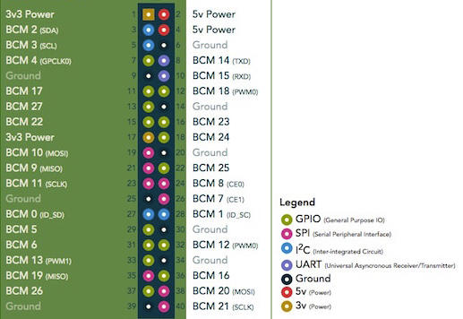
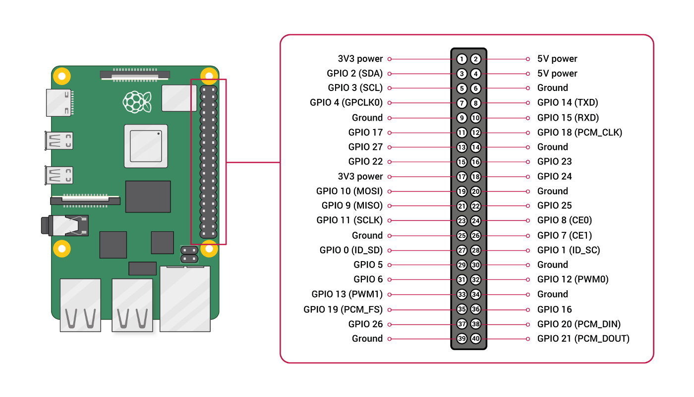
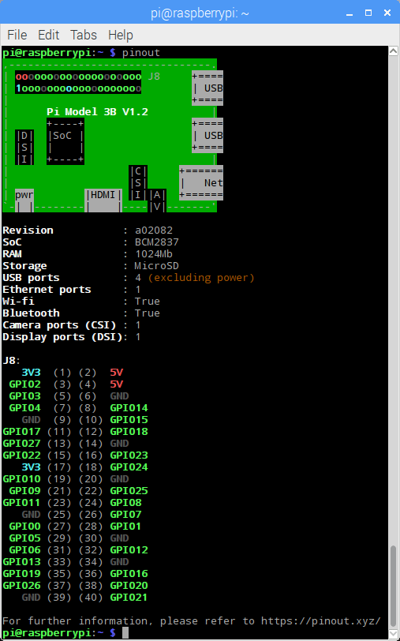

## GPIO

Todos los pines GPIO funcionan a 3.3V


(Fuente: [pinout.xyz](https://pinout.xyz/))



Tenemos varios pines de 3.3V y de 5V, también varios GND


(Fuente: [raspberrypi.org](https://www.raspberrypi.org/documentation/usage/gpio/))


Hay pines que pueden funcionar de un modo especial


* PWM (pulse-width modulation)
    * Software PWM available on all pins
    * Hardware PWM available on GPIO12, GPIO13, GPIO18, GPIO19
* SPI: protocolo de comunicaciones con dispositivos SPI
    * SPI0: MOSI (GPIO10); MISO (GPIO9); SCLK (GPIO11); CE0 (GPIO8), CE1 (GPIO7)
    * SPI1: MOSI (GPIO20); MISO (GPIO19); SCLK (GPIO21); CE0 (GPIO18); CE1 (GPIO17); CE2 (GPIO16)
* I2C: protocolo de comunicaciones con dispositivos I2C
    * Data: (GPIO2); Clock (GPIO3)
* EEPROM Data: (GPIO0); EEPROM Clock (GPIO1)
*Serial
    * TX (GPIO14); RX (GPIO15)


Podemos ver los nombres de los pines GPIO con el comando

```sh
pinout
```



## Usando sensores analógicos

https://projects.raspberrypi.org/en/projects/physical-computing/13

## Alimentación

Consumo por pin GPIO: 16mA
Consumo total de todos los GPIOs: 50mA


## GPIO Zero: python para GPIO

[Tutorial GPIO Zero](https://www.raspberrypi.org/documentation/usage/gpio/python/README.md)

[Referencia](https://gpiozero.readthedocs.io/)


## Recursos

[Introduction to Raspberry Pi 4 GPIO](https://itnext.io/an-introduction-to-raspberry-pi-4-gpio-and-controlling-it-with-node-js-10f2ce41af12)