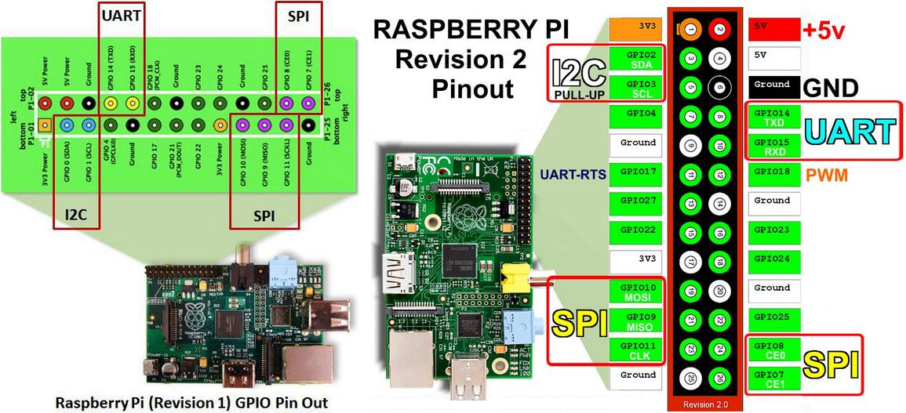

## GPIO


¿Qué son los GPIO?

* Son los pines que podemos usar como salidas o como entradas, es decir, para activar dispositivos (leds, motores, etc) o para leer el estado de sensores, interruptores etc. Siempre funcionan en modo digital.
* Podemos configurar cada uno como entrada o como salida.
* Utilizan **3.3V** Por ello tenemos que tener cuidado con el voltaje que usa el dispositivo que conectamos, Un dispositivo que use 5V podría dañarla.
* Algunos de ellos se pueden usar como comunicaciones especializadas: SPI, I2C, UART


## Pines

Las distintas versiones de la Raspberry tienen algunos pines distintos.

Hasta la Raspberry Pi 2, tenían 20 pines:


	
Las versiones de 40 pines hasta la Raspberry pi 3+


Los GPIOs para la Raspberry pi 4


Hay que tener cuidado con no equivocarse al usarlos. Para evitar errores podemos usar una etiqueta


O esta otra versión del gran @pighixxx con los diferentes etiquetados [para descargar en la [orginal](https://pbs.twimg.com/media/DACXWfzXkAE--mT.jpg)

 

[](https://youtu.be/9UiZ7m6UacM)

[Vídeo sobre etiquetas en los GPIO de Raspberry](https://youtu.be/9UiZ7m6UacM)

### Usos de los GPIOs

¿Para qué podemos usar los GPIO?

* Encender apagar LEDs (no podemos aspirar a encender nada de mayor potencia directamente). Estas son las salidas digitales, capaces de estar en estado alto o bajo.
* Algunos de estos pines pueden generar PWM (modulación por ancho de pulso) protocolo que usan los servos.
* Detectar pulsaciones de botones/interruptores. Estas son las entradas digitales.
• Acceso al puerto serie por los terminales TX/TX
• Acceso al bus I2C, bus de comunicaciones usado por muchos dispositivos
• Acceso al bus SPI, bus de comunicaciones similar al I2C pero con diferentes especificaciones

El bus I2C y SPI nos permiten conectar con dispositivos externos que nos
expanden su funcionalidad. Es como si conectáramos periféricos a nuestra
Raspberry.


* También están disponibles las líneas de alimentación de 5v y 3.3v y por supuesto tierra.

* Todos los pines se pueden configurar tanto de entrada como de salida.

* Algunos de los pines tienen una segunda función como por ejemplo los etiquetados como SCL y SDA utilizados para I2C y los MOSI, MISO y SCKL utilizados para conectar con dispositivos SPI.
* Hay que tener muy claro que todos los pines usan niveles lógicos de 3.3V y no es seguro conectarlos directamente a 5V, porque las entradas han de ser menores de 3.3V. Igualmente no podemos esperar salidas superiores a 3.3V.
* En caso de querer conectar con lógica de 5v tendremos que usar una electrónica para adaptar niveles.
* Existen dispositivos convertidores de niveles (level shifters) con diferentes tecnologías. Los más antiguos están formados por unas resistencias y unos transistores.


Para identificar más fácilmente los pines recordad que podemos usar el truco de las etiquetas del que ya hablamos


## Manejo basico de los pines

Vamos a hacer ahora algunos montajes básicos


### Encendiendo un led

Necesitaremos un Led y una resistencia de 220Ohmios (o 330) 
Vamos conectarlos de la siguiente manera


El programa es muy sencillo

```python
from gpiozero import LED  # importamos los modulos necesarios
from time import sleep

red = LED(17)  	# declaramos un led conectado al GPIO 17

while True:  	# Repetimos en bucle para siempre
	red.on() 	# Encendemos el led
	sleep(1)	# Esperamos 1 segundo
	red.off()	# Apagamos el led
	sleep(1)	# Esperamos otro segundo
```

[Código](https://github.com/javacasm/RaspberryOnline2ed/blob/master/codigo/test_led.py)

Podemos utilizar el edito Thonny para ejecutar los siguientes ejemplos 

### Usando botones/pulsadores

Vamos ahora a conectar un botón y a detectar cuando está pulsado


Y el programa es muy sencillo también

```python
from gpiozero import Button # importamos los modulos necesarios

button = Button(2) # Declaramos pulsador conectado al GPIO 2

button.wait_for_press() # Espera hasta que se pulse el boton
print('Me has pulsado') # Nos informa de que se ha pulsado
```

[Código](https://github.com/javacasm/RaspberryOnline2ed/blob/master/codigo/Test_boton.py)

Fácilmente podemos mezclar los dos ejemplos, haciendo que el led se encienda durante un tiempo cuando pulsemos

```python
from gpiozero import LED, Button # importamos modulos necesarios
from time import sleep

led = LED(17)  # declaramos un led conectado al GPIO 17
button = Button(2) # Declaramos un pulsador conectado al GPIO 2

button.wait_for_press()  	# Espera hasta que se pulse el boton
led.on()					# Encendemos el led
sleep(3) 					# Esperamos 3 segundos
led.off()					# Apagamos el led
```

Ya tenemos todo lo necesario para montar un semáforo ¿te animas?


## GPIO

Todos los pines GPIO funcionan a 3.3V


(Fuente: [pinout.xyz](https://pinout.xyz/))


Tenemos varios pines de 3.3V y de 5V, también varios GND


(Fuente: [raspberrypi.org](https://www.raspberrypi.org/documentation/usage/gpio/))


Hay pines que pueden funcionar de un modo especial


* PWM (pulse-width modulation)
    * Software PWM available on all pins
    * Hardware PWM available on GPIO12, GPIO13, GPIO18, GPIO19
* SPI: protocolo de comunicaciones con dispositivos SPI
    * SPI0: MOSI (GPIO10); MISO (GPIO9); SCLK (GPIO11); CE0 (GPIO8), CE1 (GPIO7)
    * SPI1: MOSI (GPIO20); MISO (GPIO19); SCLK (GPIO21); CE0 (GPIO18); CE1 (GPIO17); CE2 (GPIO16)
* I2C: protocolo de comunicaciones con dispositivos I2C
    * Data: (GPIO2); Clock (GPIO3)
* EEPROM Data: (GPIO0); EEPROM Clock (GPIO1)
*Serial
    * TX (GPIO14); RX (GPIO15)


Podemos ver los nombres de los pines GPIO con el comando

```sh
pinout
```


## Alimentación

Consumo por pin GPIO: 16mA
Consumo total de todos los GPIOs: 50mA


## GPIO Zero: python para GPIO

[Tutorial GPIO Zero](https://www.raspberrypi.org/documentation/usage/gpio/python/README.md)

[Referencia](https://gpiozero.readthedocs.io/)


## Recursos

[Introduction to Raspberry Pi 4 GPIO](https://itnext.io/an-introduction-to-raspberry-pi-4-gpio-and-controlling-it-with-node-js-10f2ce41af12)

[GPIO Zero en ](https://www.raspberrypi.org/magpi-issues/Essentials_GPIOZero_v1.pdf)

[Raspberry pi GPIO](http://mbrobotics.es/blog/raspberry-pi-gpios/)

[Servidor web con flask](https://wikitic.github.io/raspberry_pi-webserver-python/)