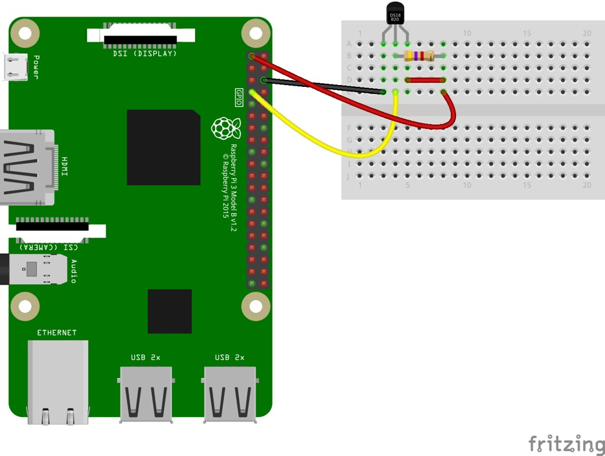

## Sensores

Veamos como podemos conectar sensores de temperatura digitales como pueden ser el DS18x20 o el DHT11

### DS18x20

Este sensor de aspecto idéntico a un transistor nos permite medir fácilmente la temperatura con un montaje mínimo:



Necesitamos una resistencia de 4.7ohmios que actuará como pull-up en el montaje.

Por defecto el driver de one-wire us el GPIO04, pero si necesitamos cambiarlo podemos hacerlo modificando en el fichero /boot/config.txt la línea 'dtoverlay=w1-gpio,gpiopin=x'

Para poder usarlo tenemos que activar en la configuración el acceso al protocolo OneWire que usa este sensor. Para ello entramos en configuración con 

```sh
sudo raspi-config
```
Y en la opción "Interfacing" activamos "one-wire interface"


y reiniciamos para que se activen los cambios.

Instalamos el módulo python **w1thermsensor** con 

```sh
sudo pip3 install w1thermsensor
```
Un sencillo programa nos permite ver el valor de temperatura cada segundo

```python
import time

from w1thermsensor import W1ThermSensor # importamos la librería
sensor = W1ThermSensor()

while True:
    temperature = sensor.get_temperature()
    print(' Temperatura {}º'.format(temperature))
    time.sleep(1) 
```

[Código](https://github.com/javacasm/RaspberryOnline2ed/blob/master/codigo/test_ds18x20.py)

### Sensores de temperatura y humedad DHT: DHT22

Vamos a hacer ahora un montaje con un conocido sensor de humedad y temperatura como es el DHT22. Lo mismo sería aplicable a su hermano pequeño el DHT11


Vamos a hacerlo usando un módulo específico que existe para [este sensor](https://github.com/adafruit/Adafruit_Python_DHT) 

El montaje es muy sencillo (tomado de la [página de "el atareao"](https://www.atareao.es/podcast/temperatura-con-la-raspberry/)), donde se incluye una resistencia de 10K en modo pull-up, que pondremos si usamos el sensor directamente. En el caso de que utilicemos un módulo con un pcb con el sensor DHT22 soldado en ella no será necesaria la resistencia si este la lleva incorporada.


Instalamos el módulo de Adafruit para sensores DHT

```sh
pip3 install Adafruit_DHT
```

El [programa](https://github.com/javacasm/RaspberryOnline2ed/blob/master/codigo/test_dht22.py) no puede ser más sencillo

```python
#!/usr/bin/python3
import sys
import Adafruit_DHT as dht
import time


sensor = dht.DHT22 # Podría ser tambien un DH11
pin = 4
while True:
    humedad, temperatura = dht.read_retry(sensor, pin) # recuperamos los valores del sensor
    if humedad != None and temperatura != None:
        print('Temp={0:0.1f} ºC,  Hum={1:0.1f} %'.format(temperatura, humedad))
        time.sleep(5) # esperamos 5 segundos
    else:
        print('Error de conexión. Verifique la conexiona al pin {}'.format(pin))
```


También podíamos haber aprovechado para hacer este montaje usando [CiruitPython](https://learn.adafruit.com/circuitpython-on-raspberrypi-linux/overview) que es una variante de Micropython (la versión de python para microcontroladores), creada por Adafruit, que ha añadido objetos de más alto nivel como motor, sensor, etc.. 

Para ello seguiríiamos [este tutorial](https://learn.adafruit.com/dht-humidity-sensing-on-raspberry-pi-with-gdocs-logging/python-setup)

