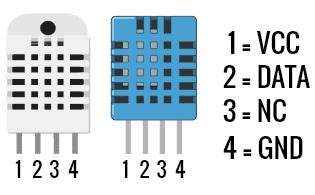
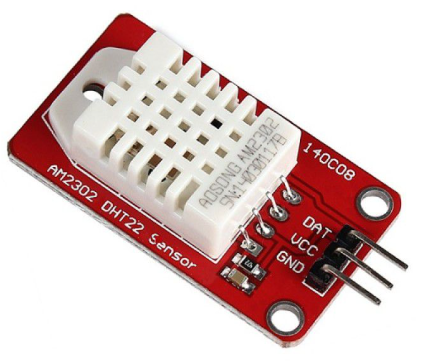
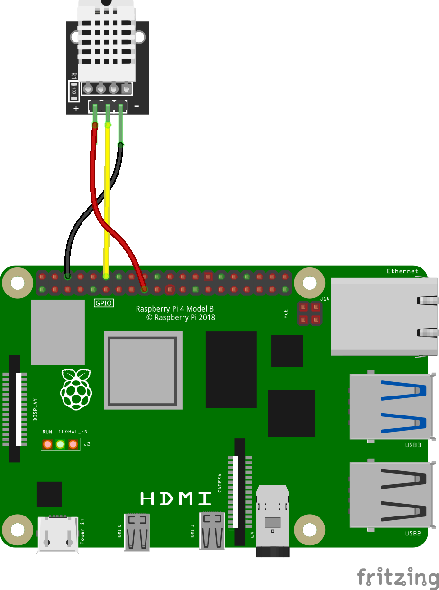
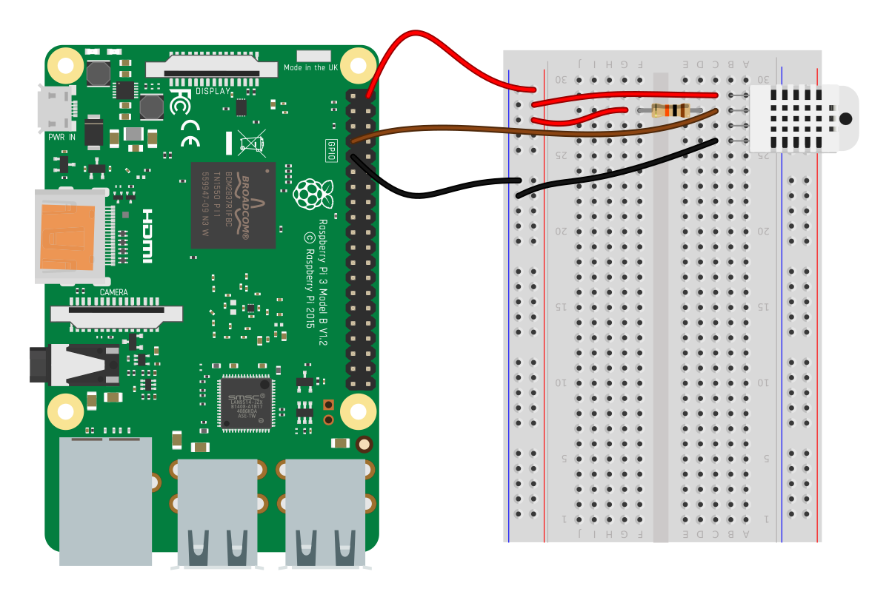
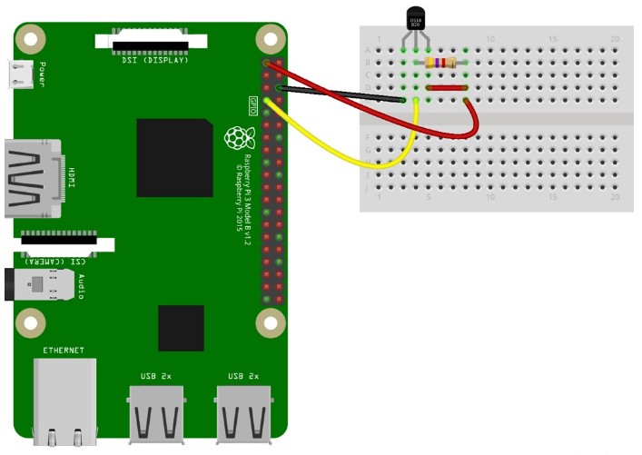
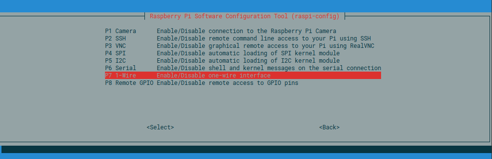

## Sensores de temperatura

Veamos cómo podemos conectar sensores de temperatura digitales como el DS18x20 o el DHT11. La Raspberry no puede hacer medidas analógicas y no podemos usar directamente termistores o sensores TMP36 o TM35.

Vamos a ver entre los sensores de temperatura digitales cuáles usar:

1. **DS18B20 (OneWire)**
    
    - **Descripción**: Sensor digital de temperatura que utiliza el protocolo 1-Wire, requiriendo un solo pin de datos. Disponible en formato TO-92 o como sonda impermeable.
    - **Especificaciones**:
        - Rango de Temperatura: -55°C a +125°C
        - Precisión: ±0.5°C (de -10°C a +85°C)
        - Resolución: 9–12 bits (configurable)
        - Interfaz: 1-Wire
    - **Ventajas**:
        - Alta precisión y resolución.
        - Permite conectar múltiples sensores en un solo pin GPIO (cada sensor tiene un ID único).
        - Versión impermeable ideal para entornos extremos (por ejemplo, líquidos o exteriores).
        - Robusto y fiable para aplicaciones industriales.
    - **Desventajas**:
        - Requiere una resistencia de pull-up (4.7kΩ).
        - Configuración inicial más compleja debido al protocolo 1-Wire.
        - Coste moderado, superior al DHT11.
    - **Casos de Uso**: Monitorización precisa en entornos extremos (por ejemplo, acuarios, estaciones meteorológicas, sistemas de refrigeración).
    
2. **DHT11**
    
    - **Descripción**: Sensor digital de bajo coste que mide temperatura y humedad relativa.
    - **Especificaciones**:
        - Rango de Temperatura: 0°C a 50°C
        - Precisión de Temperatura: ±2°C
        - Rango de Humedad: 20–80% RH
        - Precisión de Humedad: ±5% RH
        - Frecuencia de Muestreo: 1 Hz (una lectura por segundo)
        - Interfaz: Digital (un solo pin de datos)
    - **Ventajas**:
        - Muy económico.
        - Combina temperatura y humedad en un solo dispositivo.
        - Fácil de usar, especialmente con módulos que incluyen resistencia de pull-up.
        - Ideal para principiantes.
    - **Desventajas**:
        - Baja precisión y rango limitado.
        - Frecuencia de muestreo lenta.
        - Sensible a interferencias y errores de lectura.
    - **Casos de Uso**: Proyectos básicos de monitorización en interiores (por ejemplo, habitaciones, pequeños invernaderos).
    
3. **DHT22/AM2302**
    
    - **Descripción**: Versión mejorada del DHT11, con mayor precisión y rango para temperatura y humedad.
    - **Especificaciones**:
        - Rango de Temperatura: -40°C a +80°C
        - Precisión de Temperatura: ±0.5°C
        - Rango de Humedad: 0–100% RH
        - Precisión de Humedad: ±2–5% RH
        - Frecuencia de Muestreo: 0.5 Hz (una lectura cada 2 segundos)
        - Interfaz: Digital (un solo pin de datos)
    - **Ventajas**:
        - Mejor precisión y rango que el DHT11.
        - Asequible en comparación con sensores de alta gama.
        - Salida digital que simplifica la interfaz.
        - Adecuado para entornos más exigentes.
    - **Desventajas**:
        - Más caro que el DHT11.
        - Requiere temporización precisa (gestionada por la biblioteca).
        - Puede requerir resistencia de pull-up externa en algunos casos.
    - **Casos de Uso**: Monitorización en interiores y exteriores donde se necesita mayor precisión (por ejemplo, invernaderos, sistemas HVAC).

**Comparación de Sensores**:

|Característica|DS18B20|DHT11|DHT22|
|---|---|---|---|
|**Rango de Temp.**|-55°C a +125°C|0°C a 50°C|-40°C a +80°C|
|**Precisión Temp.**|±0.5°C|±2°C|±0.5°C|
|**Humedad**|No|20–80% RH (±5%)|0–100% RH (±2–5%)|
|**Frecuencia Muestreo**|Alta (configurable)|1 Hz|0.5 Hz|
|**Coste**|Moderado|Bajo|Moderado|
|**Interfaz**|1-Wire|Digital|Digital|
|**Multi-sensor**|Sí|No|No|

**Recomendaciones**:

- **DS18B20**: Para proyectos que requieren alta precisión, múltiples sensores o entornos extremos.
- **DHT22**: Para aplicaciones que necesitan temperatura y humedad con buena precisión (por ejemplo, control climático).
- **DHT11**: Para proyectos de bajo presupuesto o aprendizaje, donde la precisión no es crítica.


### Sensores de temperatura y humedad DHT: DHT22

Vamos a hacer  un montaje con un conocido sensor de humedad y temperatura como es el DHT22. Lo mismo sería aplicable a su hermano pequeño el DHT11




Si estas usando un sensor ya montado en un módulo te puedes ahorrar la resistencias que ya traerá integrada el módulo.





Si usas el sensor directamente tendrás que hacer un montaje muy sencillo (tomado de la [página de "el atareao"](https://www.atareao.es/podcast/temperatura-con-la-raspberry/)), donde se incluye una resistencia de 10K en modo pull-up, que pondremos si usamos el sensor directamente. En el caso de que utilicemos un módulo con un pcb con el sensor DHT22 soldado en ella no será necesaria la resistencia si este la lleva incorporada.




Podrías usar las librerías de Adafruit para los sensores DHT, pero desde hace tiempo Adafruit [desaconseja el uso de estos sensores](https://learn.adafruit.com/modern-replacements-for-dht11-dht22-sensors)

Vamos a  usar la librería DHT de Adafruit para su plataforma [CiruitPython](https://learn.adafruit.com/circuitpython-on-raspberrypi-linux/overview) que es una variante de Micropython (la versión de python para microcontroladores), que ha añadido objetos de más alto nivel como motor, sensor, etc.. El problema es que es una instalación bastante pesada donde instalamos mucho más de lo que necesitamos. 

Instalamos en nuestro entorno virtual los módulos `adafruit-circuitpython-dht lgpio` con:

```sh
pip3 install adafruit-circuitpython-dht lgpio
```

El código Python es sencillo:

```python

#!/usr/bin/python3

"""
Ejemplo de lectura de tmperatura y humdad con el sensor DHT22
Se requiere el módulo adafruit_DHT de circuitpython 

Instalación:

pip3 install adafruit-circuitpython-dht lgpio
"""

import sys
import adafruit_dht	 as dht
import time
import board
import RPi.GPIO as GPIO

GPIO.setwarnings(False)
sensor = dht.DHT22(board.D18)
while True:

    if sensor.humidity != None and sensor.temperature != None:
        print(f'Temp={sensor.temperature} ºC,  Hum={sensor.humidity} %')
        time.sleep(5) # esperamos 5 segundos
    else:
        print('Error de conexión. Verifique el montaje')

```
### DS18x20 

Este sensor de aspecto idéntico a un transistor nos permite medir fácilmente la temperatura con un montaje mínimo:



Necesitamos una resistencia de 4.7 ohmios que actuará como pull-up en el montaje.

Por defecto el driver de one-wire usa el GPIO04, pero si necesitamos cambiarlo podemos hacerlo modificando en el fichero /boot/config.txt la línea 'dtoverlay=w1-gpio,gpiopin=x'

Para poder usarlo tenemos que activar en la configuración el acceso al protocolo OneWire que usa este sensor. Para ello entramos en configuración con 

```sh
sudo raspi-config
```
Y en la opción "Interface Options" activamos "1-Wire"  interface



y reiniciamos para que se activen los cambios.

Instalamos el módulo python **w1thermsensor** dentro del correspondiente entorno virtual con 

```sh
pip3 install w1thermsensor
```
Un sencillo programa nos permite ver el valor de temperatura cada segundo

```python
import time

from w1thermsensor import W1ThermSensor # importamos la librería
sensor = W1ThermSensor()

while True:
    temperature = sensor.get_temperature()
    print(' Temperatura {}º'.format(temperature))
    time.sleep(1) 
```

[Código](https://github.com/javacasm/RaspberryOnline2ed/blob/master/codigo/T6.2_test_ds18x20.py)
