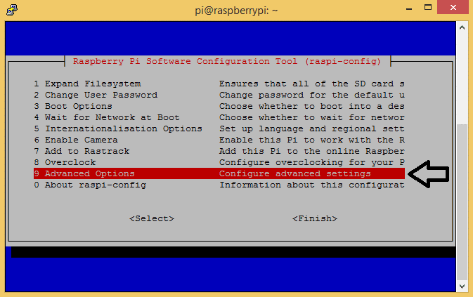
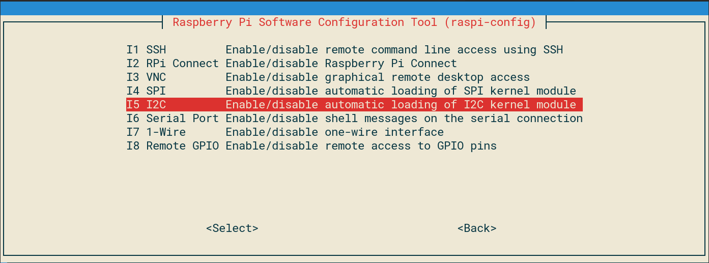
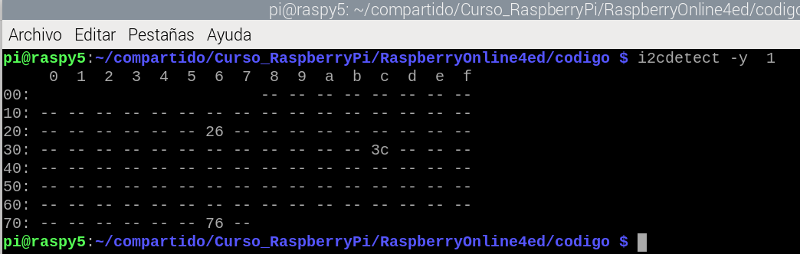
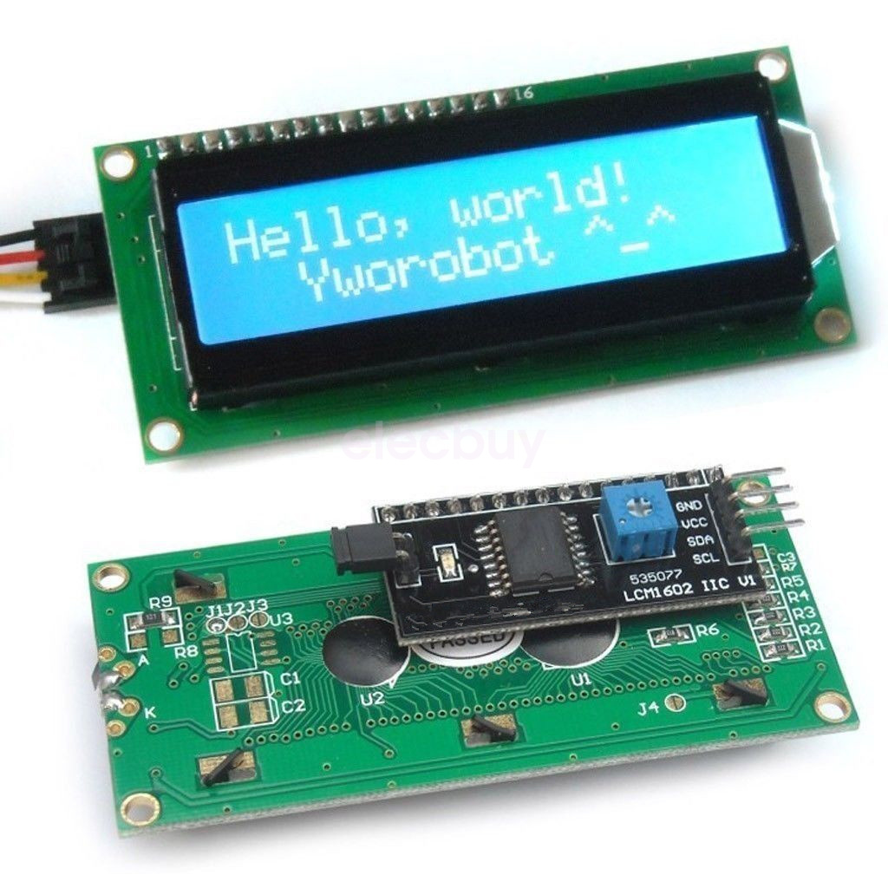
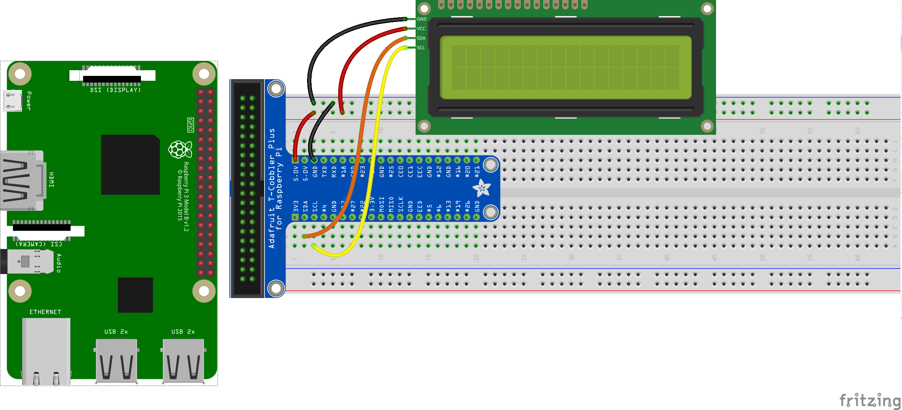
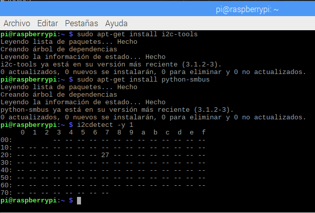
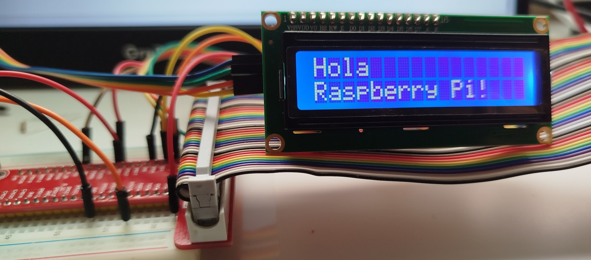
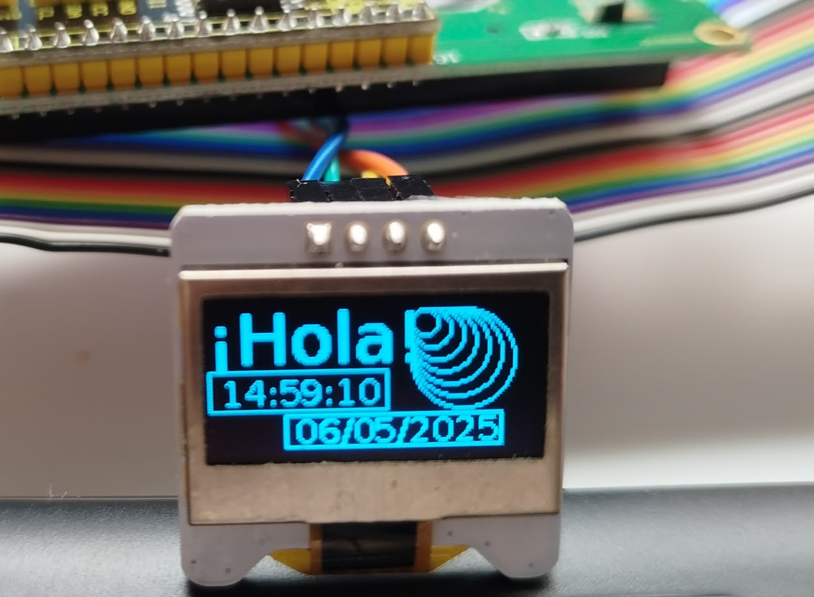
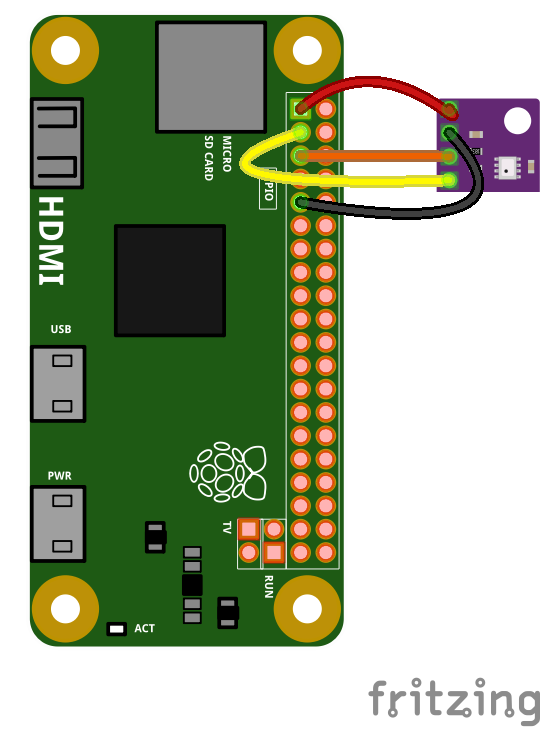

## Componentes I2C

I2C es un protocolo de comunicación entre dispositivos, muy usado en el mundo de la electrónica. Al ser un bus, podemos conectar varios dispositivos I2C simultáneamente y además no necesitamos pines independientes para cada uno, sino que usaremos para todos los mismos pines llamados SDA(3) y SCL(5), teniendo cada uno de ellos una dirección (address) en el bus I2C, lo que nos permite dirigirnos a él.

Este protocolo I2C funciona en un modo llamado Master/Slave, donde la Raspberry Pi hace el papel de Master, llevando la iniciativa en todas las comunicaciones, mientras que los otros dispositivos responden a sus peticiones.

Antes de utilizar I2C tenemos que activar el driver correspondiente en la pestaña de configuración de interfaces de "raspi-config" (que ejecutaremos con sudo, como siempre)





Tras rearrancar podemos asegurarnos de que el driver I2C está activo viendo los mensajes de arranque
```sh
$ dmesg | grep i2c
[    4.925554] bcm2708_i2c 20804000.i2c: BSC1 Controller at 0x20804000 (irq 79) (baudrate 100000)
[    4.929325] i2c /dev entries driver
```

o con el comando lsmod
```sh
$ lsmod | grep i2c
i2c_dev                 5769  0
i2c_bcm2708             4943  0
regmap_i2c              1661  3 snd_soc_pcm512x,snd_soc_wm8804,snd_soc_core
```

Para que un usuario pueda usar i2c debe de estar incluido en el grupo correspondiente 'i2c'. Podemos asegurarnos de ello con

```sh
sudo adduser pi i2c
```

Ahora instalaremos herramientas i2c, que nos van a permitir identificar a los dispositivos conectados.

```sh
sudo apt install i2c-tools
```

Con estas herramientas I2C vamos a poder detectar los dispositivos conectados al bus I2C comprobando que la conexión física es correcta:




Y el módulo  python `smbus` en nuestro entorno virtual:

```sh
pip3 install smbus
```

### Pantallas

Las pantallas LCD son las que suelen tener las máquinas de vending


1. **LCD 16x2 (Compatible con HD44780)**
    - **Descripción**: Pantalla de caracteres con 16 columnas y 2 filas, que utiliza una interfaz paralela (modo de 4 u 8 bits) o de tipo I2C con 2 cables de conexión (más alimentación).
    - **Especificaciones**:
        - Resolución: 16x2 caracteres
        - Interfaz: Paralela (modo de 4 bits para ahorrar pines GPIO)
        - Alimentación: 5V (retroiluminación), lógica compatible con 3.3V
        - Contraste: Ajustable mediante potenciómetro
    - **Ventajas**:
        - Económica y ampliamente disponible.
        - Ideal para mostrar datos simples como números o texto (por ejemplo, lecturas de temperatura).
        - Retroiluminación para visibilidad en condiciones de poca luz.
        - Compatible con muchas bibliotecas.
    - **Desventajas**:
        - Requiere múltiples pines GPIO (6 en modo de 4 bits).
        - Limitada a texto (sin gráficos).
        - Necesita un potenciómetro externo para ajustar el contraste.
        - Consumo de energía superior al OLED.
    - **Casos de Uso**: Proyectos simples que muestran datos numéricos o textuales (por ejemplo, estaciones meteorológicas básicas).


2. **OLED 0.96" (SSD1306)**
    
    - **Descripción**: Pantalla monocromática (blanca, azul o amarilla) de 128x64 píxeles, que utiliza I2C o SPI.
    - **Especificaciones**:
        - Resolución: 128x64 píxeles
        - Interfaz: I2C (utilizada aquí para minimizar cables)
        - Alimentación: 3.3V
        - Contraste: Ajustable por software
    - **Ventajas**:
        - Alto contraste y visibilidad sin necesidad de retroiluminación.
        - Permite mostrar texto, gráficos y animaciones simples.
        - Usa solo 2 pines GPIO (I2C).
        - Bajo consumo de energía.
    - **Desventajas**:
        - Más cara que la LCD.
        - Área de visualización más pequeña.
        - Requiere bibliotecas específicas para gráficos.
    - **Casos de Uso**: Proyectos compactos o que necesitan gráficos (por ejemplo, interfaces de usuario, visualización de datos).

**Comparación de Pantallas**:

| Característica  | LCD 16x2            | OLED 0.96"     |
| --------------- | ------------------- | -------------- |
| **Resolución**  | 16x2 caracteres     | 128x64 píxeles |
| **Interfaz**    | Paralela (4/8 bits) | I2C/SPI        |
| **Pines GPIO**  | 6 (4-bit) o 2 (i2C) | 2 (I2C)        |
| **Gráficos**    | No                  | Sí             |
| **Coste**       | Bajo                | Moderado       |
| **Consumo**     | Moderado            | Bajo           |
| **Visibilidad** | Requiere luz        | Alto contraste |

**Recomendaciones**:

- **LCD 16x2**: Para proyectos económicos que solo necesitan texto simple.
- **OLED 0.96"**: Para proyectos compactos, gráficos o con requisitos de bajo consumo.


## Controlando una pantalla LCD de tipo I2C

Conectamos el LCD I2C



Conectaremos SDA(3) -> SDA, SCL(5) -> SCL, 5V o 3.3V -> Vcc y  GND -> GND

Debemos consultar el  voltaje que necesita nuestra LCD, que puede ser 3.3V o 5V (suele ser 5V)

Y ejecutamos la herramienta para detectar dispositivos i2C y su correspondiente dirección (normalmente el fabricante nos proporciona este dato)

```sh
i2cdetect -y 1
```



Vemos que se ha detectado el LCD en la dirección 0x27 (podemos obtener otros valores como 0x26, 0x30 o 0x3F)

Usaremos el módulo de [I2C_LCD_driver.py](https://github.com/javacasm/RaspberryOnline2ed/blob/master/codigo/I2C_LCD_driver.py) que pondremos en la misma carpeta de nuestro código. Una vez sepamos la dirección de nuestro LCD cambiaremos el valor de la variable "ADDRESS" en el fichero `I2C_LCD_driver.py`. Por ejemplo si nuestro LCD usa 0x27, dejaremos así la variable

```python
# LCD direccion, el fabricante nos da ese dato
ADDRESS = 0x27
```

Para probar a ver si funciona todo usamos este [código](https://github.com/javacasm/RaspberryOnline2ed/blob/master/codigo/T6.3.test_lcd_i2C.py)

```python
import I2C_LCD_driver
from time import *

mylcd = I2C_LCD_driver.lcd()

mylcd.lcd_display_string("Hola",line = 1 )
mylcd.lcd_display_string("Raspberry Pi!", line = 2)
```

Donde hemos indicado que una parte del texto se ponga en la línea 1 y otra en la línea 2.

Veremos el resultado. Hay que recordar que las pantallas LCD tienen un potenciómetro en la parte trasera para regular el contraste, y los fabricantes suelen ponerlo al mínimo....



Un [ejemplo sencillo](https://github.com/javacasm/RaspberryOnline2ed/blob/master/codigo/T6.3.parpadeo_lcd_i2C.py) para hacer que parpadee un texto

```python
import time
import I2C_LCD_driver
mylcd = I2C_LCD_driver.lcd()

while True:
	mylcd.lcd_display_string("TEXTO", line=1, pos=5)
	mylcd.lcd_display_string("PARPADEANTE", line=2, pos=3)
	time.sleep(1)
	mylcd.lcd_clear()
	time.sleep(1)
```

Donde hemos usado `line`para indicar la línea y `pos`para indicar la columna donde mostrar el texto.

Vamos a hacer ahora un [sencillo reloj](https://github.com/javacasm/RaspberryOnline2ed/blob/master/codigo/T6.3.reloj_lcd_i2C.py) que muestra la fecha y la hora

```python
import I2C_LCD_driver
import time
mylcd = I2C_LCD_driver.lcd()


while True:
	mylcd.lcd_display_string(f'Hora:{time.strftime("%H:%M:%S")}', line = 1, pos = 1)

	mylcd.lcd_display_string(f'Fecha:{time.strftime("%d/%m/%Y")}',line = 2)
	time.sleep(1) # esperamos 1 segundo
```

Ahora vamos a hacer un [programa](https://github.com/javacasm/RaspberryOnline2ed/blob/master/codigo/T6.3_ip_lcd_i2C.py) que muestra la dirección IP de nuestra Raspberry Pi, algo muy útil si no tenemos conectada otra pantalla. Para ello nos conectamos a un servidor externo y leemos el extremo local de la conexión.

```python
# Ejemplo 6.3 de cómo mostrar la IP en la  LCD
import socket
import I2C_LCD_driver

mylcd = I2C_LCD_driver.lcd()

# función para obtener la ip usando una conexión a internet
def get_local_ip_address(target):
  ipaddr = ''
  try:
    s = socket.socket(socket.AF_INET, socket.SOCK_DGRAM)
    s.connect((target, 8000))
    ipaddr = s.getsockname()[0]
    s.close()
  except:
    pass

  return ipaddr

myIP = get_local_ip_address('google.com')

mylcd.lcd_display_string("IP:",line = 1 )
mylcd.lcd_display_string(myIP, line = 1, pos = 3)
```

### Pantallas gráficas OLED

Vamos a usar la librería para pantalla OLED de CircuitPython creada por Adafruit. Como hemos dicho antes al instalarla necesita bastantes otras librerías más, pero ya que la hemos usado antes, nos compensa volver a usarla.

En este tipo de pantallas además de mostrar textos, podemos dibujar  y mostrar imágenes. Para incluyen métodos que dibujan rectángulos, elipses, polígonos, líneas,...

Casi todas estas librerías siguen un esquema similar: primero se llaman a las funciones que dibujan, muestran texto y luego hay que llamar a un método `show` que hace que se muestre de golpe la pantalla, es como si se dibujara en otra pantalla y este método cambia una pantalla por otra.



Veamos un [ćodigo](https://github.com/javacasm/RaspberryOnline2ed/blob/master/codigo/T6.3_oled_text.py) donde se muestra texto usando tipos de letra distintos, también con diferentes tamaños y dibujamos un rectángulo alrededor. También dibujaremos una serie de circulos. Está basado en el ejemplo`ssd1306_pillow_shapes.py` del módulo  `ssd1306` de  Adafruit. 

```python
# Adaptado por @javacasm del ejemplo ssd1306_pillow_shapes.py de Adafruit ssd1306 
# SPDX-FileCopyrightText: 2021 Melissa LeBlanc-Williams for Adafruit Industries
# SPDX-License-Identifier: MIT

# This example is for use on (Linux) computers that are using CPython with
# Adafruit Blinka to support CircuitPython libraries. CircuitPython does
# not support PIL/pillow (python imaging library)!
#
# Ported to Pillow by Melissa LeBlanc-Williams for Adafruit Industries from Code available at:
# https://learn.adafruit.com/adafruit-oled-displays-for-raspberry-pi/programming-your-display

# Importamos los módulo necesarios...
import board
import digitalio
from PIL import Image, ImageDraw, ImageFont
import adafruit_ssd1306
import time


i2c = board.I2C()  # uses board.SCL and board.SDA

# Creamos un objeto de tipo SSD1306 OLED
# Los dos primeros argumentos son ancho y alto.
# También podíamos pasar la dirección i2c con addr=0x3c
oled = adafruit_ssd1306.SSD1306_I2C(128, 64, i2c)


# Borramos la pantalla
oled.fill(0)

# Creamos una imagen en blanco donde dibujaresmo.
image = Image.new("1", (oled.width, oled.height))
# accedemos al objeto que dibujará en la imagen
draw = ImageDraw.Draw(image) 

# cargamos 2 fuentes de 2 tamaños distintos. Puedes usar los que quieras de esa cartpeta o descargar nuevos
font = ImageFont.truetype("/usr/share/fonts/truetype/dejavu/DejaVuSans.ttf", 28)
font2 = ImageFont.truetype("/usr/share/fonts/truetype/dejavu/DejaVuSans.ttf", 14)

# Dibujamos circulos
for i in range(40,5,-5):
    draw.ellipse((80, 5, 80+i, 5+i), outline=255, fill=0)
# añadimos texto
draw.text((0, 0), "¡Hola!", font=font, fill=255)

# primero dibujamos el rectángulo 
draw.rectangle((0, 29, 70, 45), outline=255, fill=0)
#luego el texto que contiene
draw.text((5, 30), f'{time.strftime("%H:%M:%S")}', font=font2, fill=255)

# ... marco
draw.rectangle((30, 47, 115, 60), outline=255, fill=0)
# ... texto enmarcado
draw.text((34, 46), f'{time.strftime("%d/%m/%Y")}', font=font2, fill=255)

# Copiamos la imagen en pantalla 
oled.image(image)
# Actualizamos la pantalla
oled.show()

```
### Sensor atmosférico BME280

Vamos a usar ahora el sensor atmosférico BME280, capaz de medir temperatura, humedad y presión. También se conecta con I2C.


Conectamos los pines SDA y SCL de los dos dispositivos y la alimentación a 3.3V



Una vez conectado vamos a ver si lo detectamos

```sh
$ i2cdetect -y 1
       0  1  2  3  4  5  6  7  8  9  a  b  c  d  e  f
  00:          -- -- -- -- -- -- -- -- -- -- -- -- --
  10: -- -- -- -- -- -- -- -- -- -- -- -- -- -- -- --
  20: -- -- -- -- -- -- -- -- -- -- -- -- -- -- -- --
  30: -- -- -- -- -- -- -- -- -- -- -- -- -- -- -- --
  40: -- -- -- -- -- -- -- -- -- -- -- -- -- -- -- --
  50: -- -- -- -- -- -- -- -- -- -- -- -- -- -- -- --
  60: -- -- -- -- -- -- -- -- -- -- -- -- -- -- -- --
  70: -- -- -- -- -- -- 76 --
```

Vamos a usar el paquete Python RPi.bme280. Instalamos el módulo RPI.bme280  dentro del correspondiente entorno virtual 

```sh
pip3 install RPi.bme280
```

y probamos a ejecutar el [código de ejemplo](https://github.com/javacasm/RaspberryOnline2ed/blob/master/codigo/T6.3_test_bme280.py)

```python
import smbus2
import bme280

port = 1
address = 0x76 # usaremos la dirección que hemos encontrado
bus = smbus2.SMBus(port)

calibration_params = bme280.load_calibration_params(bus, address) # parámetros de compensación

# leemos los datos
data = bme280.sample(bus, address, calibration_params) 

# mostramos los datos 
print(data.id)
print(data.timestamp)
print(data.temperature)
print(data.pressure)
print(data.humidity)

# los mostramos en otro formato
print(data)
```


Tras probar que el proyecto funciona podemos mejorar el rendimiento de las comunicaciones I2C de la opción por defecto de 100KHz a 400KHz cambiando en el fichero "/boot/config.txt" a esta línea:

```sh
dtparam=i2c_arm=on,i2c_baudrate=400000
```

