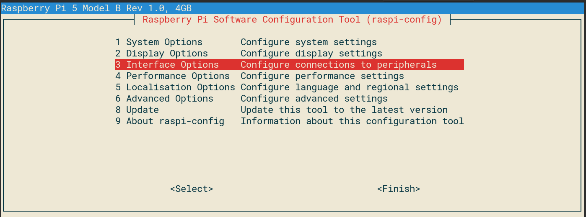

## Componentes I2C

I2C es un protocolo de comunicación ente dispositivos, muy usado en el mundo de la electrónica. Al ser un bus, podemos conectar varios dispositivos I2C simultáneamente y además no necesitamos pines independientes para cada uno, sino que usaremos para todos los mismos pines llamdados SDA(3) y SCL(5), teniendo cada uno de ellos una dirección (address) en el bus I2C, lo que nos permite dirigirnos a él.

Este protocolo I2C funciona en un modo llamado Master/Slave, donde la raspberry hace el papel de Master, llevando la iniciativa en todas las comunicación, mientras que los otros dispositivos responden a sus peticiones.

Antes de utilizar I2C tenemos que activar el driver correspondiente en la pestaña de configuración de interfaces de "raspi-config" (que ejecutaremos con sudo, como siempre)




Tras rearrancar podemos asegurarnos de que el driver I2C está activo viendo los mensajes de arranque
```sh
$ dmesg | grep i2c
[    4.925554] bcm2708_i2c 20804000.i2c: BSC1 Controller at 0x20804000 (irq 79) (baudrate 100000)
[    4.929325] i2c /dev entries driver
```

o con el comando lsmod
```sh
$ lsmod | grep i2c
i2c_dev                 5769  0
i2c_bcm2708             4943  0
regmap_i2c              1661  3 snd_soc_pcm512x,snd_soc_wm8804,snd_soc_core
```

Para que un usuario pueda usar i2c debe de estar incluido en el grupo correspondiente 'i2c'. Podemos asegurarnos de ello con

```sh
sudo adduser pi i2c
```

Ahora instalaremos herramientas i2c, que nos van a permitir identificar a los dispositivos conectados.

```sh
sudo apt-get install i2c-tools
```

Y una librería python
```sh
sudo apt-get install python-smbus
```

## Controlando una pantalla LCD de tipo I2C

Vamos a ver cómo conectar una pantalla LCD de tipo LCD de las que se suelen tener las máquinas de vending


Conectamos el LCD


Conectaremos SDA(3) -> SDA, SCL(5) -> SCL, 3.3V -> Vcc y  GND -> GND

Y ejecutamos la herramienta para detectar dispositivos i2C y su correspondiente dirección (normalmente el fabricante nos proporciona este dato)

```sh
i2cdetect -y 1
 ```


Vemos que se ha detectado el LCD en la dirección 0x27 (en nuestro caso podemos obtener otro valor como 0x30 o 0x3F)

Usaremos el codigo de [I2C_LCD_driver.py](https://github.com/javacasm/RaspberryOnline2ed/blob/master/codigo/I2C_LCD_driver.py)

Para probar a ver si funciona todo

```python
import I2C_LCD_driver
from time import *

mylcd = I2C_LCD_driver.lcd()

mylcd.lcd_display_string("Hola LCD!", 1)
```

Un ejemplo sencillo para hacer que parpade un texto

```python
import time
import I2C_LCD_driver
mylcd = I2C_LCD_driver.lcd()

while True:
	mylcd.lcd_display_string(u"TEXTO PARPADEANTE")
	time.sleep(1)
	mylcd.lcd_clear()
	time.sleep(1)
```

Mostrar la fecha y la hora

```python
import I2C_LCD_driver
import time
mylcd = I2C_LCD_driver.lcd()


while True:
	mylcd.lcd_display_string("Hora: %s" %time.strftime("%H:%M:%S"), 1)

	mylcd.lcd_display_string("Fecha: %s" %time.strftime("%d/%m/%Y"), 2)
```

Para mostrar la dirección IP, algo muy útil si no tenemos conectada otra pantalla

```python
import I2C_LCD_driver
import socket
import fcntl
import struct

mylcd = I2C_LCD_driver.lcd()

def get_ip_address(ifname):
	s = socket.socket(socket.AF_INET, socket.SOCK_DGRAM)
	return socket.inet_ntoa(fcntl.ioctl(
		s.fileno(),
		0x8915,
		struct.pack('256s', ifname[:15])
	)[20:24])

mylcd.lcd_display_string("IP Address:", 1)

mylcd.lcd_display_string(get_ip_address('eth0'), 2)
```

Más ejemplos en [la fuente original](http://www.circuitbasics.com/raspberry-pi-i2c-lcd-set-up-and-programming/)		

### Sensor atmosférico BME280

Vamos a usar ahora el sensor atmosférico BME280, capaz de medir temperatura, humedad y presión. También se conecta con I2C.


Conectamos los pines SDA y SCL de los dos dispositivos


Una vez conectado vamos a ver si lo detectamos

```sh
$ i2cdetect -y 1
       0  1  2  3  4  5  6  7  8  9  a  b  c  d  e  f
  00:          -- -- -- -- -- -- -- -- -- -- -- -- --
  10: -- -- -- -- -- -- -- -- -- -- -- -- -- -- -- --
  20: -- -- -- -- -- -- -- -- -- -- -- -- -- -- -- --
  30: -- -- -- -- -- -- -- -- -- -- -- -- -- -- -- --
  40: -- -- -- -- -- -- -- -- -- -- -- -- -- -- -- --
  50: -- -- -- -- -- -- -- -- -- -- -- -- -- -- -- --
  60: -- -- -- -- -- -- -- -- -- -- -- -- -- -- -- --
  70: -- -- -- -- -- -- 76 --
```

Vamos a usar el paquete Python RPi.bme280 y seguiremos [su tutorial](https://pypi.org/project/RPi.bme280/). Instalamos el módulo RPI.bme280

```sh
pip3 install RPi.bme280
```

y probamos a ejecutar el [código de ejemplo](https://github.com/javacasm/RaspberryOnline2ed/blob/master/codigo/test_bme280.py)

```python
import smbus2
import bme280

port = 1
address = 0x76 # usaremos la dirección que hemos encontrado
bus = smbus2.SMBus(port)

calibration_params = bme280.load_calibration_params(bus, address) # parámetros de compensación

# leemos los datos
data = bme280.sample(bus, address, calibration_params) 

# mostramos los datos 
print(data.id)
print(data.timestamp)
print(data.temperature)
print(data.pressure)
print(data.humidity)

# los mostramos en otro formato
print(data)
```


Tras probar que el proyecto funciona podemos mejorar el rendimiento de las comunicaciones I2C de la opción por defecto de 100KHz a 400KHz cambiando en el fichero "/boot/config.txt" a esta línea:

```sh
dtparam=i2c_arm=on,i2c_baudrate=400000
```
