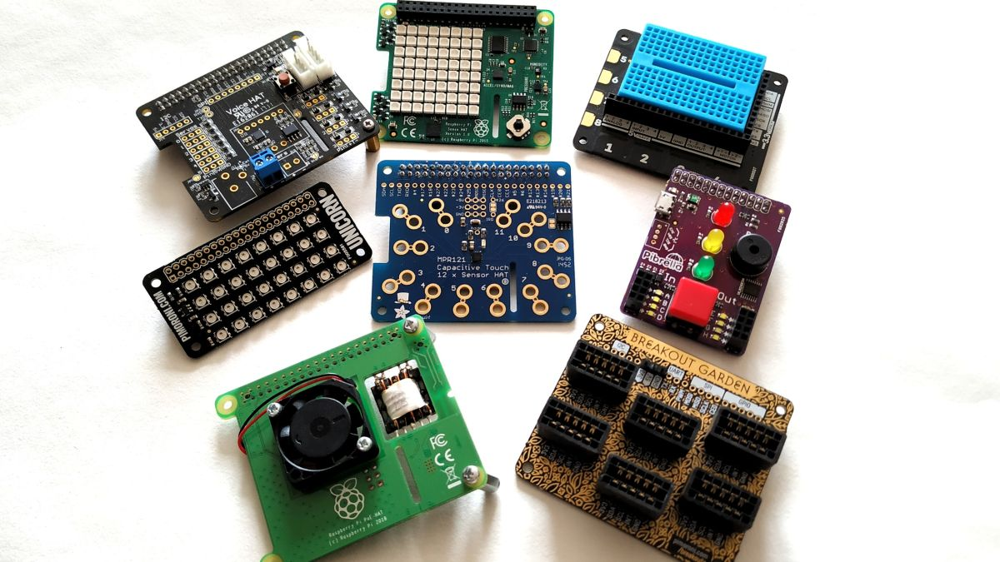

Si en el mundo Arduino las placas que se se conectan encima de la placa Arduino y añaden funcionalidad se denominan **"shields"**, en el mundo Raspberry se les llama **"Hats"**

En esta página podemos ver algunos de ellos

https://www.tomshardware.com/amp/best-picks/best-raspberry-pi-hats