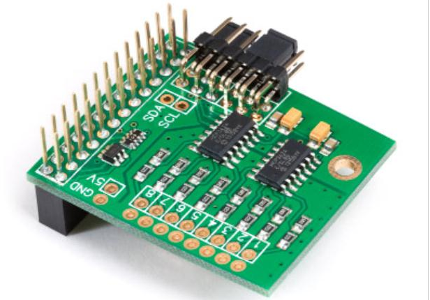

MCP2008
ADS1115

### Leyendo valores analógicos

Para leer valores analógicos usaremos electrónica externa, com pueden se [esta placa](https://www.abelectronics.co.uk/p/65/adc-differential-pi-raspberry-pi-analogue-to-digital-converter) o [esta otra](http://www.adafruit.com/products/1085), ambas de 16 bits. El [montaje es sencillo](http://learn.adafruit.com/reading-a-analog-in-and-controlling-audio-volume-with-the-raspberry-pi)

## Usando sensores analógicos

https://projects.raspberrypi.org/en/projects/physical-computing/13