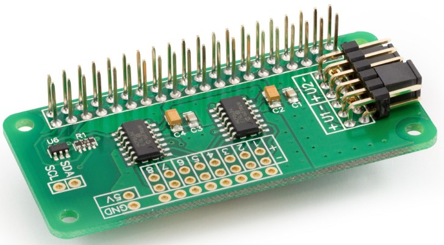
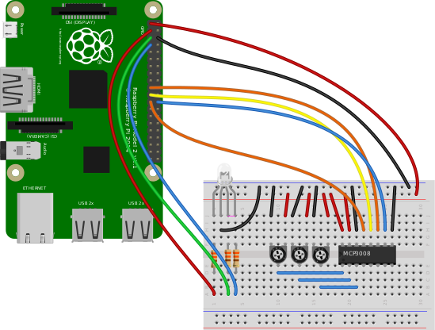
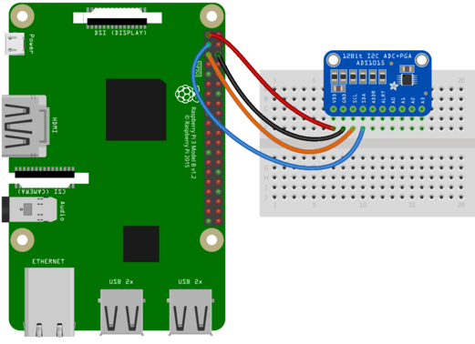

### Leyendo valores analógicos

Nuestra Raspberry no dispone de módulo ADC por lo que para leer valores analógicos necesitamos añadir electrónica externa, como puede ser [esta placa](https://www.abelectronics.co.uk/p/65/adc-differential-pi-raspberry-pi-analogue-to-digital-converter) que incluye todo lo necesario y sólo tenemos que conectar a nuestra Raspberry, dándonos 4 puertos analógicos de 18 bits y que leen en el rango de ±2.048V. Usaremos los ejemplos y librerías del fabricante.




### ADC con MCP3008

Otro opción es usar un chip que integre ADCs, como es el MCP3008 que nos proporciona 8 canales de 10bits y utiliza conexión SPI (debemos activarla en la configuración de la Raspberry)

La conexión SPI es algo complicada que la I2C, pero tiene la ventaja de una mayor velocidad de transferencia de datos:


|MCP3008|Raspberry Pi|
|---|---
|VDD|	3.3V
|VREF|	3.3V
|AGND|GND
|CLK|GPIO11
|DOUT|GPIO9
|DIN|GPIO10
|CS|GPIO8
|DGND|GND

Tenemos que activar el driver de SPI en la configuración (vía raspi-config con sudo, claro)

El [ejemplo](https://github.com/javacasm/RaspberryOnline2ed/blob/master/codigo/test_mcd3008.py) sería:

```python

from gpiozero import MCP3008
pot = MCP3008(0)
print(pot.value)
while True:
    print(pot.value)

```


Vamos a hacer una sencilla aplicación en la que controlaremos el brillo de  un led con un potenciómetro


```python
from gpiozero import PWMLED
from gpiozero import MCP3008
pot = MCP3008(0)
print(pot.value)
led = PWMLED(21)

while True:
    print(pot.value)
    led.value = pot.value
```

Un ejemplo más complejo podría ser controlar un led RGB con 3 potenciómetros:



La librería gpiozero permite hacer un código supercompacto

```python
from gpiozero import RGBLED, MCP3008

led = RGBLED(red=2, green=3, blue=4)
red_pot = MCP3008(channel=0)
green_pot = MCP3008(channel=1)
blue_pot = MCP3008(channel=2)

while True:
    led.red = red_pot.value
    led.green = green_pot.value
    led.blue = blue_pot.value
```

### ADC con ADS1115

El módulo ADC [ADS1115](http://www.adafruit.com/products/1085) utiliza comunicación I2C y nos da 4 canales de 16 bits. 



Por supuesto, tenemos que tener activo el driver I2C en nuestra Raspberry.

Para usarlo necesitamos tener instaladas las librerías de circuitpython

```sh
pip3 install RPI.GPIO
pip3 install adafruit-blinka
```

Ahora instalamos la librería del ADS1115

```sh
pip3 install adafruit-circuitpython-ads1x15
```

Ya podemos probar el ejemplo:

```python
import board
import busio
i2c = busio.I2C(board.SCL, board.SDA) # configuramos la conexión I2C
import adafruit_ads1x15.ads1115 as ADS
from adafruit_ads1x15.analog_in import AnalogIn

ads = ADS.ADS1115(i2c) # creamos nuestro objeto ads

chan = AnalogIn(ads, ADS.P0) # leemos el canal 0
print(chan.value, chan.voltage)
```

