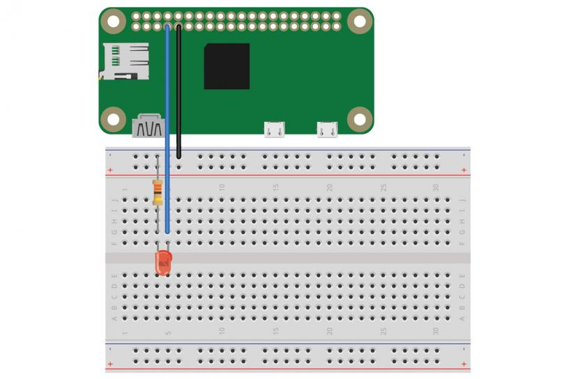

## MQTT y python

Usaremos el módulo  **paho-mqtt** que permite tanto publicar como suscribirse a topics.

```sh
sudo pip3 install paho-mqtt
```

En este ejemplo en python la raspberry hace parpadear un led conectado al GPIO4 cuando recibe un mensaje con topic "client/led"

```py
#! /usr/bin/python3
import paho.mqtt.client as mqtt
from gpiozero import LED
from time import sleep
MQTT_SERVER = "192.168.1.93"
MQTT_PATH = "client/led"
led = LED(4)
def on_connect(client, userdata, flags, rc):
  print("Connected with result code "+str(rc))
  client.subscribe(MQTT_PATH)
def on_message(client, userdata, msg):
  print(msg.topic+" "+str(msg.payload.decode("utf-8")))
  led.on()
  sleep(3)
  led.off()
client = mqtt.Client()
client.on_connect = on_connect
client.on_message = on_message
client.connect(MQTT_SERVER, 1883, 60)
client.loop_forever()   

```



Podemos probarlo publicando mensajes con el topi adecuado


```sh
mosquitto_pub -h 192.168.1.93 -t "client/led" -m "Blink"
```
