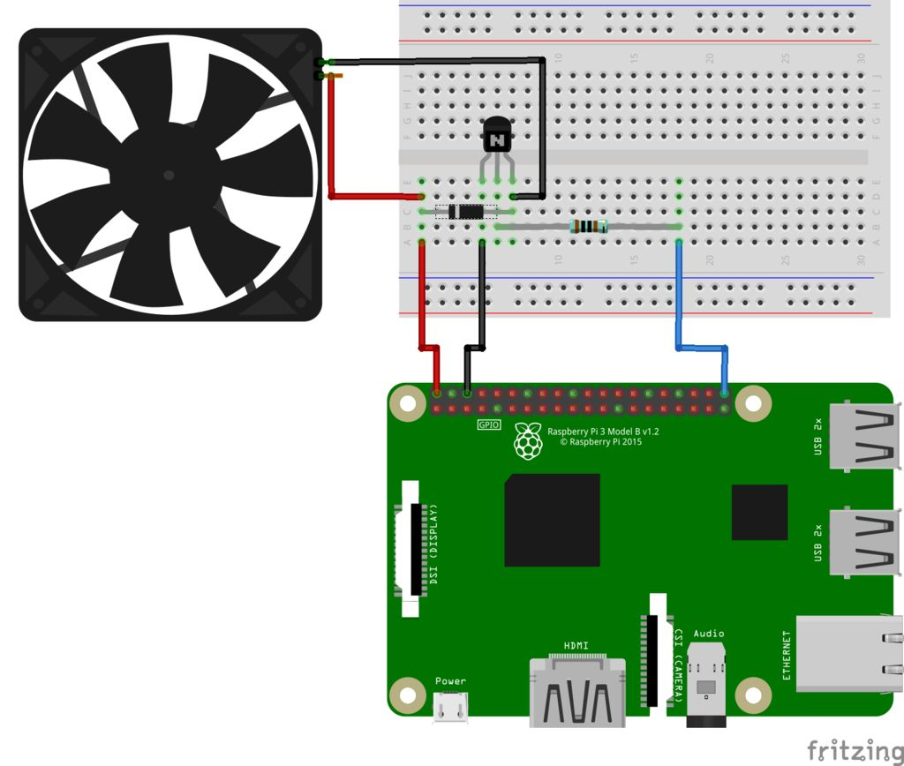

## Controlando motores

### Usando más potencia

En el caso bastante normal de que necesitemos más potencia de las que nos da un pin (16mA) podemos utilizar un transistor. 

Veamos el montaje de cómo controlar un ventilador con un transistor:



Se ha incluído un diodo en antiparalelo para evitar corrientes de inducción y una resistencia de 1K para controlar la corriente que  va a la base del transistor 2N2222.

A la salida de este transistor podemos conectar también un relé o unos leds de potencia.

Usando señal PWM podemos controlar la velocidad del ventilador y modular la velocidd de giro en función de la temperatura de la CPU


```python
from gpiozero import PWMLED
from time import sleep
import sys
import os
from time import sleep
import signal

maxTMP = 70
medTMP = 60

fan = PWMLED(21)

def getCPUtemperature():
    res = os.popen('vcgencmd measure_temp').readline()
    temp =(res.replace("temp=","").replace("'C\n",""))
    #print("temp is {0}".format(temp)) #Uncomment here for testing
    return temp

try:
    while True:
    	CPU_temp = float(getCPUtemperature())
	    if CPU_temp > maxTMP:
			fan.value = 1.0  # Máxima velocidad
		elif CPU_temp > medTMP:
			fan.value = 0.5  # Velocidad media
		else:
			fan.value = 0    # Parada
		sleep(5)
```

### Motores

Para controlar motores vamos a necesitar una placa que se encargue de manejar la suficiente potencia.
Vamos a usar un módulo muy utilizado llamado L298


Usaremos un par de sencillos motores DC


Y también necesitaremos una alimentación externa para los motores, que puede ser unas pilas o un batería con un powerback 

Conectaremos los motores de la siguiente manera:


Y la batería de la siguiente forma


Y ahora conectaremos los pines de control de la siguiente forma


La placa L298 necesita 4 pines para controlar el sentido de giro de los dos motores In1 e In2 para el motor 1, In3 e In4 para el motor 2

Conectaremos 7 -> In1,  8 -> In2,  9 -> In3, 10 -> In4 y  GND -> GND

Veamos ahora un sencillo ejemplo de control

```python
from gpiozero import Motor  # Importamos los modulos
from time import sleep

# Motor izquierdo (L) conectando pines 7 y 8 a la placa L298
motorL = Motor(forward = 7, backward = 8)
# Motor derecho (R) conectando pines 9 y 9 a la placa L298
motorR = Motor(forward = 9, backward = 10)

while True:  # Bucle para siempre
    motorL.forward()  # Motor L hacia adelante
    motorR.forward()  # Motor R hacia adelante
    sleep(5)		  # Esperamos 5 segundos
    motorL.backward() # Motor L hacia atras
    motorR.backward() # Motor R hacia atras
    sleep(5)		  # Esperamos 5 segundos
```

[Código](https://github.com/javacasm/RaspberryOnline2ed/blob/master/codigo/Test_motores.py)

Y nuestros motores deben de moverse hacia adelante y hacia atrás

Si lo que queremos es montar un robot con esos 2 motores podemos hacerlo de una manera más sencilla usando este ejemplo

```python
from gpiozero import Robot  # importamos todo lo modulos necesarios
from time import sleep
robby = Robot(left=(7,8), right=(9,10))  # definimos las conexiones del robot
robby.forward(0.4) # nos movemos hacia adelante con 40% de velocidad
sleep(5)         # esperamos 5 segundos
robby.right(0.4) # nos giramos a la derecha con 40% de velocidad
sleep(5)         # esperamos 5 segundos
robby.stop() # paramos

```

[Código](https://github.com/javacasm/RaspberryOnline3ed/blob/master/codigo/test_robot.py)

Ahora ya podemos hacer robót como estos

[zerobot](https://www.thingiverse.com/thing:2352440)


[Smart Zero](https://www.thingiverse.com/thing:2727285)


[Formula Pi](https://www.formulapi.com/) Capaces de buscar su propio camino usando la cámara com podemos ver en [este vídeo](https://youtu.be/2PU-UDYm2Xw?t=40)


## Controlando un servomotor

Un servomotor es un tipo de motor que sólo realiza movimientos angulares entre 0 y 180 grados (existen algunos modelos que se llaman trucados o de rotación continua pero no vamos a tratar aquí)

Una de las grandes ventajas de los servos es que incluyen su propio contolador con lo que sólo necesitamos alimentarlos y una señal de control


Podremos controlarlos de las patillas GPIO12, GPIO13, GPIO18, GPIO19


Conectaremos 18 -> Naranja, 5V -> Rojo, GND -> Marrón

El código es muy sencillo. Este ejemplo va desde el mínimo, al punto medio y luego al máximo

```python
from gpiozero import Servo  # importamos los modulos necesarios
from time import sleep

servo = Servo(18)			# definimos el servo conectado al gpio 18

while True:					# bucle infinito
    servo.min()				# posicion de un extremo
    sleep(2)				# esperamos 2 segundos
    servo.mid()				# posicion central
    sleep(2)				# esperamos 2 segundos
    servo.max()				# posicion del otro extremo
    sleep(2)				# esperamos 2 segundos
```

[Código](https://github.com/javacasm/RaspberryOnline2ed/blob/master/codigo/test_servo.py)


### RaspiRobot


Esta placa nos permite controlar un típico robot de 2 motores de manera muy sencillo. 

* El manejo de motores es mucho más complejo que el manejo de leds.
* La programación es exactamente la misma,
* La electrónica necesaria para controlarlos es totalmente diferente.
* Si bien podemos conectar directamente un led a un pin de GPIO, conectar un motor es totalmente desaconsejable, por varias razones:
	* La primera porque los motores requieren de mayor potencia para funcionar,
	* Necesitaremos una electrónica capaz de gestionar estas potencias
	* Serán controladas desde los pines de la RaspBerry.
	* En caso de forzar la electrónica de alimentación de nuestra Raspberry a dar una mayor potencia podríamos quemarla.
	* El funcionamiento de los motores hace que estos generen al acelerar unas corrientes de inducción de sentido opuesto a las que les aplicamos para funcionar y que de no ser suprimidas podrían dañar la electrónica a la que están conectados.

En la [web de RaspiRobot](https://github.com/simonmonk/raspirobotboard/wiki) vemos instrucciones de montaje

[Vídeo: Raspirobot - Controlando robots con Raspberry](https://youtu.be/FjjP8007DXA?list=PLDxBiw1MlK6SqyPGhhox9WlsximiNrcgK)

¿Qué podemos hacer con RaspiRobot?

* Controla 2 motores,
* 2 leds,
* 2 entradas de pulsador,
* 2 salidas de colector abierto, para poder usar mayores potencias
* Conector I2C y
* otro serie

Descargamos la librería

```sh
wget https://github.com/simonmonk/raspirobotboard/archive/master.zip
```

La descomprimimos
```sh
unzip master.zip
```
	
y la instalamos
```sh
sudo python3 setup.py install
```

Un programa sencillo podría ser

```python
from raspirobotboard import *
rr = RaspiRobot() # creamos el objeto
rr.set_led1(1) # activamos el led 1
rr.set_led2(0) # desactivamos el led 2
rr.set_oc1(1) # activamos la salida 1
rr.forward() # movemos los dos motores hacia adelante
rr.reverse() # movemos los dos motores hacia atrás
rr.left() # motor izquierdo hacia adelante, derecho hacia atrás
rr.right() # motor izquierdo hacia atrás, derecho hacia adelante
rr.stop() # los dos motores hacia atrás
rr.sw1_closed() # devuelver True o False según cerrado o abierto
```

### Steppers: motores paso a paso


Los motores paso a paso son motores que nos permiten una gran precisión de giro, pudiendo determinar su moviendo en grados.

Vamos a ver cómo usar el motor de la imagen, que tiene 4 bobinas. La placa de control es muy sencilla y necesita de 4 pines para controlarla (en realidad la placa sólo transforma la salida de los pines de raspberry en una señal de la potencia que necesita el motor)

Veamos como conectarla usando 5V y GND y los pines de control 
```
IN1 ==> GPIO12
IN2 ==> GPIO16
IN3 ==> GPIO20
IN4 ==> GPIO21
```

Este [código](https://www.hackster.io/mjrobot/playing-with-electronics-rpi-gpio-zero-library-tutorial-f984c9) nos permite controlar el movimiento del motor


```python
import time
import sys
from gpiozero import OutputDevice as stepper
IN1 = stepper(12)
IN2 = stepper(16)
IN3 = stepper(20)
IN4 = stepper(21)
stepPins = [IN1,IN2,IN3,IN4] # Motor GPIO pins
stepDir = -1        # 1 para sentido horario
                    # -1 para sentido antihorario
mode = 1            # mode = 1: Low Speed ==> Higher Power
                    # mode = 0: High Speed ==> Lower Power
if mode:            # Low Speed ==> High Power
  seq = [[1,0,0,1], # Secuencia de medio paso
        [1,0,0,0], 
		[1,1,0,0],
		[0,1,0,0],
		[0,1,1,0],
		[0,0,1,0],
		[0,0,1,1],
		[0,0,0,1]]
else:               # High Speed ==> Low Power 
  seq = [[1,0,0,0], # secuencia estándar
             [0,1,0,0],
             [0,0,1,0],
             [0,0,0,1]]
stepCount = len(seq)
if len(sys.argv)>1: # Tiempo de espera como argumento
  waitTime = int(sys.argv[1])/float(1000)
else:
  waitTime = 0.004    # 2 ms para máxima velocidad
stepCounter = 0
while True:                     # bucle principal
  for pin in range(0,4):
    xPin=stepPins[pin]          # Get GPIO
    if seq[stepCounter][pin]!=0:
      xPin.on()
    else:
      xPin.off()
  stepCounter += stepDir
  if (stepCounter >= stepCount):
    stepCounter = 0
  if (stepCounter < 0):
    stepCounter = stepCount+stepDir
  time.sleep(waitTime)     # espera antes de cambiar el paso
			 
```


Veamos un ejemplo de lo que se puede hacer usando la precisión de los motores stepper

		


