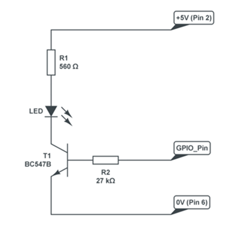

## Controlando motores

### Usando más potencia

En el caso bastante normal de que necesitemos más potencia de las que nos da un pin (16mA) Podemos utilizar un transistor. Veamos el montaje




A la salida de este transistor podemos conectar un relé para obtener aún más potencia

### Motores

Para controlar motores vamos a necesitar una placa que se encargue de manejar la suficiente potencia.
Vamos a usar un módulo muy utilizado llamado L298


Usaremos un par de sencillos motores DC


Y también necesitaremos una alimentación externa para los motores, que puede ser unas pilas o un batería con un powerback 

Conectaremos los motores de la siguiente manera:


Y la batería de la siguiente forma


Y ahora conectaremos los pines de control de la siguiente forma


Conectaremos 7 -> In1,  8 -> In2,  9 -> In3, 10 -> In4 y  GND -> GND

Veamos ahora un sencillo ejemplo de control

```python
from gpiozero import Motor  # Importamos los modulos
from time import sleep

# Motor izquierdo (L) conectando pines 7 y 8 a la placa L298
motorL = Motor(forward = 7, backward = 8)
# Motor derecho (R) conectando pines 9 y 9 a la placa L298
motorR = Motor(forward = 9, backward = 10)

while True:  # Bucle para siempre
    motorL.forward()  # Motor L hacia adelante
    motorR.forward()  # Motor R hacia adelante
    sleep(5)		  # Esperamos 5 segundos
    motorL.backward() # Motor L hacia atras
    motorR.backward() # Motor R hacia atras
    sleep(5)		  # Esperamos 5 segundos
```

[Código](https://github.com/javacasm/RaspberryOnline/blob/master/codigo/Test_motores.py)

Y nuestros motores deben de moverse hacia adelante y hacia atrás

Si lo que queremos es montar un robot con esos 2 motores podemos hacerlo de una manera más sencilla usando este ejemplo

```python
from gpiozero import Robot  # importamos todo lo modulos necesarios
from time import sleep
robby = Robot(left=(7,8), right=(9,10))  # definimos las conexiones del robot
robby.forward(0.4) # nos movemos hacia adelante con 40% de velocidad
sleep(5)         # esperamos 5 segundos
robby.right(0.4) # nos giramos a la derecha con 40% de velocidad
sleep(5)         # esperamos 5 segundos
robby.stop() # paramos

```

[Código](https://github.com/javacasm/RaspberryOnline/blob/master/codigo/test_robot.py)

Ahora ya podemos hacer robót como estos

[zerobot](https://www.thingiverse.com/thing:2352440)


[Smart Zero](https://www.thingiverse.com/thing:2727285)


[Formula Pi](https://www.formulapi.com/) Capaces de buscar su propio camino usando la cámara com podemos ver en [este vídeo](https://youtu.be/2PU-UDYm2Xw?t=40)


## Controlando un servomotor

Un servomotor es un tipo de motor que sólo realiza movimientos angulares entre 0 y 180 grados (existen algunos modelos que se llaman trucados o de rotación continua pero no vamos a tratar aquí)
Una de las grandes ventajas de los servos es que incluyen su propio contolador con lo que sólo necesitamos alimentarlos y una señal de control


Podremos controlarlos de las patillas GPIO12, GPIO13, GPIO18, GPIO19


Conectaremos 18 -> Naranja, 5V -> Rojo, GND -> Marrón

El código es muy sencillo. Este ejemplo va desde el mínimo, al punto medio y luego al máximo

```python
from gpiozero import Servo  # importamos los modulos necesarios
from time import sleep

servo = Servo(18)			# definimos el servo conectado al gpio 18

while True:					# bucle infinito
    servo.min()				# posicion de un extremo
    sleep(2)				# esperamos 2 segundos
    servo.mid()				# posicion central
    sleep(2)				# esperamos 2 segundos
    servo.max()				# posicion del otro extremo
    sleep(2)				# esperamos 2 segundos
```

[Código](https://github.com/javacasm/RaspberryOnline/blob/master/codigo/test_servo.py)

MATERIAL ANTIGUO INTEGRAR LO QUE VALGA


### RaspiRobot


Esta placa nos permite controlar un típico robot de 2 motores de manera muy sencillo. 

* El manejo de motores es mucho más complejo que el manejo de leds.
* La programación es exactamente la misma,
* La electrónica necesaria para controlarlos es totalmente diferente.
* Si bien podemos conectar directamente un led a un pin de GPIO, conectar un motor es totalmente desaconsejable, por varias razones:
	* La primera porque los motores requieren de mayor potencia para funcionar,
	* Necesitaremos una electrónica capaz de gestionar estas potencias
	* Serán controladas desde los pines de la RaspBerry.
	* En caso de forzar la electrónica de alimentación de nuestra Raspberry a dar una mayor potencia podríamos quemarla.
	* El funcionamiento de los motores hace que estos generen al acelerar unas corrientes de inducción de sentido opuesto a las que les aplicamos para funcionar y que de no ser suprimidas podrían dañar la electrónica a la que están conectados.

En la [web de RaspiRobot](https://github.com/simonmonk/raspirobotboard/wiki) vemos instrucciones de montaje

[Vídeo: Raspirobot - Controlando robots con Raspberry](https://youtu.be/FjjP8007DXA?list=PLDxBiw1MlK6SqyPGhhox9WlsximiNrcgK)

¿Qué podemos hacer con RaspiRobot?

* Controla 2 motores,
* 2 leds,
* 2 entradas de pulsador,
* 2 salidas de colector abierto, para poder usar mayores potencias
* Conector I2C y
* otro serie

Descargamos la librería

	wget https://github.com/simonmonk/raspirobotboard/archive/master.zip

La descomprimimos conviene

	unzip master.zip
	
y la instalamos

	sudo python setup.py install

Un programa sencillo podría ser

		from raspirobotboard import *
		rr = RaspiRobot() # creamos el objeto
		rr.set_led1(1) # activamos el led 1
		rr.set_led2(0) # desactivamos el led 2
		rr.set_oc1(1) # activamos la salida 1
		rr.forward() # movemos los dos motores hacia adelante
		rr.reverse() # movemos los dos motores hacia atrás
		rr.left() # motor izquierdo hacia adelante, derecho hacia atrás
		rr.right() # motor izquierdo hacia atrás, derecho hacia adelante
		rr.stop() # los dos motores hacia atrás
		rr.sw1_closed() # devuelver True o False según cerrado o abierto


### Steppers: motores paso a paso


Los motores paso a paso son motores que nos permiten una gran precisión de giro, pudiendo determinar su moviendo en grados.

Vamos a ver cómo usar el motor de la imagen, que tiene 4 bobinas. La placa de control es muy sencilla y necesita de 4 pines para controlarla (en realidad la placa sólo transforma la salida de los pines de raspberry en una señal de la potencia que necesita el motor)

Veamos como conectarla usando 5V y GND y los pines 24,25,8 y 7


Vamos a ver ahora la programación.

		import timeimport RPi.GPIO as GPIO
		GPIO.setmode(GPIO.BCM)
		StepPins = [24,25,8,7] # Pines que conectamos a la placa de control
		for pin in StepPins: # configuramos todos los pines como salida
			GPIO.setup(pin,GPIO.OUT)
			GPIO.output(pin, False)
			StepCounter = 0
			WaitTime = 0.5
			StepCount1 = 4
			Seq1 = []
			Seq1 = range(0, StepCount1) # Definimos la secuencia de giro
			Seq1[0] = [1,0,0,0]
			Seq1[1] = [0,1,0,0]
			Seq1[2] = [0,0,1,0]
			Seq1[3] = [0,0,0,1]
			while 1==1: # realizamos un bucle infinito enviando la secuencia
				for pin in range(0, 4): #iteramos sobre los pasos de la secuencia
					xpin = StepPins[pin]
					if Seq[StepCounter][pin]!=0:
						GPIO.output(xpin, True)
					else:
						GPIO.output(xpin, False)
					StepCounter += 1
					time.sleep(WaitTime)

Veamos un ejemplo de su precisión

		

### Servos

Los servos son motores pensados para mantener una posición concreta, disponen de electrónica de control propia y a la se le indica la posición que deben mantener mediante un pulso que hay que enviar 50 veces por segundo.

El ancho de este pulso determina la posición a mantener, como podemos ver en la imagen adjunta.


La estabilidad de la posición depende de la precisión con la enviemos la señal de control.

Veamos un método para generar esta señal con python. Está pensada para controlar 2 servos:

		def mover_servo(grados,servo):
			if servo==1: GPIO_servo=22
			elif servo==2: GPIO_servo=21
			# creamos el pulso
			pos_servo=(0.0000122*grados)+0.0002
			GPIO.output(GPIO_servo, True) #activamos la salida
			time.sleep(pos_servo) # esperamos la duración del pulso
			GPIO.output(GPIO_servo, False) # desativamos la señal porque el pulso ha terminado
			#esperamos el tiempo necesario hasta enviar el siguiente pulso
			time.sleep(0.0025-pos_servo)


Si lo probamos veremos que el servo vibra debido a la mala calidad de la señal por su falta de estabilidad. Python es un lenguaje interpretado y temporización que hemos hecho dependerá de la carga que tenga nuestra Raspberry

Podemos mejorar la calidad de la señal utilizando un programa escrito en C que producirá una mejor temporización.


### Uniéndolo todo

Vamos a utilizar un par de servos para hacer que una cámara [siga una cara](http://www.instructables.com/id/Pan-Tilt-face-tracking-with-the-raspberry-pi/?ALLSTEPS)


Estos son los pasos para instalar todo lo necesario

		sudo apt-get update
		sudo apt-get install git python-opencv python-all-dev libopencv-dev
		sudo modprobe servoblaster
		git clone https://github.com/mitchtech/py_servo_facetracker

Y para ejecutarlo

		cd py_servo_facetracker
		python ./facetracker_servo_gpio.py 0


### Motores y servos

A veces no interesa controlar varios motores y servos desde una misma placa. 

[Servo desde python](https://learn.adafruit.com/adafruits-raspberry-pi-lesson-8-using-a-servo-motor?view=all)


[Varios motores](https://learn.adafruit.com/adafruit-dc-and-stepper-motor-hat-for-raspberry-pi?view=all)

