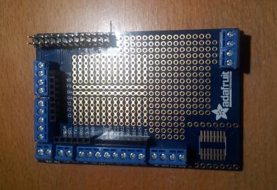
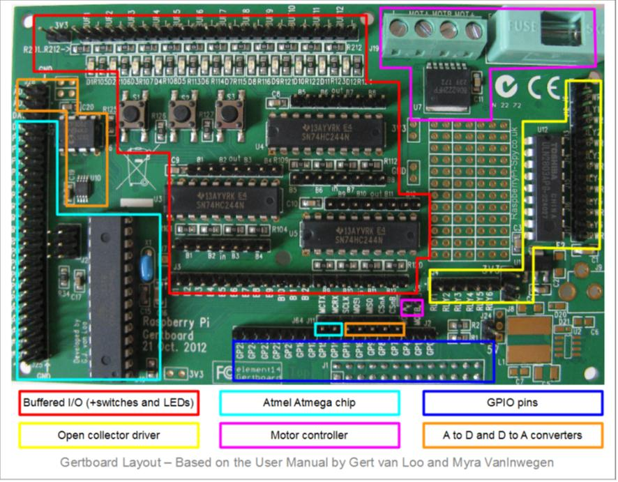
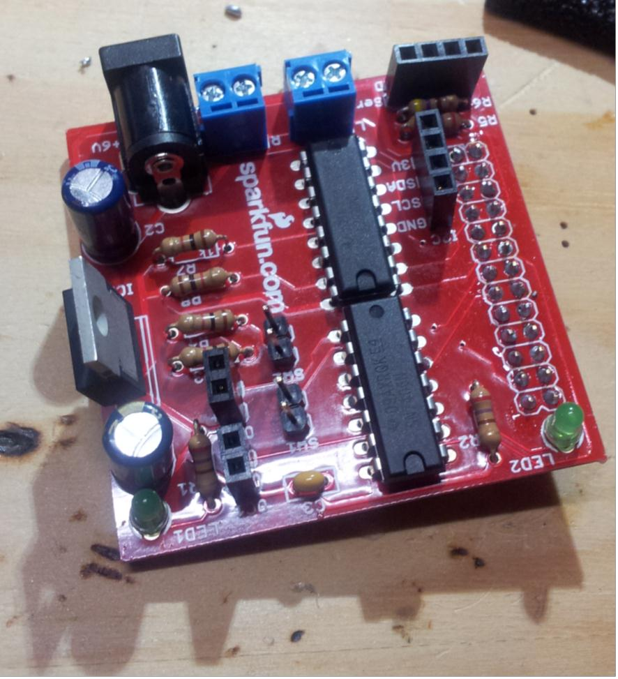

## Placas de extensión: Hats

Si en el mundo Arduino las placas que se se conectan encima de la placa Arduino y añaden funcionalidad se denominan **"shields"**, en el mundo Raspberry se les llama **"Hats"**

En [esta página](https://www.tomshardware.com/amp/best-picks/best-raspberry-pi-hats) podemos ver algunos de ellos.

## Placas GPIO

Existen muchas de estas placas que facilitan la conexión de electrónica.

[Vídeo: Cómo conectar hats/shields a RaspBerry Pi](https://drive.google.com/file/d/1qVIEIs47dEkF7Y0r4qwp4uRRv6R5nxIa/view?usp=sharing)

### Clobber

* Es bastante arriesgado y complicado trabajar directamente con los pines del conector GPIO de la RaspBerry.
* Existen en el mercado una gran variedad de placas que nos facilitan la vida.
* Algunas sólo nos facilitan la conexión.
* Otras nos proporcionan mayor funcionalidad.
* En cualquier caso ganamos en tranquilidad al usarlas.

Son simples adaptadores que nos facilitan la vida permitiendo conectar de manera sencilla con las placas de prototipo.

[Vídeo: Conectando electrónica a Raspberry - Cobbler DIY](https://drive.google.com/file/d/10JFZ8M7WVF23vrh1gj18Ia3SZ0FwcOF8/view?usp=sharing)

### PiPlate

Se trata de una placa de prototipo especialmente adaptada al tamaño de la Raspberry y que nos permite acceder de forma sencilla a los pines por nombre y funcionalidad.

[Video: Placa de prototipo para Raspberry Pi - Pi Plate](https://drive.google.com/file/d/12nz53fows1h3KZTM3or7KGpP5TQru44P/view?usp=sharing)

### PiFace

* Tiene un fin claramente educativo,
* Incluye diferentes dispositivos
* Leds que se pueden activar independientemente,
* 2 relés para activar cargas de potencia y
* 4 pulsadores conectados a otras tantas entradas

### Slice of I/O

Se trata de una placa sencilla que nos permite acceder a 8 entradas y otras tantas salidas con la seguridad de que existe una electrónica que protege a nuestra RaspBerry

### Gertboard

Es una placa de desarrollo con una enorme cantidad de complementos, como son controladores de motores, ADC, DAC, 12 leds, 3 pulsadores y hasta un microcontrolador ATMega (similar a Arduino)

### RaspiRobot

Esta placa nos permite controlar un típico robot de 2 motores de manera muy sencillo. 

