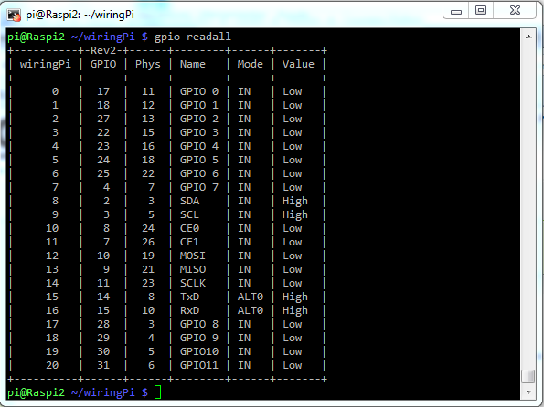
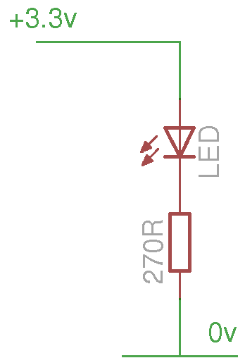
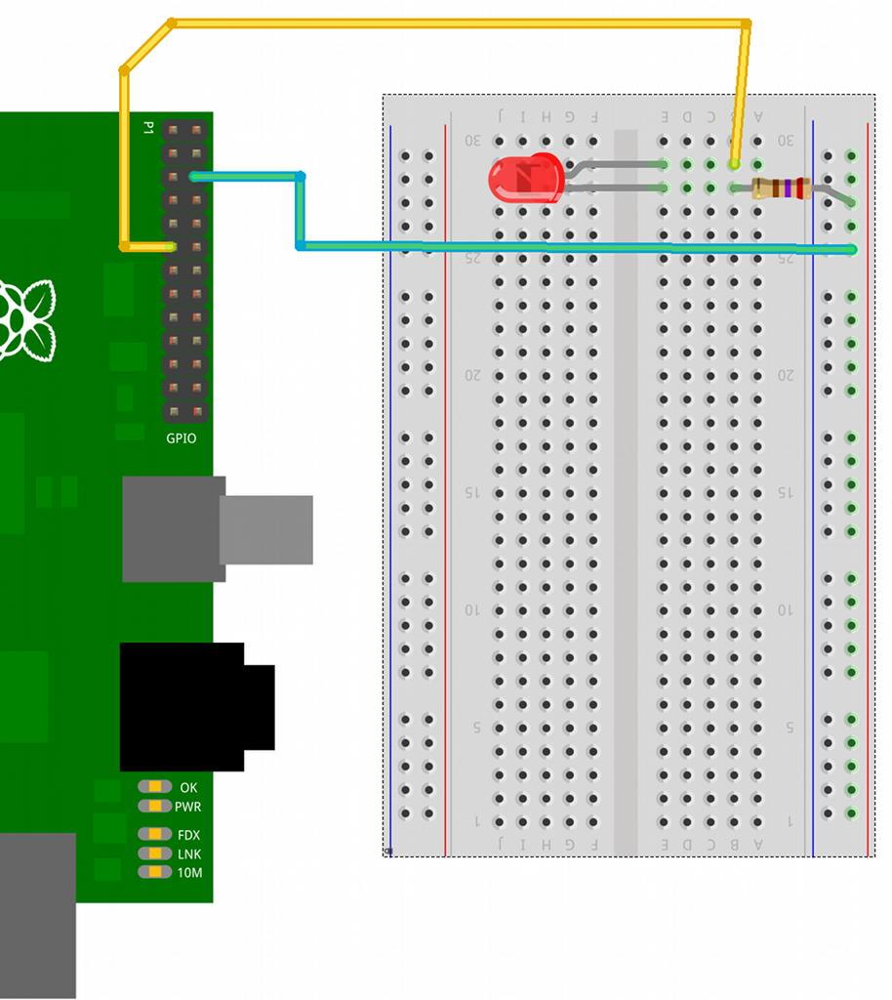

## Otras Librerías

Existen otras librerías que nos facilitarán el acceso a los GPIO (todas usan lenguaje python como base). Nosotros veremos algunas de ellas por motivos históricos y porque muchos proyectos las usan y conviene saber utilizalas.

Para probarlas re-haremos algunos de los ejemplos ya vistos con estas librerías

* Shell (línea de comandos)
* Rpi. GPIO
* wiringPi (Gordon Henderson wiringpi.com)
* BCM 2835

Veamos como llaman a los distintos pines


#### Wiring

Para instalarlo tenemos que tener instalado parte del entorno de desarrollo de python

		sudo apt-get install python-dev python-pip

Descargamos el código (también podíamos haber descargado el fichero zip)

		sudo pip install wiringpi

La compilamos

		./build

Y ya podemos usarla

		gpio readall





### Conectando un led

Este es el esquema para conectar un led



El montaje sería



Hagamos un programa que parpadea el led conectado

```python
		import time
		# Importamos la libreria wiringpi
		import wiringpi
		# Configuramos la numeracion de los pines con respecto al
		# estandar de la libreria wiringpi (pin de entrada salida
		#	GPIO0)

		io = wiringpi.GPIO(wiringpi.GPIO.WPI_MODE_PINS)

		# Configuramos el pin 0 como salida
		io.pinMode(0,io.OUTPUT)

		# Ciclo for que ejecutamos 3 veces
		for x in range (0,3):
			io.digitalWrite(0,io.HIGH) #encendemos el led
			time.sleep(0.5) # esperamos medio segundo
			io.digitalWrite(0,io.LOW) # apagamos el led
			time.sleep(0.5) # esperamos medio segundo
```

Para ejecutar estos programas necesitamos permiso de administrador

		sudo python blink.py

### Conectado un pulsador


Usando el código

```python
		# Encendemos un led cuando se activa el pulsador
		import wiringpi

		io=wiringpi.GPIO(wiringpi.GPIO.WPI_MODE_PINS)

		io.pinMode(7,io.OUTPUT)  # Pin 7 como salida
		io.pinMode(0,io.INPUT)   # Pin 0 como entrada
		io.pullUpDnControl(0,io.PUD_UP)  # Resistencia pull-up

		while True:  # Hacemos un bucle sin fin
			x=io.digitalRead(0)  # Leemos el valor del pulsador
			if x==io.LOW: 	# Si esta pulsado valor bajo (por la resistencia pull-up)
				io.digitalWrite(7,io.HIGH)   # Activamos el led
			else:
				io.digitalWrite(7,io.LOW) 	# Apagamos el led
```

Vemos que para leer el pulsador activamos las resistencias pull-up, es decir cuando se pulse se pone en estado bajo, esto es lo que se conoce como  lógica invertida (o negativa). Aunque puede parecer raro, es como se suele utilizar en la industria pues aporta ventajas de conexión y mantenimiento.

### Usando GPIO

Instalamos la librería

		sudo apt-get install python-dev python-rpi.gpio

El programa que los usa

```python
		import RPi.GPIO as GPIO
		# Usamos la numeración de los GPIO no el numero de los pines
		GPIO.setmode(GPIO.BCM)
		GPIO.setup(7, GPIO.IN) # establecemos el GPIO 7 como entrada
		GPIO.setup(8, GPIO.OUT) # establecemos el GPIO 8 como salida
		input_value = GPIO.input(7) # recuperamos el valor de entreda
		GPIO.output(8, True) # establecemos la salida en alto
```

O este ejemplo más complejo

```python
		import RPi.GPIO as GPIO
		import time
		# Usamos la posición en el conector
		GPIO.setmode(GPIO.BOARD)
		# pin 11 (GPIO17) como output
		GPIO.setup(11, GPIO.OUT)
		var=1
		print "Empezamos el bucle infinito"
		while var==1 :
			print "Output False"
			GPIO.output(11, False)
			time.sleep(1) # esperamos un tiempo
			print "Output True"
			GPIO.output(11, True)
			time.sleep(1)
```
