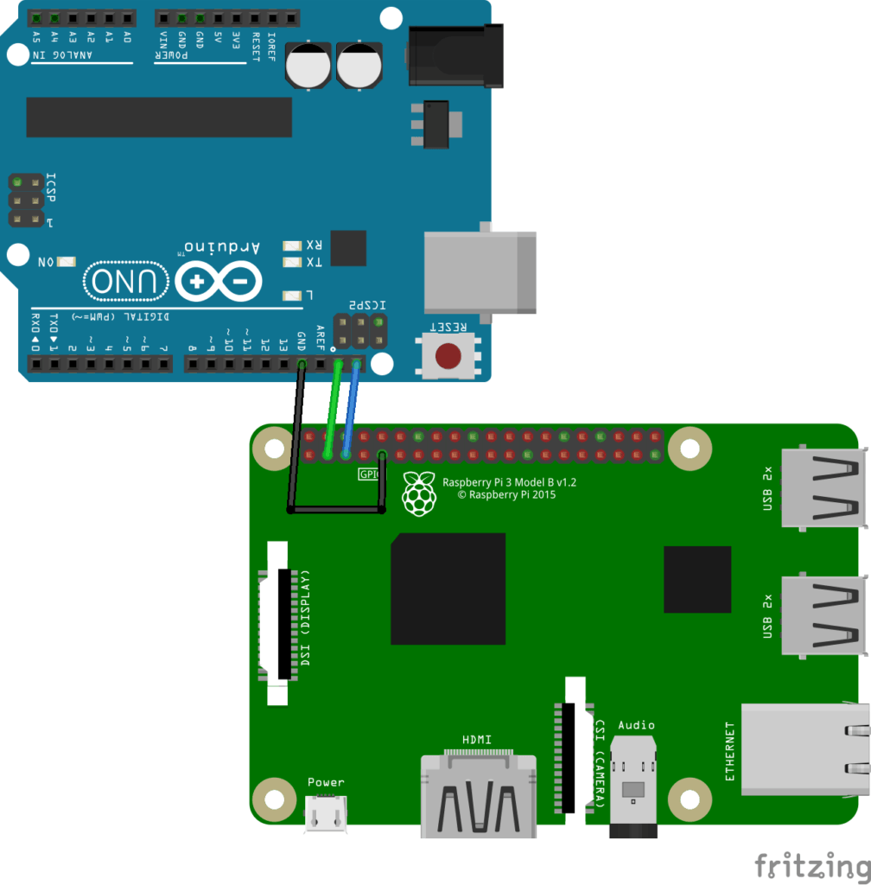
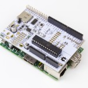
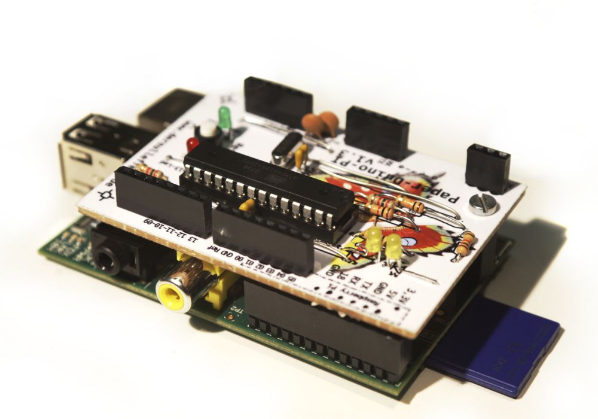
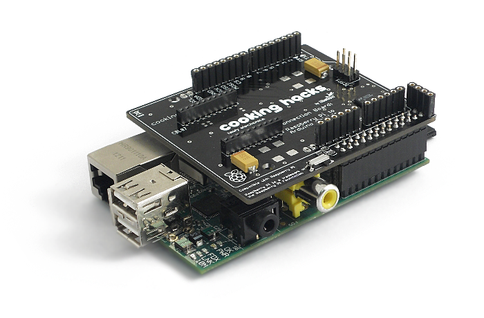

## Conexión con Arduino

Anteriormente vimos que Arduino y Raspberry Pi son perfectamente complementarios.

Por tanto el conectarlos de manera que ambos puedan trabajar juntos parece que es la mejor idea.

A lo largo de este capítulo veremos varias formas de conectarlos, algunas utilizando un simple cable y otras con placas y electrónica de por medio.

Vamos a comenzar con la manera de conectarlos más sencilla, las que los conectan con cables

### Conectando vía cable

Las más sencillas son aquellas que conectan los puertos serie de ambos Esta conexión la podemos hacer de varias formas.

* Utilizando un cable USB, puesto que Arduino sólo consume (si no tiene nada conectado) en torno a los 50mA podemos alimentarlo sin problema del USB de la Raspberry.

* Utilizando un cable serie entre ambos puertos serie. Hay que tener en cuenta los diferentes voltajes

En cualquiera de los dos casos es necesario que desactivemos la consola serie de la Raspberry e instalamos la librería py-serial.

En [este tutorial](https://geekytheory.com/arduino-raspberry-pi-lectura-de-datos/) podemos ver cómo hacerlo.

### Conexión Raspberry Pi - Arduino con I2C

Otra opción interesante es conectarlos utilizando el protocolo I2C, de esta forma la comunicación puede alcanzar más velocidad y nos serviría para conectar otros dispositivos I2C. 

Para que funcione tenemos que tener activado el interface i2c (como ya vimos antes) y conectamos las dos placas de esta manera




Vamos a hacer un montaje donde podemos controlar un relé conectado a Arduino desde la Raspberry Pi usando comunicaciones i2c

Vamos a subir a nuestro arduino un programa que actúa como esclavo i2c como este (ejemplo basado en [stackoverflow](https://stackoverrun.com/es/q/9886922))

```C++
#include <Wire.h>

#define DIRECCION_ESCLAVO 0x09

#define CMD_OFF '0'
#define CMD_ON  '1'

#define PIN_RELE 2


void setup() {
    pinMode(PIN_RELE, OUTPUT);

    Serial.begin(9600); 
    // inicializamos i2c como esclavo con la dirección dada
    Wire.begin(DIRECCION_ESCLAVO);

    // funciones callbacks para la comunicación i2c 
    Wire.onReceive(receiveData);
    Wire.onRequest(sendData);

    Serial.println("Ready!");
}

void loop() {
    delay(100);
}

// callback para datos recibidos
void receiveData(int byteCount){
    while(Wire.available()) { // Hay datos disponibles
        int comando = Wire.read();
        Serial.print("recibido comando: ");
        Serial.println(comando);
        switch(comando){
        case CMD_ON:
            digitalWrite(PIN_RELE, HIGH); 
            break;
        case CMD_OFF:
            digitalWrite(PIN_RELE, LOW); 
            break;
        default:
            Serial.print("Comando no definido:");
            Serial.println(comando)
        
        }
    }
}
// Cuando nos piden datos enviamos el estado del rele
void sendData(){ 
    int relay_status relay_status=digitalRead(PIN_RELE);
    Wire.write(relay_status);
}

```

El programa lee los comandos que le enviamos y siempre que se le piden datos responde con el estado del relé.


Programamos nuestro arduino y al ejecutar el comando i2c_detect

```sh
i2cdetect -y 1
```

Vemos conectado al bus i2c a nuestro arduino en la dirección **0x09**


```
     0  1  2  3  4  5  6  7  8  9  a  b  c  d  e  f
00:          -- -- -- -- -- -- 09 -- -- -- -- -- -- 
10: -- -- -- -- -- -- -- -- -- -- -- -- -- -- -- -- 
20: -- -- -- -- -- -- -- -- -- -- -- -- -- -- -- -- 
30: -- -- -- -- -- -- -- -- -- -- -- -- -- -- -- -- 
40: -- -- -- -- -- -- -- -- -- -- -- -- -- -- -- -- 
50: -- -- -- -- -- -- -- -- -- -- -- -- -- -- -- -- 
60: -- -- -- -- -- -- -- -- -- -- -- -- -- -- -- -- 
70: -- -- -- -- -- -- -- --   
```


En la Raspberry vamos a usar un programa sencillo que nos permite enviar diferentes comandos: 

* El comando '0' apagará el relé
* El comando '1' encenderá el relé

```python

import smbus
import time

bus = smbus.SMBus(1)

# Dirección del programa arduino
address = 0x09

def writeNumber(value):
       bus.write_byte(address, value)
       # bus.write_byte_data(address, 0, value)
       return -1

def readNumber():
       number = bus.read_byte(address)
       # number = bus.read_byte_data(address, 1)
       return number

while True:
       var = input("Comando (0 off - 1 On):")
       if not var:
           continue
       writeNumber(ord(var))
       number = readNumber()
       print('Status: ' + str(number))
```

### Utilizando placas intermedias

Existen dispositivos pensados para facilitar esta comunicación. Veamos algunos de ellos

#### Alamode

Se trata de una placa compatible con Arduino que se conecta directamente a los GPIO de la Raspberry Pi y que dispone de su propia tarjeta SD

Más información en [este](http://www.internetdelascosas.cl/2013/09/11/alamode-un-arduino-para-raspberry-pi/) y [este enlace]( http://makezine.com/2012/12/12/new-product-alamode-arduino-compatible-shield-for-raspberry-pi/)



#### Paperduino pi

[Paperduino](http://paperpcb.dernulleffekt.de/doku.php?id=raspberry_boards:paperduinopi) es diseño de Arduino que se puede hacer directamente sobre una placa de prototipo y que está pensado para conectarlo directamente a la Raspberry




#### Raspberry Pi to arduino shield Bridge




[Esta placa](http://www.cooking-hacks.com/documentation/tutorials/raspberry-pi-to-arduino-shields-connection-bridge) nos permite crear una especie de emulador de Arduino, es decir, ejecutar proyectos de arduino (ino o pde) en la raspberry. Además tiene  conectores estándar de Arduino lo que nos permite conectar shield de arduino.
Hay que tener cuidado con los shields que conectamos puesto que podríamos tener problemas si estos funcionan en 5v y


