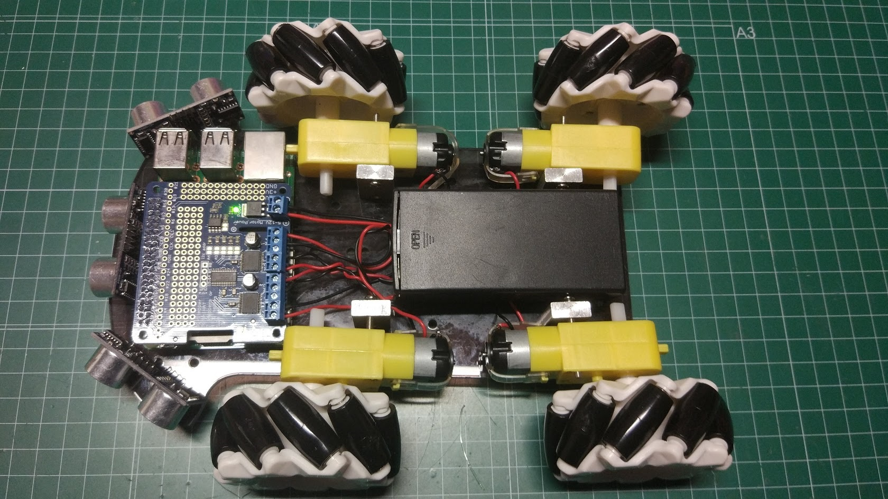
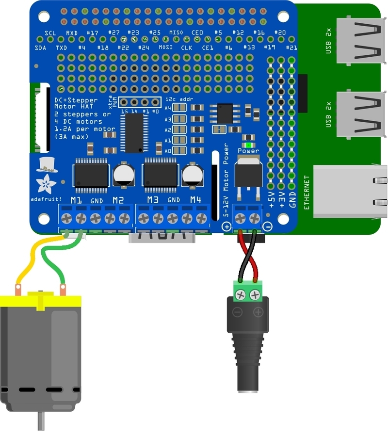
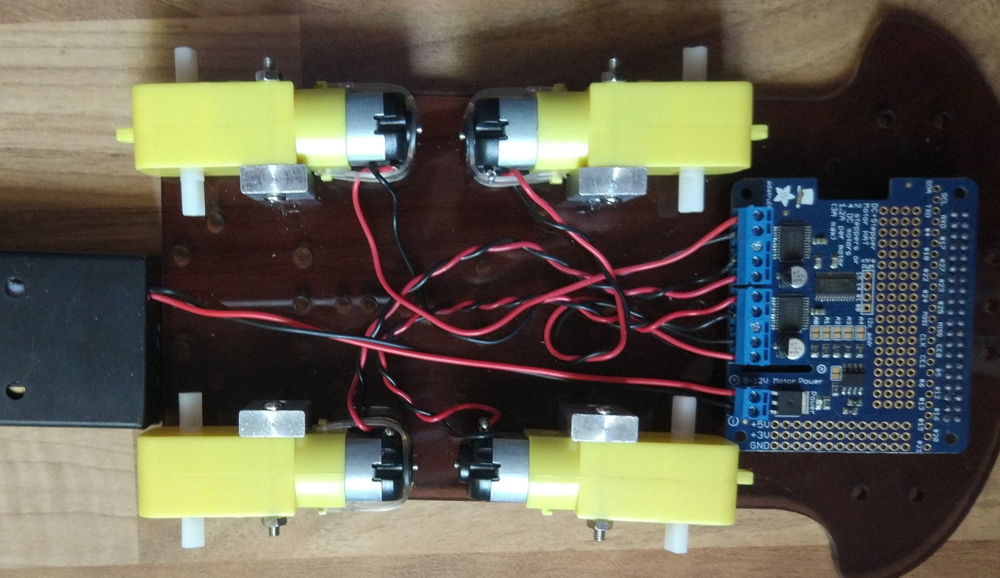
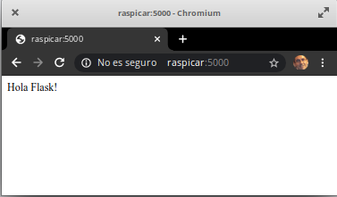
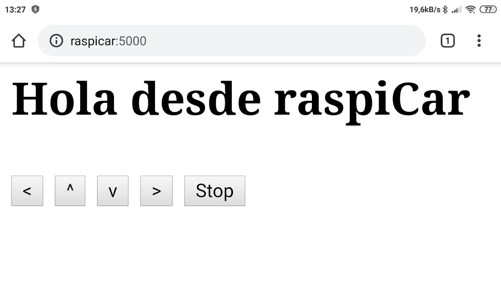
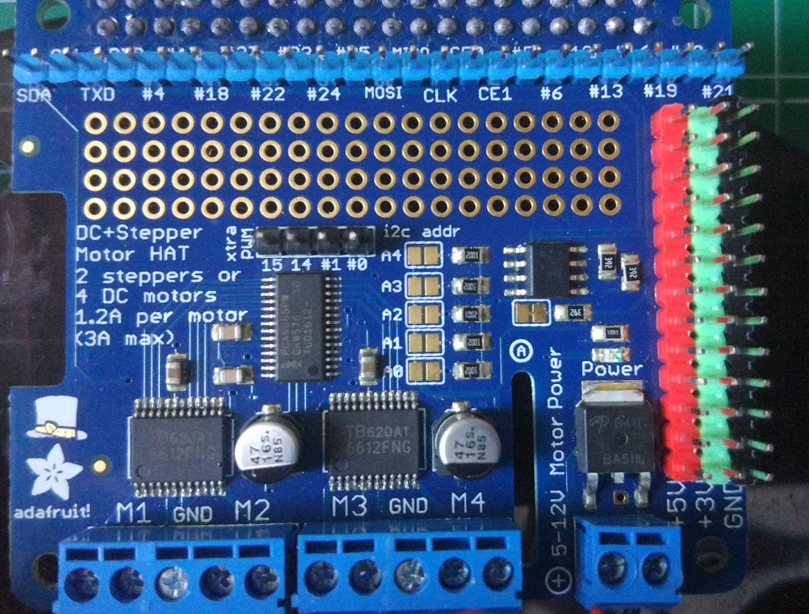
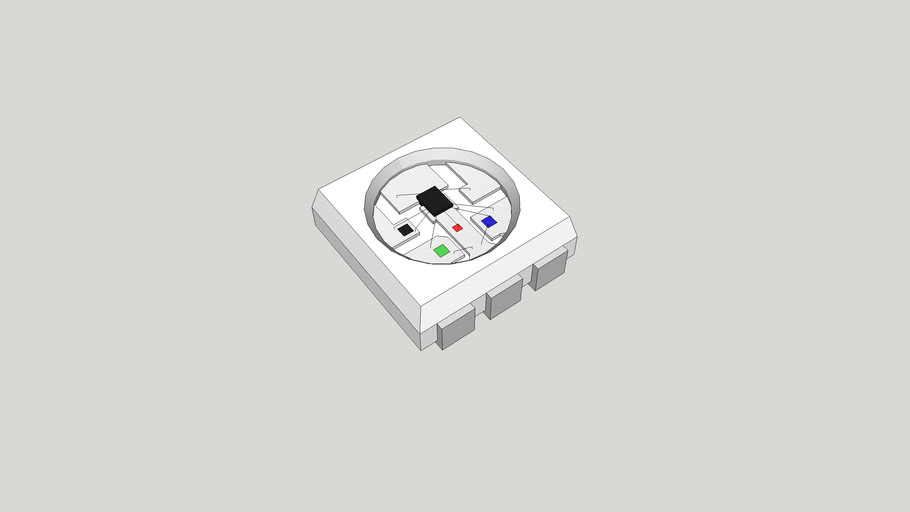
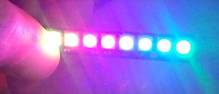
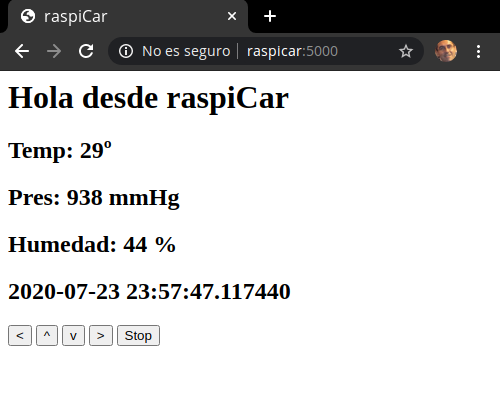
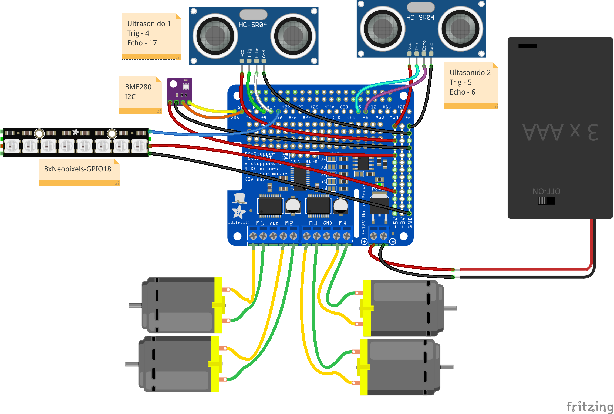

# Robótica




### Robot controlado con Raspberry

Vamos a crear un robot controlado íntegramente por Raspberry: 

* Cámara con streaming
* sensor ultrasonidos 
* 4 motores 
* baterias
* Sensor atmosférico
* Publica los datos en su web que también permite controlar el movimiento
* Acceso vía bot de Telegram

[](https://drive.google.com/file/d/1Dl-a4_nf0WqiTFA8fIac8TluXgGer1-_/view?usp=sharing)

[Vídeo-Descripción de robot controlado por Raspberry Pi: Raspicar](https://drive.google.com/file/d/1Dl-a4_nf0WqiTFA8fIac8TluXgGer1-_/view?usp=sharing)

## Versiones

V0: robot standar con movimiento normales
V1: sensores de temperatura y sensores de ultrasonidos
V2: añadimos ruedas onmi
V3: añadimos cámara y sensor de batería (I2C)

### Equipo

Usaremos el siguiente equipamiento

* Raspberry Pi 2
* Adaptador wifi usb
* Battery Shield. La principal característica es que carga mientras funciona. Sorprendemente muchos powerbank no lo hacen
* Motor shield de Adafruit
* 4 motores TT
* 3 sensores ultrasonidos
* Cámara Raspberry v1.3
* Caja para 2 x 18650 para los motores


### Instalación

Instalamos la versión mínima de Raspberry Pi OS, pero con escritorio para poder luego hacer pruebas con la cámara más fácilmente.

Ahora conectamos un teclado, ratón y monitor  para una primera configuración:
* Idioma
* Zona horaria
* Conexión al wifi: 
    * Configuración del punto móvil del wifi que usaremos
    * Configuración del wifi local
* Activamos: SSH. VNC, Cámara, I2C, SPI, UART, OneWire
* Actualización
 
 Como tanto la Raspberry como la cámara eran antiguas he hecho una actualización de los firmwares, que han solucionado un problema que tenía con la cámara

```sh
 rpi-update
```

### Conexion remota

Como vamos a necesitar conectarnos remotamente al robot, tanto para controlarlo como para hacer cambios en la programación, intentaremos hacer un entorno de desarrollo completo en la propia Raspberry del robot, sin necesidad de un ordenador externo, más que para conectarnos por VNC o SSH.

* Creamos una red wifi, preferiblemente con el móvil para poder acceder a internet al mismo tiempo
* Mientras aún tenemos monitor y teclado conectamos a este wifi a  raspicar para que se conecte cuando esté visible.
* Para encontrar la ip asignada a Raspicar, a partir de la ip del portátil o del móvil, imaginemos que es 192.168.43.134 hacemos
```sh
sudo nmap -sP 192.168.43.0-254
```
Así veremos las ips de los otros dispositivos conectados

```
Starting Nmap 7.60 ( https://nmap.org ) at 2020-07-20 16:50 CEST
Nmap scan report for _gateway (192.168.43.1)
Host is up (0.049s latency).
MAC Address: 78:02:F8:24:9C:88 (Xiaomi Communications)
Nmap scan report for raspicar (192.168.43.248)
Host is up (0.054s latency).
MAC Address: 44:33:4C:6E:09:AC (Shenzhen Bilian electronic)
Nmap scan report for toshibaL (192.168.43.237)
Host is up.
Nmap done: 255 IP addresses (3 hosts up) scanned in 3.54 seconds
```

Ya tenemos la IP de raspicar 192.168.43.248 y ya nos podemos conectar con ssh o con vnc sin problema

### Cambio de resolución del escritorio


Cuando arrancamos una Raspberry Pi sin tener monitor conectado y la tenemos configurada para que se cree el escritorio gráfico suele crearse con una resolución pequeña.

En el siguiente vídeo vamos a ver cómo hacer para modificar esa resolución. No hay más que entrar en Configuración de Raspberry -> Display y pulsar en Set Resolution

[](https://drive.google.com/file/d/1o8hYMcc-zDuWLMg7_wBSPXxQGDwuB7Np/view?usp=sharing)

[Vídeo: Cambio resolución del escritorio de una Raspberry Pi](https://drive.google.com/file/d/1o8hYMcc-zDuWLMg7_wBSPXxQGDwuB7Np/view?usp=sharing)


### Preparando el entorno

Para facilitar la conexión hacemos lo siguiente:

* Creamos las claves rsa (ssh-keygen -t rsa -b 4096 -C user@email.com)
* Puesto  que vamos a trabajar directamente en la raspberry, las incluimos en github como ya vimos
* Clonamos el repositorio base 
* Creamos uno nuevo desde el que partir
* Instalamos módulos dentro del entorno virtual correspondiente y lo necesario para trabajar cómodamente.

```sh
pip3 install python-telegram-bot==13.6
sudo apt install screen
```

### Algunos consejos para trabajar desde consola

#### Editando ficheros de texto desde consola

En muchas ocasiones cuando nos conectamos a nuestra Raspberry por SSH necesitamos editar un fichero de texto.

Son muchos los editores disponibles, pero **nano** es de los más sencillos y potentes.

En todo momento nos muestra en pantalla los comandos que tenemos disponibles, casi todos ellos combinaciones con la tecla Ctrl que se representa en la ayuda como '^` o con Alt que se representa como 'M'

[](https://drive.google.com/file/d/15ONBdnvO4_Jg7ogSkhhIQ0xZGVlCyKgU/view?usp=sharing)

[Vídeo: Uso de editor de ficheros de texto 'nano' desde consola](https://drive.google.com/file/d/15ONBdnvO4_Jg7ogSkhhIQ0xZGVlCyKgU/view?usp=sharing)

#### Trabajando en remoto con ssh en una Raspberry usando Github

Cuando trabajamos directamente en consola en la Raspberry (conectado por ssh)  podemos aprovechar la sincronización con github para varias cosas:
* Nos viene muy tener una manera de tener nuestros ficheros respaldados en algún otro sitio, además de en local
* Podemos usar github como intercambio para así poder ediciones más complejas con un editor en un ordenador con entorno gráfico
* Podemos usarlo para enviar ficheros de manera sencilla

[](https://drive.google.com/file/d/1czpyLRe8_SAskwU59KKWMRwjMZwLp-np/view?usp=sharing)

[Vídeo: Trabajando en remoto con ssh en una Raspberry usando Github](https://drive.google.com/file/d/1czpyLRe8_SAskwU59KKWMRwjMZwLp-np/view?usp=sharing)


### Motores y servos

A veces no interesa controlar varios motores y servos desde una misma placa por eso vamos a utilizar una placa de Adafruit que nos da todo lo necesario para controlar 4 motores DC o 2 steppers


### Placa Adafruit

[Producto](https://www.adafruit.com/product/2348)


La placa DC+Stepper Motor HAT de Adafruit para  Raspberry Pi es perfecta para proyectos donde se necesita mucho movimiento y pude controlar hasta  4 motores DC o  2 Stepper con control total de velocidad usando PWM.

Utiliza 4 controladores puentes en H TB6612 capaces de manejar hasta 1.2A con voltajes entre 5 y 12V. Se controla por I2C lo que nos permite poner hasta 32 de ellas conectadas entre sí.

### Conexión

Conectaremos los 4 motores y la alimentación:





Es muy importante que usemos una alimentación independiente para los motores y para la Raspberry. Los motores piden mucha corriente y podrían dar lugar a que la Raspberry se apague.

Usaremos para la alimentación de los motores 2 baterías lipo 18650, que además tiene un interruptor y que nos va a permitir apagar los motores cuando queramos que el robot no se mueva.

### Instalación

Necesitamos que el driver I2C esté activado. Si no es así lo haremos desde la configuración.

Instalamos el módulo python de Adafruit para controlar el Motor Hat dentro del entorno virtual correspondiente:

```sh
pip3 install adafruit-circuitpython-motorkit
```

Que instalará todas las dependencias necesarias.

### Primeras pruebas

Vamos a hacer unas pruebas de cómo usar los motores usando el módulo de adafruit. Usaremos directamente la shell de python3 para ejecutar los comandos.

Luego utilizaremos estas órdenes para hacer un pequeño script python de prueba.

[](https://drive.google.com/file/d/1jY4DvSMXphyZD8ojQw6G8s8QBk32-hbR/view?usp=sharing)

[Vídeo: Primeras pruebas de control de motores con Raspicar](https://drive.google.com/file/d/1jY4DvSMXphyZD8ojQw6G8s8QBk32-hbR/view?usp=sharing)


Veamos un ejemplo sencillo que nos va permitir comprobar que el conexionado es correcto y la posición de cada motor:

```python

# https://learn.adafruit.com/adafruit-dc-and-stepper-motor-hat-for-raspberry-pi?view=all
import time
from adafruit_motorkit import MotorKit
kit = MotorKit()

print('motor1')
kit.motor1.throttle = 1.0
time.sleep(5)
kit.motor1.throttle = 0

print('motor2')
kit.motor2.throttle = 1.0
time.sleep(5)
kit.motor2.throttle = 0

print('motor3')
kit.motor3.throttle = 1.0
time.sleep(5)
kit.motor3.throttle = 0

print('motor4')
kit.motor4.throttle = 1.0
time.sleep(5)
kit.motor4.throttle = 0

```


Vamos a construir ahora un sencillo módulo para facilitarnos los movimientos donde tendremos unos métodos para los movimientos básicos:

```python

import time
from adafruit_motorkit import MotorKit
import utils

"""
Posición de los motores en el robot. 
Las flechas indican el sentido de giro con el cableado actual
   -------
^4|       |3^
  |       |
  |       |
v1|       |2v
   -------

"""

v = '0.3'

# niveles de movimiento, la velocidad depende del voltaje
throttle_max = 1
throttle_med = 0.5
throttle_min = 0.3
throttle_stop = 0

def backward(speed):
    global kit
    utils.myDebug('backward ' + str(speed))
    kit.motor4.throttle = -1 * speed
    kit.motor3.throttle = -1 * speed
    kit.motor2.throttle = speed
    kit.motor1.throttle = speed

def forward(speed):
    global kit
    utils.myDebug('forward ' + str(speed))
    kit.motor4.throttle = speed
    kit.motor3.throttle = speed
    kit.motor2.throttle = -1 * speed
    kit.motor1.throttle = -1 * speed 

def stop():
    global kit
    utils.myDebug('stop')
    kit.motor4.throttle = 0
    kit.motor3.throttle = 0
    kit.motor2.throttle = 0
    kit.motor1.throttle = 0

def right(speed):
    global kit
    utils.myDebug('right ' + str(speed))
    kit.motor4.throttle = -1 * speed
    kit.motor3.throttle = speed
    kit.motor2.throttle = -1 * speed
    kit.motor1.throttle = speed

def left(speed):
    global kit
    utils.myDebug('left ' + str(speed))
    kit.motor4.throttle =  speed
    kit.motor3.throttle = -1 * speed
    kit.motor2.throttle =  speed
    kit.motor1.throttle = -1 * speed

kit = None

def init():
    global kit
    utils.myDebug('Robot.py ' + v)
    kit  = MotorKit()

```

Ahora vamos a hacer un sencillo test en el que el robot se mueve para lo que usaremos  un lenguaje de más alto nivel:

```python
import robot
import time

espera = 2 

robot.init()
for i in range(0,4):
    robot.forward(robot.throttle_max)
    time.sleep(espera)
    robot.right(robot.throttle_max)
    time.sleep(espera/2)
robot.stop()
```

[](https://drive.google.com/file/d/1s9pWm2-ONltuL1Xn8Eolh3bTs-3VYl72/view?usp=sharing)


[Vídeo: Prueba de movimiento de Raspicar](https://drive.google.com/file/d/1s9pWm2-ONltuL1Xn8Eolh3bTs-3VYl72/view?usp=sharing)


## Control remoto

Vamos a crear una sencilla aplicación web que el mismo robot publicará en su web y que nos permitirá controlarlo fácilmente. Para ello usaremos flask, un módulo python, que nos permite crear aplicaciones web de manera muy sencilla. La instalación y primeros pasos es muy sencilla y podremos verla en detalle en [este proyecto de Raspberry Pi org](https://projects.raspberrypi.org/en/projects/python-web-server-with-flask)

Instalamos flask dentro del entorno virtual correspondiente

```sh
pip3 install flask
```
creamos la carpeta de aplicación webApp

```sh
mkdir webApp
```

y dentro creamos una versión de prueba de la aplicación en el fichero app.py

```python
from flask import Flask

app = Flask('Primera prueba de flask')

@app.route('/') # la asociamos al directorio raíz del servidor web
def index():
    return 'Hola Flask!'

if __name__ == '__main__':
    app.run(debug=True, host='0.0.0.0') # por defecto usará la ip y el puerto 5000

```

La arrancamos con 

```sh
python3 app.py
```

Y nos avisa de que está funcionando
```
 * Serving Flask app "Primera prueba de flask" (lazy loading)
 * Environment: production
   WARNING: Do not use the development server in a production environment.
   Use a production WSGI server instead.
 * Debug mode: on
 * Running on http://0.0.0.0:5000/ (Press CTRL+C to quit)
 * Restarting with stat
 * Debugger is active!
 * Debugger PIN: 105-828-726
```

Probamos desde otro ordenador apuntando un navegador web a http://raspicar:5000



Vamos a hacer ahora una sencilla web que nos va a permitir controlar a raspiCar. Tendremos un fichero para app en flask y otro html que mezclará el aspecto con un poco de javascript para hacer que los botones envien las peticiones a la app

Podemos resumir la estructura de la aplicación en lo siguiente:

* Cada botón/control que usemos tiene 3 partes:
    * Button o gadget html
    * Ruta en flask para cada url
    * Código javascript que enlace la interacción del usuario con el botón y la url correspondiente.

La aplicación flask es esta, hecha a partir del este [excelente tutorial de Sergey Koba de Mobidev](https://mobidev.biz/blog/building-pluto-the-robot-part-iii-web-server)

```python
from flask import Flask, render_template, request, Response

import robot

import time

app = Flask('Robot control')
state_msg = 'Hola desde raspiCar '
robot.init()

@app.route('/')
def index():  # Por defecto mostramos la página index.html
   return render_template('index.html', state_msg=state_msg)

@app.route('/move/<direction>') # al acceder a url /move/dirección se dispara este método
def move(direction):
    if direction == 'forward':
       robot.forward(0.5)
    if direction == 'backward':
       robot.backward(0.5)
    if direction == 'left':
       robot.left(0.5)
    if direction == 'right':
       robot.right(0.5)
    return '{}'

@app.route('/stop')  # dirección para el botón de parada
def stop():
    robot.stop()
    return '{}'

if __name__ == '__main__':
    app.run(debug=True, host='0.0.0.0')
```

Crearemos un fichero html que mezcla el aspecto con el javascript de los botones. Lo llamaremos index.html y lo pondremos en el dirección templates junto a fichero de la app flask

```HTML
<html lang="es">
<head>
<meta charset="utf-8">
<meta http-equiv="X-UA-Compatible" content="IE=edge">
<meta name="viewport" content="width=device-width, initial-scale=1">
<title>raspiCar</title>
<script src="https://code.jquery.com/jquery-3.1.1.min.js" 
integrity="sha256-hVVnYaiADRTO2PzUGmuLJr8BLUSjGIZsDYGmIJLv2b8=" 
crossorigin="anonymous"></script>
<head>
<body>
<h1>{{ state_msg }}<h1>

<button type="button" class="btn btn-default" id="move-left"> < </button>
<button type="button" class="btn btn-default" id="move-forward"> ^ </button>
<button type="button" class="btn btn-default" id="move-backward"> v </button>
<button type="button" class="btn btn-default" id="move-right"> > </button>
<button type="button" class="btn btn-danger" id="stop">Stop</button>

<script>
    $('#stop').on('click', function(){
        $.get('/stop');
    });
    $('#move-forward').on('click', function(){
        $.get('/move/forward');
    });
    $('#move-backward').on('click', function(){
        $.get('/move/backward');
    });
    $('#move-left').on('click', function(){
        $.get('/move/left');
    });
    $('#move-right').on('click', function(){
        $.get('/move/right');
    });
</script>
</body>
</html>
```
Ejecutamos la app y vamos a probar desde un móvil

```sh
python3 robotApp.py
```

Nos conectamos a raspicar:5000



[](https://drive.google.com/file/d/19Mekvp36bAzZujimjHYrWY4Hbu3hnoM9/view?usp=sharing)

[Vídeo: Control remoto desde el móvil de robot con Raspberry raspiCar](https://drive.google.com/file/d/19Mekvp36bAzZujimjHYrWY4Hbu3hnoM9/view?usp=sharing)

Si quieres profundizar más, en [este enlace tienes un webApp mucho más sofisticada](http://www.tobias-weis.de/control-a-raspberrypi-robot-using-flask-and-a-mobile-browser/)


## Añadiendo más electrónica

Hemos soldado unos pines a la placa Motor Hat para poder conectar más componentes que ahora iremos añadiendo.

La placa viene preparada para ello, proporcionando pines de alimentación a 5V y 3.3V y GND suficientes para muchos dispositivos



### Sensor de distancia (ultrasonidos)

Vamos a conectar ahora varios sensores de ultrasonido a raspiCar. Cada sensor tiene 4 pines: GND, Vcc, Echo y Trigger.

En este montaje vemos como se recomienda conectarlos a la Raspberry, usando un divisor de tensión para el pin Echo con el fin de no sobrepasar los 3V


Vamos a conectar 2 sensores en los siguientes pines

||Ultrasonido 1|Ultasonido 2
|---|---|---
|Trig|4|5
|Echo|17|6


```python
from gpiozero import DistanceSensor
import time
ultrasonic1 = DistanceSensor(echo = 17, trigger = 4)
ultrasonic1.max_distance = 2

ultrasonic2 = DistanceSensor(echo = 6, trigger = 5)
ultrasonic2.max_distance = 2

def distance2cm(u):
    return int(u.distance * 100)

while True:
    print(distance2cm(ultrasonic1), ' ' , distance2cm(ultrasonic2))
    time.sleep(0.2)

```

[Tutorial de sensor de distancia con ultrasonidos](https://projects.raspberrypi.org/en/projects/physical-computing/12)


### Neopixels



Los neopixels son leds RGB que tienen la gran ventaja de que se controlan con un único pin digital. Además podemos conectarlos entre sí de forma que se pueden manejar muchos de ellos con un único pin.

Por ejemplo para controlar los 8 neopixels que vamos a conectar en forma de barra a raspiCar sólo necesitamos 1 pin pudiendo controlar el color RGB de cada uno de ellos.



Se venden en muchos formatos, como tiras, matrices, etc...

Para usarlo en la Raspberry necesitamos instalar la librería de adafruit para los neopixel y nos aseguramos de tener instalado el módulo blinka de adafruit dentro del entorno virtual correspondiente

```sh
pip3 install adafruit-circuitpython-neopixel
python3 -m pip install --force-reinstall adafruit-blinka

```

Para probarlo podemos usar el ejemplo de Adafruit, con solo cambiar el pin al que lo conectamos y el número de leds. En [este ejemplo](https://github.com/javacasm/RaspberryOnline2ed/blob/master/codigo/test_neopixels.py) usamos 8 leds conectados al pin 18 (no se pueden usar cualquier pin)

[](https://drive.google.com/file/d/1_SPI8lfhXHtHh0wwTiRqKfDILDBxBeQB/view?usp=sharing)

[Vídeos: Neopixels en acción: 8 neopixels conectados a una Raspberry Pi](https://drive.google.com/file/d/1_SPI8lfhXHtHh0wwTiRqKfDILDBxBeQB/view?usp=sharing)


Un ejemplo típico que es casi obligatorio hacer cuando uno tiene varios leds es el llamado SCanner Larson o la luz del coche fantástico o la luz de los Cylons


Este es [un ejemplo](https://github.com/javacasm/RaspberryOnline2ed/blob/master/codigo/test_larsson.py) de cómo hacerlo:

```python

import time
import board
import neopixel

pixel_pin = board.D18

num_pixels = 8

ORDER = neopixel.GRB

pixels = neopixel.NeoPixel(
    pixel_pin, num_pixels, brightness=0.2, auto_write=False, pixel_order=ORDER
)

pausa = 0.05
while True:
    for i  in  range(0, num_pixels):
        pixels.fill((0 , 0, 0))
        pixels[i] = (255,0,0)
        pixels.show()
        time.sleep(pausa)
    for i  in  range(num_pixels - 1 , -1, -1):
        pixels.fill((0 , 0, 0))
        pixels[i] = (255,0,0)
        pixels.show()
        time.sleep(pausa)

```

[](https://drive.google.com/file/d/1YDr6lSa-frzR2XQfLunNbJzRwy8Q0IbY/view?usp=sharing)

[Vídeo: Scanner Larson, el coche fantástico y cylon con neopixels en una Raspberry Pi](https://drive.google.com/file/d/1YDr6lSa-frzR2XQfLunNbJzRwy8Q0IbY/view?usp=sharing)


### Sensor atmosférico: BME280

Añadimos un sensor atmosférico I2C bme280 como ya vimos anteriormente.

Tenemos que tener cuidado de no ponerlo cerca de las baterías ni de los motores pues tomaría una temperatura incorrecta

Incorporaremos los valores de temperatura, humedad y presión tanto en el bot de telegram como en la webApp para controlar a raspiCar

Para integrar los valores en la webApp con flask tenemos que modificar tanto la plantilla HTML index.html, donde añadiremos un lugar donde poner los valores y una referencia a cada uno de ellos en forma de parámetro. Añadiremos este bloque tras el mensaje de tipo H1

```HTML
<h2>Temp: {{ temperatura }}º </h2>
<h2>Pres: {{ presion }} mmHg </h2>
<h2>Humedad: {{ humedad }} % </h2>
<h2> {{ fechaDatos }}</h2>
```

Ahora tenemos que hacer que la webApp obtenga estos datos del sensor, para lo que añadiremos este código antes de la creación del objeto app

```python
import smbus2
import bme280

port = 1
address = 0x76 # usaremos la dirección que hemos encontrado
bus = smbus2.SMBus(port)

calibration_params = bme280.load_calibration_params(bus, address) # parámetros de compensación
```
y luego obteniendo los datos y pasándolo al renderizado de la template con estas líneas dentro del método index()

```python
   data = bme280.sample(bus, address, calibration_params)
   fechaDatos = data.timestamp
   temperatura = int(data.temperature)
   presion = int(data.pressure)
   humedad = int(data.humidity)
   return render_template('./index.html', state_msg=state_msg, presion = presion, humedad = humedad, temperatura = tempe
ratura, fechaDatos = fechaDatos)

```



De igual manera podríamos incluirlo dentro del bot de Telegram.

### Montaje final

Nos queda un montaje así:



Podemos descargar todo el código de raspiCar del [repositorio de github](https://github.com/javacasm/raspiCar)


[](https://drive.google.com/file/d/1_C3J8c-py1Cm9gB89Ei22LLI6VWr6VeI/view?usp=sharing)


[Vídeo: Montaje final robot móvil controlar con Raspberry Pi:  RasPiCar](https://drive.google.com/file/d/1_C3J8c-py1Cm9gB89Ei22LLI6VWr6VeI/view?usp=sharing)


