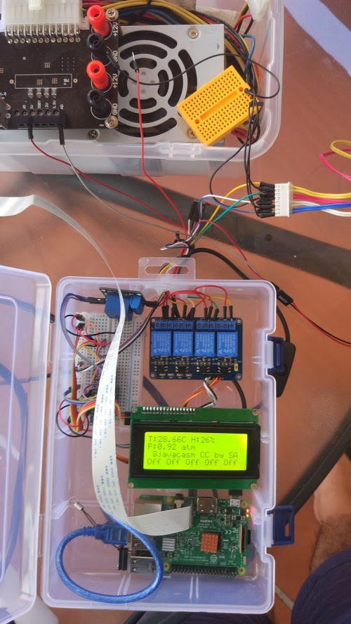
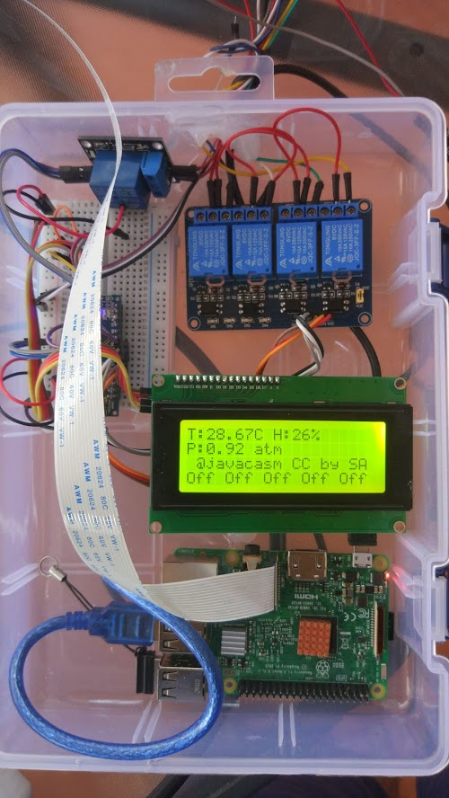
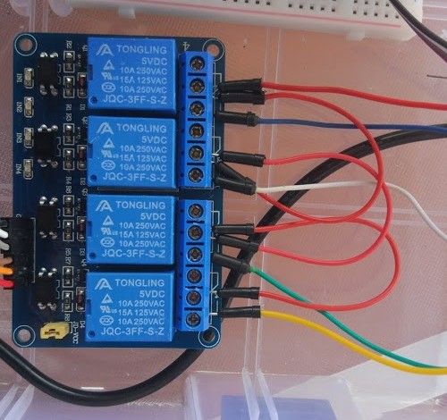

##  Monitoriza de jardín con Raspberry y Arduino

Vamos a crear un sistema de monitorización y control de riego. Queremos que cuando esté terminado tenga las siguientes funciones:

* Control de humedad 
* Estación meteo
* Control de riego
* Streaming de vídeo
* Time lapse
* Batería
* Panel solar

Como en todo proyecto es buena idea definir varias versiones par ir trabajando por etapas:
* Versión 0
    * Control de bomba de riego y electroválvulas para la distribución del agua
    * Control remoto mediante bot de telegram
    * Captura de imágenes estáticas (vigilancia y time lapse)

En futuras versiones haremos
* Versión 1
    * Medida de humedad en distintas partes
    * Streaming de vídeo
* Versión 2
    * Uso de paneles solares y baterías

En este apartado vamos a desarrollar la primera versión v0. Aunque la segunda es aparentemente sencilla, el cableado para los sensores de humedad y el deterioro que estos sufren debido a la corrosión lo hace más complejo.

[](https://drive.google.com/file/d/13ySo16FPBgtD9eO0f7B6ZGA00ziM3D18/view?usp=sharing)

[Vídeo: Sistema de control riego con Raspberry Pi y Arduino](https://drive.google.com/file/d/13ySo16FPBgtD9eO0f7B6ZGA00ziM3D18/view?usp=sharing)


### Sistema de control remoto de riego  V0

Usaremos una Raspberry para el procesamiento y las comunicaciones y un arduino nano que se encargará de controlar los relés y los sensores. Están conectados por un cable USB.

Se establecerá un protocolo de comunicaciones entre el Arduino y la Raspberry para intercambiar datos por el puerto serie.

### Alimentación

* Para alimentar la Raspberry usaremos un transformador microUSB de 5V y 2A
* Arduino lo alimentamos directamente de la Raspberry por el cable USB
* Bomba y electroválvulas se alimenta de una fuente ATX de PC


En futuras versiones sacaremos los 5V de la fuente y quedará una única fuente

### Montaje

En el interior de una caja estanca pondremos la Raspberry, el Arduino y los relés.



De la caja saldrán las conexiones a las electroválvulas y el sensor atmosféricos

Puesto que tenemos que controlar 1 bomba y 4 electroválvulas necesitaremos 5 relés que conectaremos a Arduino.

En la imagen se ven los cables de colores cada uno para cada válvula. El rojo es la alimentación que llega a los relés y pasa por el común de uno a otro



Utilizaremos una pantalla LCD de 20x4 conectada por I2C a Arduino para mostrar en todo momento el estado del sistema

### Programación:

El software de Arduino tiene que encargarse de:

* Control de relés de electroválvulas y relé bomba de riego
* Medida de condiciones atmosféricas: Temperatura, humedad y presión usando un sensor BME280
* Mostrar el estado en un lcd 20x4
* Envío el estado (relés y sensores) bajo petición por el puerto serie
* Definir en un array de los pines a los que están conectados los N relés
* Controlar si los relés son de conexión directa o invertida (estado Low los activa)

El programa de Arduino está disponible en el [repositorio del proyecto](https://github.com/javacasm/RiegoRaspberryArduino/blob/master/Riego-RA-Arduino/Riego-RA-Arduino.ino)

Veamos algunos detalles:

* Definimos los caracteres del protocolo de comunicación a usar:
```arduino
#define END_OF_COMMAND '\n'
#define CMD_HELP       'h'
#define CMD_DATA2SERIE '#'
#define CMD_PIN2STATE  'S'
#define CMD_WILCARD    '*'
#define CMD_PIN_HIGH   'H'
#define CMD_PIN_LOW    'L'
#define CMD_SET_SENSOR_PERIOD 'T'
```
* Creamos métodos para cada comando
* Se lee constantemente el puerto serie y cuando se detecta un END_OF_COMMAND se manda a ejecutar lo recibido
* Los comandos son muy cortos y sencillos. Por ejemplo 'S3H' quiere decir activar el 3er relé 
* Arduino nunca toma la iniciativa para enviar, sólo contesta.
* Los datos de los sensores y el estado se manda en una única línea separados por SEPARADOR_SERIE

El [software de la Raspberry](https://github.com/javacasm/RiegoRaspberryArduino/tree/master/Riego-RA-Raspberry) está basado en el bot de los otros programas al que se le han añadido las funciones de comunicación con Arduino

Necesitamos tener instalado el módulo Telegram-bot  para python

```sh
pip3 install python_telegram_bot
```
En ese código es muy importante que las caracteres del protocolo de la comunicación con Arduino sean los mismos y estén adecuadamente codificados, como byte porque Arduino no entiende unicode:

```python
separadorDatosArduino = b';'
endCommand = b'\n'
helpCommand = b'h'
getDataCommand = b'#'
setReleCommand = b'S'
releOffCommand = b'L'
releOnCommand = b'H'
```
También se ha trabajado bastante el hacer robusta la comunicación con Arduino, incluso reseteándolo automáticamente si hay problemas (arduinoUtils.resetArduino()). Todo ello a través del puerto serie.

Para que esto funcione hay que saber detectar el puerto serie de Arduino, lo que se hace en el método "arduinoUtils.detectarPuertoArduino()", método y técnica tomados del [proyecto miniTierra de @inopya](https://github.com/inopya/mini-tierra).

Instalamos la [librería BME280 de finiteSpace para arduino](https://github.com/finitespace/BME280) y la "LiquidCrystal I2C" de Frank de Brabander.

### Futuras versiones y mejoras

* Medir la temperatura dentro de la caja y activar si es necesario un ventilador para enfriar el sistema
* Guardar los datos de Arduino en una base de datos
* Crear una webApp para ver los datos en local
